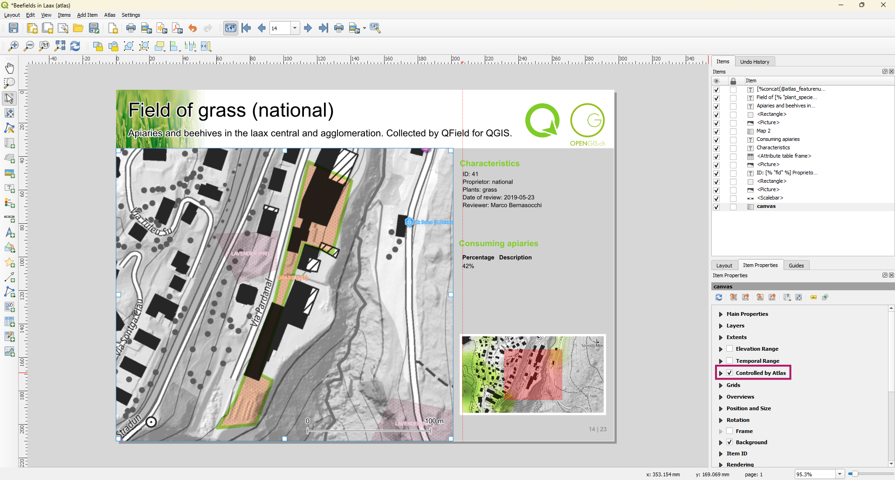

# Print Layouts

It's possible to export laid out maps as PDF documents either with the default in-built one of QField or through project print layouts configured within QGIS.

## Preparation of Print Layout

The layouts need to be pre-configured in the layout editor.
You can choose whether it should be a general static layout or an "atlas-driven" layout, which dynamically prints an individual layout of every feature.

You can read more about Print Layouts [Here](https://docs.qgis.org/latest/en/docs/user_manual/print_layout/overview_layout.html)<!-- markdown-link-check-disable-line -->
And particularly, about **Atlas-driven Layouts** [Here](https://docs.qgis.org/latest/en/docs/user_manual/print_layout/create_output.html#atlas-generation)<!-- markdown-link-check-disable-line -->

!!! Workflow

    1. Select **New Print Layout** from the **Project** Tab.
    If you have existing ones already, you can access them through **Layouts**
    !
    2. A new window will open, where you can customize your layout.

!!! Example

    Here is an example of an **Atlas-driven Layout**
    !

    **Note:** It is important to enable the **Controlled by Atlas** Setting to enable the atlas.
