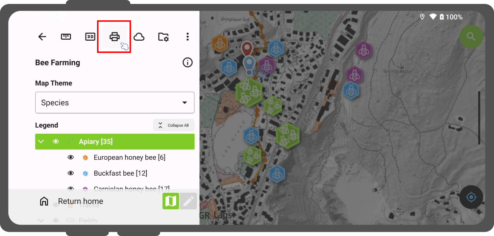
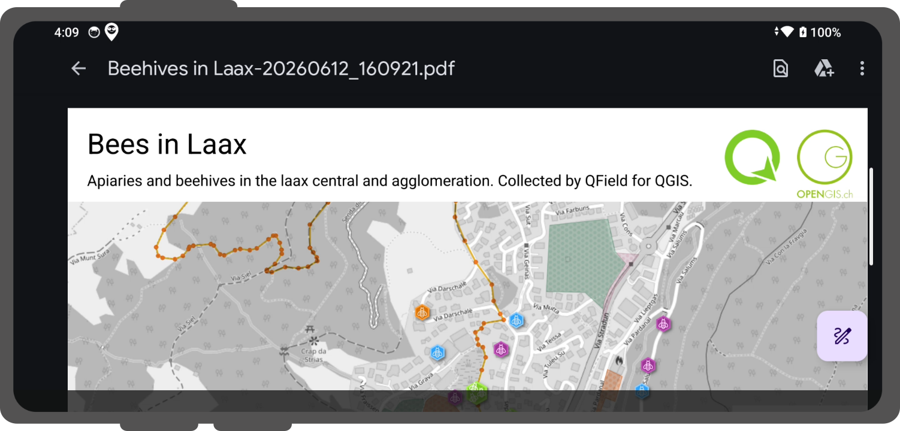
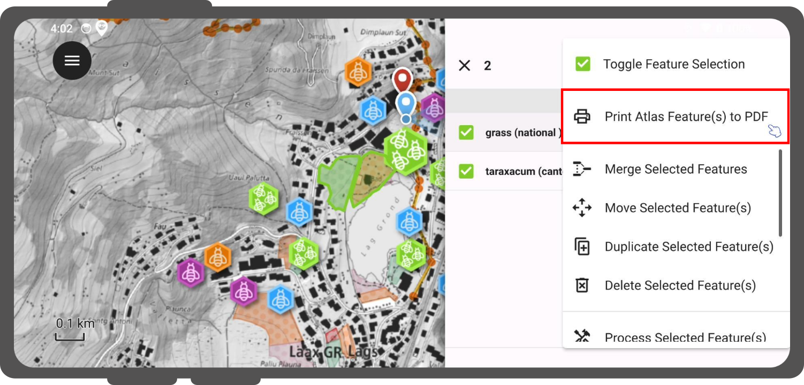

# Print to PDF

Export configured QGIS map print layouts as PDF documents directly within QField.

## Usage
:material-tablet: Fieldwork

Access print layout exports from the main menu inside QField.

!!! Workflow
    1. Open the **Side Dashboard**.
    2. Tap **"Print to PDF"**.
    3. Select a print layout from the submenu if your project contains multiple layouts.
    (If your project contains a single print layout, QField immediately initiates the export).
    4. Open and view the generated PDF document when prompted upon completion.

!

!

## Feature-Driven Atlas Print

Export atlas-driven print layouts by selecting coverage layer vector features on the map canvas or inside feature forms.

!!! Workflow
    **Printing multiple atlas features:**

    1. Tap features on the map canvas to open the identification list.
    2. Long-press a feature in the identification list to enter multi-selection mode.
    3. Select additional coverage layer features to include in the export.
    4. Tap the three-dotted menu *(⋮)* and select **"Print Atlas Feature(s) to PDF"**.

!

!!! Workflow
    **Printing a single atlas feature:**

    1. Open the feature attribute form for a coverage layer feature.
    2. Tap the three-dotted menu *(⋮)* inside the form title bar and select **"Print Atlas Feature to PDF"**.
