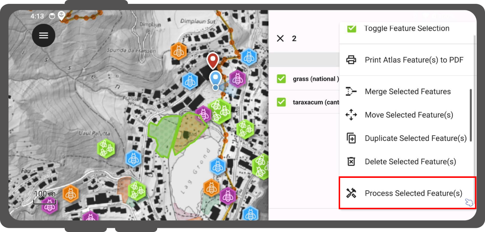
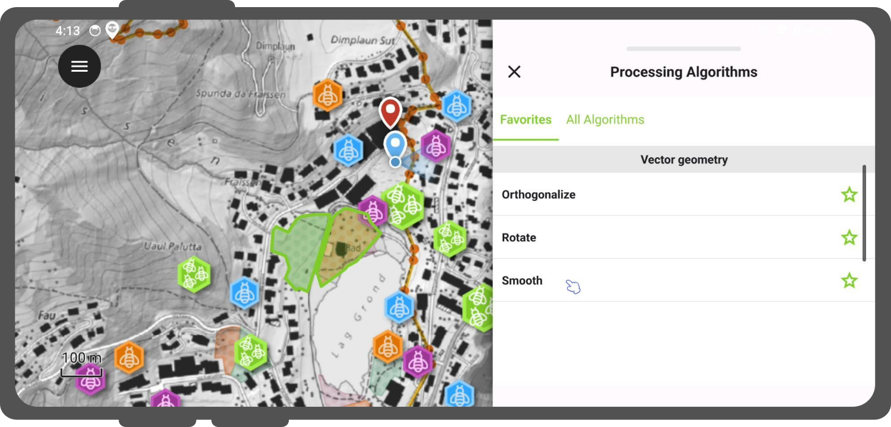
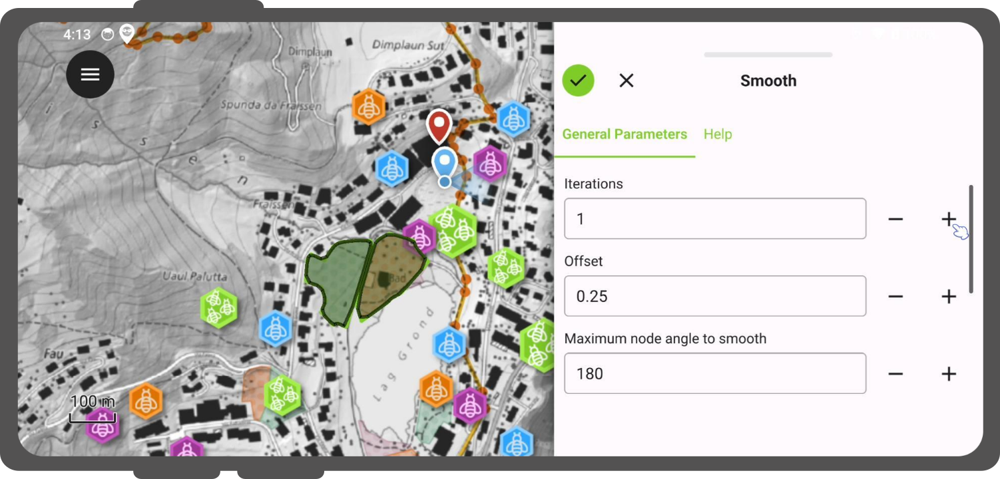

# Processing Algorithms

QField provides processing algorithms to modify digitized vector features and geometries directly on your mobile device.

## Accessing Available Algorithms
:material-tablet: Fieldwork

Run processing algorithms against one or more vector features using the identification menu.

!!! Workflow
    1. Tap features on the map canvas to open the identification list.
    2. Long-press a feature in the identification list to enter multi-selection mode.
    3. Select target features to process.
    4. Tap the three-dotted menu *(⋮)* and select **"Process Selected Feature(s)"**.

!

By default, QField displays algorithms marked as favorites.
Switch to the **"All algorithms"** tab to view the full library of available tools and toggle favorite status for individual algorithms.

!

## Running an Algorithm
:material-tablet: Fieldwork

Select an algorithm to configure parameters and execute spatial operations.

!!! Workflow
    1. Select an algorithm from the processing drawer.
    2. Configure parameters under the **"General"** and **"Advanced"** tabs.
    (Switch to the **"Help"** tab to view detailed functional documentation for the selected algorithm).
    3. Inspect the live map preview overlaid on the map canvas as parameters are adjusted.
    4. Tap the checkmark button (**"✔"**) in the drawer title bar to run the algorithm and apply geometry modifications.

!
