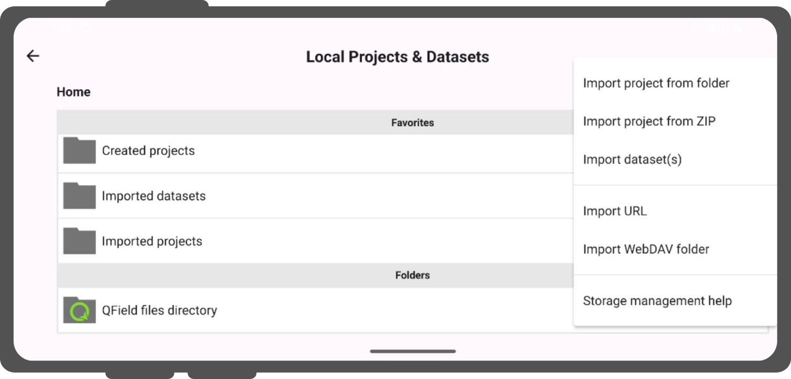
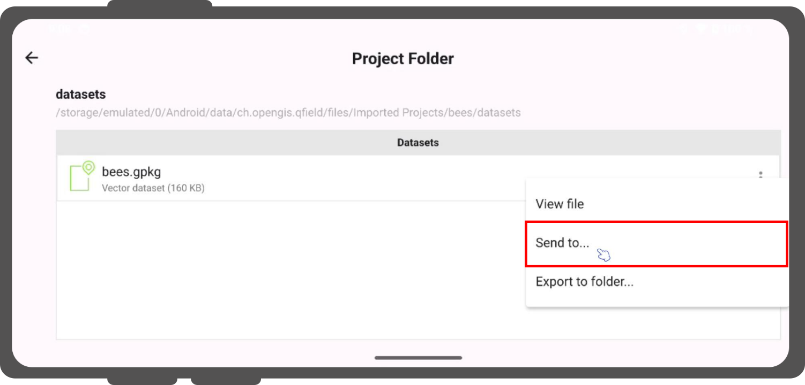

# Project Selection

QField includes a file selector to open local projects stored on your device.
To open cloud projects, see [QFieldCloud](../../get-started/tutorials/get-started-qfc.md).

!!! Note
    Starting with Android 11, applications are restricted from full access to primary and external storage directories.
    Direct access to projects and datasets stored outside app-dedicated folders is no longer available.
    Read more in the [QField Storage Access](../../how-to/project-setup/storage.md) guide.

Import project folders or datasets into the dedicated storage directory `<drive>:/Android/data/ch.opengis.qfield/files/QField` where QField maintains full read/write access.
This location supports importing files from external SD cards or cloud storage providers like Google Drive.

!!! Warning
    Uninstalling QField deletes the app-dedicated folder and all stored local projects.
    Updating QField preserves your app folder data.

## Import and Open Local Project
:material-tablet: Fieldwork

On the Welcome Screen, tap **"Local projects and datasets"** to view **"Created projects"**, **"Imported datasets"**, and **"Imported projects"** directories.
Tap the plus button (**"+"**) at the bottom right to open the import dropdown menu.

!

The dropdown menu provides options to import local data:

- **"Import project from folder"**
- **"Import project from ZIP"**
- **"Import dataset(s)"**

### Import Project from Folder or ZIP Archive

!!! Workflow
    1. Tap the plus button (**"+"**) and select **"Import project from folder"** or **"Import project from ZIP"**.
    2. Grant folder access permissions in the system file picker.
    3. Select your target project folder or compressed `.zip` archive.
    4. QField copies the content into the **"Imported projects"** directory.
    5. Tap the project in **"Imported projects"** to open it.

Re-importing a folder with an identical name overwrites existing local project files to update the project.

!!! Warning
    Edits, additions, and deletions are saved to datasets inside the imported project directory, not in the original source folder selected during import.

### Import Datasets

!!! Workflow
    1. Tap the plus button (**"+"**) and select **"Import dataset(s)"**.
    2. Select one or more files in the system file picker.
    3. QField copies selected files into the **"Imported datasets"** folder.

Ensure you select all required sidecar files when importing single datasets (for example, Shapefile datasets require `.shp`, `.shx`, `.dbf`, `.prj`, and `.cpg` files).

## Favorite Directories

The main file selector screen displays a **"Favorite directories"** section.

- **Add a favorite directory:** Long-press a directory name in the file selector.
- **Remove a favorite directory:** Long-press an entry in the favorites list.

## Set Default Project

Set a specific project as your default basemap when opening individual datasets.
This feature is useful when using a QFieldCloud project as a basemap.

### How to Set a Default Project

!!! Workflow
    1. Locate the **"Recent Projects"** list on the Welcome Screen.
    2. Long-press the project you want to set as your default basemap.
    3. Select **"Set as Default Project"** from the context menu.

!

### Basemap Loading Logic

When opening an individual dataset, QField selects a basemap using the following hierarchy:

- **Default Project:** Uses the designated default project as a basemap if set.
- **Basemap File:** Uses a `basemap.qgs` or `basemap.qgz` file found inside the device `QField` directory if no default project is set.
- **OpenStreetMap:** Loads a default OpenStreetMap XYZ layer if neither a default project nor a basemap file exists.

## Retrieve Modified Projects and Datasets
:material-monitor: Desktop preparation

Access imported projects and datasets directly by connecting your device to a computer using a USB cable.
The top navigation bar displays the storage path when opening a local file.

On most USB-connected devices, locate edited content under `<drive>:/Android/data/ch.opengis.qfield/files/` within the **"Imported Datasets"** or **"Imported Projects"** folders.

### Send To & Sharing Options
:material-tablet: Fieldwork

Share and export datasets directly from QField using native device sharing APIs.
This feature allows sending edited datasets to third-party applications (such as Gmail, Google Drive, Dropbox, Nextcloud, or messaging apps).

!

### Send Compressed File(s)

Select one or multiple dataset files inside the file picker screen to export them simultaneously as a single compressed archive.

!!! Workflow
    1. Long-press an item or tap the multi-select menu in the local file picker to enter selection mode.
    2. Select the dataset file(s) you wish to export.
    3. Tap the top menu button *(⋮)* and select **"Send compressed file(s) to..."**.
    4. Choose your destination application in the native sharing dialog.

    !
