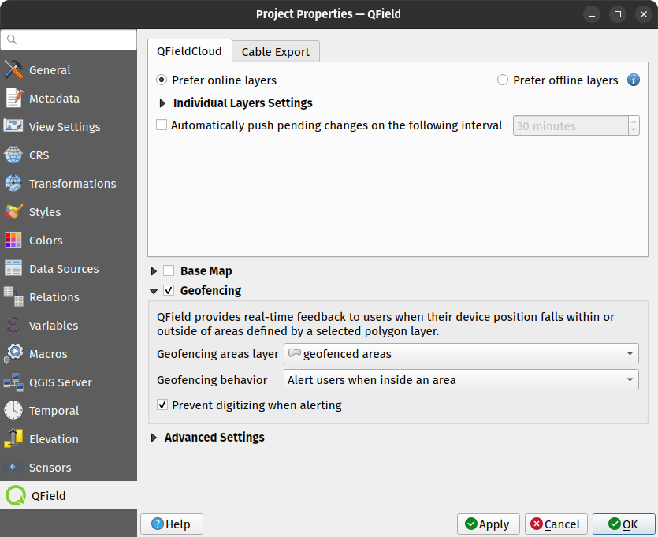

# Geofencing

QField has a built-in geofencing functinality that can alert or inform users when the position provided by their GNSS device enters and/or leaves areas defined through polygon features. Digitizing of new features can also be prohibited when a geofencing alarm is turned on.

## Defining geofenced areas
:material-monitor: Desktop preparation

Defining geofenced areas on QGIS happens with the help of the QFieldSync plugin. Simply open the project properties dialog and go to the QField panel, where you will find a checkbox to activate geofencing and a number of widgets to configure its behavior.

!

The geofencing areas layer combobox allows you to pick a polygon vector layer from your project file. You can rely on any data provider, including online sources such as postgis databases.

Once a layer is chosen, you can choose between three geofencing behavior:
- alert users when inside an area, where the polygons from the vector layer act as no-go areas
- alert users when outside all areas, where the polygons from the vector layer act as safe areas
- inform users when entering and leaving areas, where polygons from the vector layer act as areas of informed or warned about

Finally, a checkbox allows you to prohibit the digitizing of new features when in geofencing's alert mode is activated by the first two behaviors above. When checked, users will not be able to digitize new features into the currently opened project.

## Geofencing feedback

When QField turns its geofencing alert on, a glowing read circle will appear at the bottom right corner of your device's screen. The visual queue will remain on the screen until the alert is turned off based on your selected behavior. In addition, on devices that supports vibration, a tactile alert will occur alongside a message informing users of which areas has been trespassed into.

If you enabled the digitizing prevention checkbox, you will notice that QField's digitizing toolbar will disappear while in alert mode to clearly inform users of the ongoing prohibition and avoid accidental data entry.
