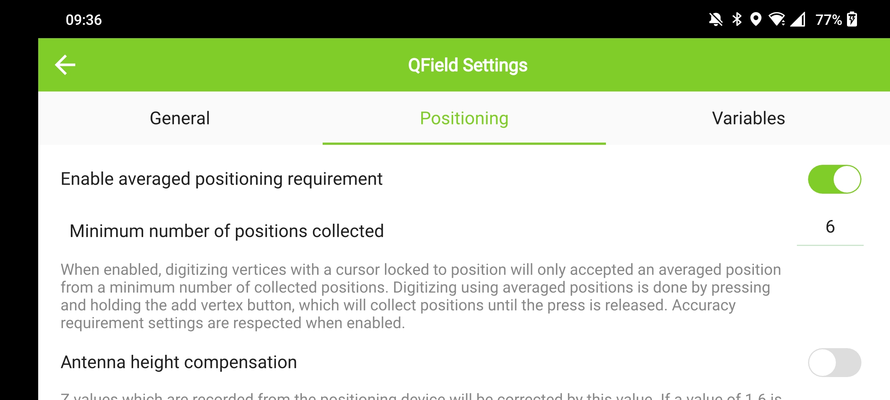
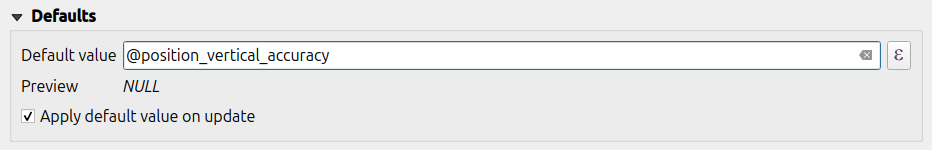
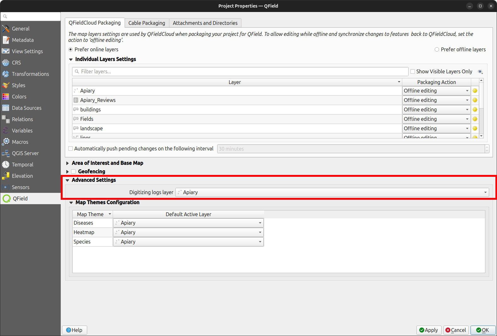

# Positioning (GNSS)

QField can make use of the internal GNSS (Global Navigation Satellite
System, like GPS, GLONASS, Galileo or Beidou). QField can also connect
to external antennas through NMEA streams over Bluetooth, TCP, or UDP
connection.

GNSS devices are also capable of measuring the altitude next to the current 2D
position on the earth surface.

## Visualization

When positioning is activated, your position will be shown in blue on the map.
Your location is visible either as a blue dot if you are still or as an arrow indicating your movement direction
if you are moving.

The blue beam indicates the current orientation of your device if the device has
a builtin magnetic compass.

A circle around your current position indicates the precision as reported by the
positioning device.

## Configuration

### Accuracy requirement

A minimum desired accuracy for measurements can be defined. The quality
will be reported in three classes, bad (red), ok (yellow) and excellent
(green). These colors will show up as a dot on top of the GNSS button.

The thresholds can be defined in the positioning settings.

If the *Enable accuracy requirement* setting is activated, you will not be able to collect new measurements with the cursor
snapped to the position with an accuracy value which is bad (red).

### Antenna height compensation

The height of the antenna pole in use can be defined in the settings.
Any measured altitude will be corrected by this value.

### Altitude correction / vertical grid shift

Altitude values can be corrected with vertical grid shift files to
calculate orthometric height.

Vertical grid shift files have to be made available to QField by putting
them into the QField app folder `<drive>:/Android/data/ch.opengis.qfield/files/QField/proj`.

!!! note
    Since QField 2 the proj files needs to be stored in the app directory `<drive>:/Android/data/ch.opengis.qfield/files/QField/proj` instead of the devices main directory `<drive>:/QField/proj`.

Once the grid shift file is placed there, it is available in QField in
the *Positioning settings* under *Vertical grid shift in use*.

If you are using altitude correction and an external positioning device
is used, consider turning *Use orthometric altitude from device* off.

The formats currently supported are:

  - GeoTIFF (.tif, .tiff)
  - NOAA Vertical Datum (.gtx)
  - NTv2 Datum Grid Shift (.gsb)
  - Natural Resources Canada's Geoid (.byn)

For example:
For the transformation from ETRS89 (reference ellipsoid GPS) to NAP (Dutch) users can download the file [nlgeo2018.gtx from NSGI](https://www.nsgi.nl/rdnaptrans) and put it in the directory.

## Usage
:material-tablet: Fieldwork

A short press on the *GNSS button* will turn on the GNSS and center to the
current location once *positioning information* is available.

Activate *edit mode* and press on the target button, the cross in the
center means it is using GNSS positioning.

!

A long press on the *GNSS button* will show the *positioning menu*.

Inside the *positioning menu* you can turn on the *positioning display*
which will show the current coordinates which are reprojected into the
project CRS along with precision information.

!

!!! note
    If you see WGS 84 lat/lon information instead of information in your
    project CRS, you probably have no signal yet.

## Using an external GNSS Receiver
:material-tablet: Fieldwork

QField supports connecting to external GNSS positioning devices via NMEA streams through Bluetooth, TCP,
or UDP connections.

In *Settings > Positioning*, you can find a set of buttons to add, edit, or delete external
devices as well as a dropdown list to switch between internal and saved external GNSS devices.

!

The breakdown of connections support by platform is as follow:

|             | :material-android: Android | :material-apple: iOS | :material-microsoft-windows: Windows | :material-linux: Linux | :material-apple: MacOS |
|-------------|----------------------------|----------------------|--------------------------------------|------------------------|------------------------|
| Bluetooth   | :material-check:           |                      | *                                    | :material-check:       | :material-check:       |
| TCP         | :material-check:           | :material-check:     | :material-check:                     | :material-check:       | :material-check:       |
| UDP         | :material-check:           | :material-check:     | :material-check:                     | :material-check:       | :material-check:       |
| Serial port | :material-check:           |                      | :material-check:                     | :material-check:       | :material-check:       |

*(\*) Bluetooth support on Windows occurs through the virtual serial port automatically
created by the operating system when it connects to the GNSS device.*

The NMEA sentences currently supported are GGA, RMC, GSA, GSV, VTG, and HDT.

!!! note
    Make sure no other app like mock location providers are using the same connection.

## Mock location
:material-tablet: Fieldwork

It is possible to provide a mock location via a separate android app to
QField. There are several options for this, one of them is [Android NTRIP Client](https://play.google.com/store/apps/details?id=com.lefebure.ntripclient).

To use this you have to [enable mock locations on your Android device](https://www.youtube.com/watch?v=v1eRHmMiRJQ).

## Averaged positioning functionality
:material-tablet: Fieldwork

!!! note
    The coordinate cursor must be locked to the current location via the [Lock to position button](../digitize/#adding-point-features)

There is a function that allows you to digitize using averaged positions.

The survey will start by pressing and holding the add vertex button, which will start collecting positions.

While collecting, an indicator will appear on top of the coordinate cursor showing a text reflecting the current number of collected positions.
If an averaged position minimum count requirement is active, a progress bar will also be present indicating the progress towards meeting that requirement.

!

To setting to activate an average position minimum count threshold can be found in QField settings's *positioning* panel.
When active, holding the add vertex button is not required, a short tap on the button will begin the collection of positions and automatically add the averaged position when the minimum count requirement is met.

!

When using [`@gnss_*` or `@position_` variables](../gnss/#additional-variables) on averaged positions, the variable will also represent the average over all collected samples.

## Project configuration
:material-monitor: Desktop preparation

### Positioning variables

You can get access to positioning information through additional
expression variables accessible in the attribute form. These will
only be available when positioning is enabled.

These variables are commonly used as default values for fields to keep
track of the quality of individual measured points.

  - `@position_source_name` - The name of the device that gave location information as
    reported by the sensor. To differenciate between internal and
    external sensor. If the position is manually set, and the
    position is not snapped to the cursor, the source name is
    "manual". **In case the cursor is not snapped to the position, all other variables will be null, if you need this, use the
    `gnss_` variables instead**.
  - `@position_quality_description` - A human readable and translated string for the quality as
        reported by the sensor. E.g. "Fixed RTK". It is only available
        when the crosshair is snapped to the sensor. - IE
  - `@position_coordinate` - A point with the coordinate in WGS84. Lon, Lat, Altitude as
        delivered by the sensor. It is only available when the crosshair
        is snapped to the sensor. - `x(@position_coordinate)` - IE
  - `@position_horizontal_accuracy` - The horizontal accuracy of the coordinate (in meters) as
        reported by the sensor. It is only available when the crosshair
        is snapped to the sensor. - IE
  - `@position_timestamp` - The timestamp of the position in UTC as reported by the sensor.
        It is only available when the crosshair is snapped to the
        sensor. - IE
  - `@position_direction` - The direction of movement in degrees from true north as reported
        by the sensor. It is only available when the crosshair is
        snapped to the sensor. - IE
  - `@position_ground_speed` - Groundspeed (in m/s) as reported by the sensor. It is only
        available when the crosshair is snapped to the sensor. - IE
  - `@position_magnetic_variation` - The angle between the horizontal component of the magnetic field
        and true north, in degrees as reported by the sensor. Also known
        as magnetic declination. A positive value indicates a clockwise
        direction from true north and a negative value indicates a
        counter-clockwise direction. It is only available when the
        crosshair is snapped to the sensor. - IE
  - `@position_vertical_accuracy` - The vertical accuracy of the coordinate (in meters) as reported
        by the sensor. It is only available when the crosshair is
        snapped to the sensor. - IE
  - `@position_3d_accuracy` - The 3 dimensional accuracy of the coordinate (in meters), 3D-RMS
        as reported by the sensor. It is only available when the
        crosshair is snapped to the sensor. - IE
  - `@position_vertical_speed` - The vertical speed (in m/s) as reported by the sensor. It is
        only available when the crosshair is snapped to the sensor. - IE
  - `@position_averaged_count` - This variable holds the number of collected positions from
        which an averaged position was calculated when digitizing in this mode. For non-averaged
        positions, the value will be set to `0` (zero). - IE
  - `@position_pdop` - Position dilution of precision as reported by the sensor. It is
        only available when the crosshair is snapped to the sensor. - E
  - `@position_hdop` - Horizontal dilution of precision as reported by the sensor. It
        is only available when the crosshair is snapped to the sensor. - E
  - `@position_vdop` - Vertical dilution of precision as reported by the sensor. It is
        only available when the crosshair is snapped to the sensor. - E
  - `@position_number_of_used_satellites` - Number of satellites as reported by the sensor. It is only
        available when the crosshair is snapped to the sensor. - IE
  - `@position_used_satellites` - A list of satellites in use (pri) as reported by the sensor. It
        is only available when the crosshair is snapped to the sensor. - `array_length(@position_used_satellites)` - E
  - `@position_fix_status_description` - The GPS Fix Status "NoData", "NoFix", "Fix2D" or "Fix3D"
        as reported by the sensor. It is only available when the
        crosshair is snapped to the sensor. - E
  - `@position_fix_mode` - Fix mode (where "M" = Manual, forced to operate in 2D or 3D or
        "A" = Automatic, 3D/2D) as reported by the sensor. It is only
        available when the crosshair is snapped to the sensor. - E

!!! info
    I: Internal position source E: External (NMEA) position source

All `@position_*` variables have a corresponding `@gnss_*` variable.
The gnss variables always report the gnss sensor values, even when the
crosshair is not snapped.

Examples:

:   -   when the crosshair is snapped to the sensor - `@gnss_horizontal_accuracy` > The
            horizontal accuracy of the coordinate (in meters) as
            reported by the sensor. - `@position_horizontal_accuracy` > The
            horizontal accuracy of the coordinate (in meters) as
            reported by the sensor. - `@position_source_name` --> sensor name.
    -   when the crosshair is manually moved - `@gnss_horizontal_accuracy` > The
            horizontal accuracy of the coordinate (in meters) as
            reported by the sensor. - `@position_horizontal_accuracy` > The value
            is `NULL`. - `@position_source_name` > The value is
            `manual`.

### Vertex logger

It is possible to setup a log layer of the collected vertices. This
allows to keep track of meta data for each vertex like GNSS quality
attributes and more. To set this up, a point layer can be added to the
project and attributes configured to store this information.

{width="600px"}

Then you should assign the role *digitizing logger* on a point layer.

Go to *QFieldSync > Project Properties*

{width="600px"}

To be most effective, the layer attributes should have default value that
relies on the positioning variables enumerated above.
