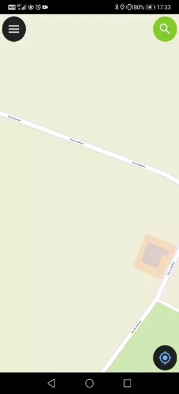
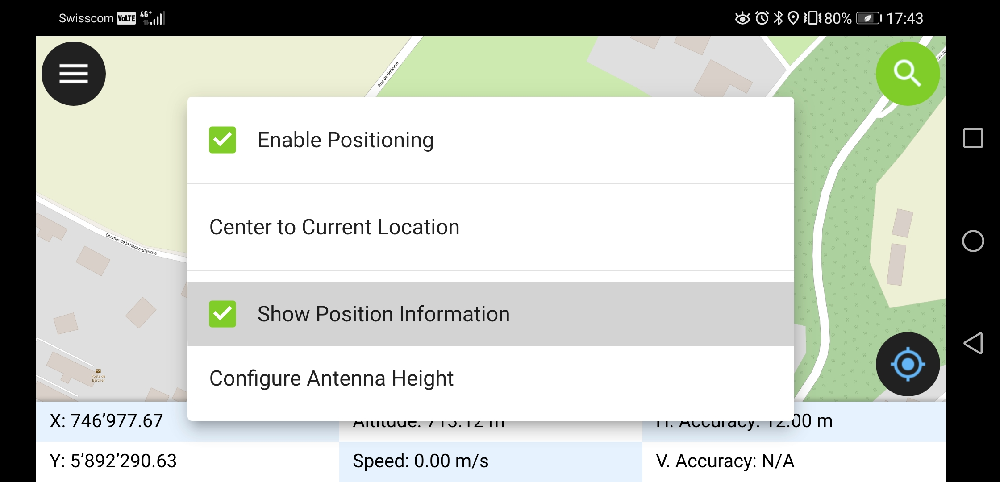

# GNSS

A short press on the GNSS button will turn on the GNSS and center to the
current location once positioning information is available.

Activate edit mode and press on the target button, the cross in the
center means it is using GNSS positioning.

!

A long press on the GNSS button will show the positioning menu.

Inside the positioning menu you can turn on the positioning display
which will show the current coordinates which are reprojected into the
project CRS along with precision information.

!

!!! note
    If you see WGS 84 lat/lon information instead of information in your
    project CRS, you probably have no signal yet.

## Using an external GNSS-Receiver

QField supports connecting external GNSS antennas via bluetooth.

In settings -> positioning, paired bluetooth devices can be scanned and
chosen as position source.

Make sure no other app like mock location providers are using the
bluetooth antenna.

## Mock location

It is possible to provide a mock location via a separate android app to
QField. There are several options for this, one of them is [Android NTRIP Client](https://play.google.com/store/apps/details?id=com.lefebure.ntripclient).

To use this you have to [enable mock locations on your Android device](https://www.youtube.com/watch?v=v1eRHmMiRJQ).

## High precision surveying and quality metadata

For more information how to setup high precision measurement and add
quality indication metadata to collected features, see the corresponding
`GNSS documentation<gnss_variables>`.
