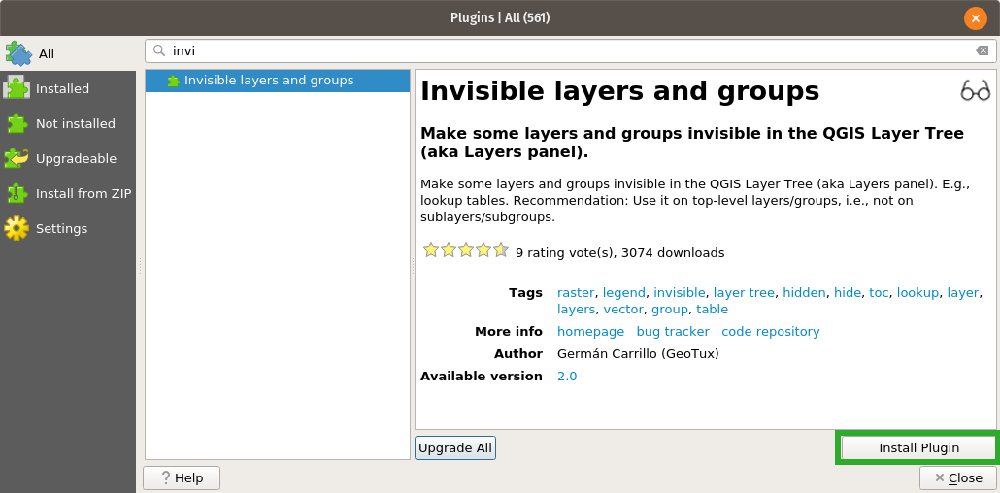
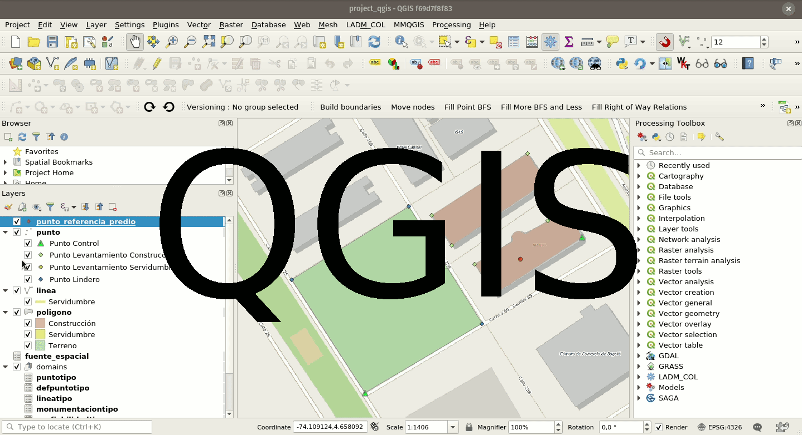

# Hiding legend nodes

It is possible to configure your QGIS projet to allow hiding legend nodes

## Configure hidden nodes
:material-desktop-mac:{ .device-icon } Desktop preparation

First, you should verify if the plugin *Invisible layers and
groups* is installed. If you don't have it installed, you can do it going
to *Plugins > Manage and install plugins > find Invisible layers and
groups > click in install plugin*.

!

When you finish the installation of the plugin, you will see in the QGIS
interface this buttons:

Once the installation process is finished, it is possible to start
hiding the nodes of the legend of our project.

1.  Choose the layers or groups that you want to hide.
2.  When you finish the layer/group selection, click *Make selected layers and groups invisible*. You will notice the selected layers
    and groups have disappear from the layers panel. They are still
    available in the project for visualization and joins, though.
3.  Save your project, you can use the section QFieldSync plugin to save
    your project, or save your geopackage and project in the same
    folder.
4.  Copy the files generated in your device.
5.  Open QField in your device, and you will see the configuration of
    hidden legend nodes.

!

!!! note
    If you want to see the hidden layers/groups again, click on show
    invisible layers and groups.
    
