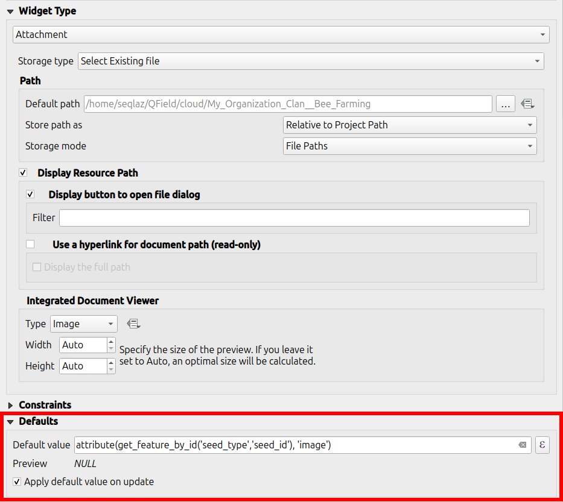
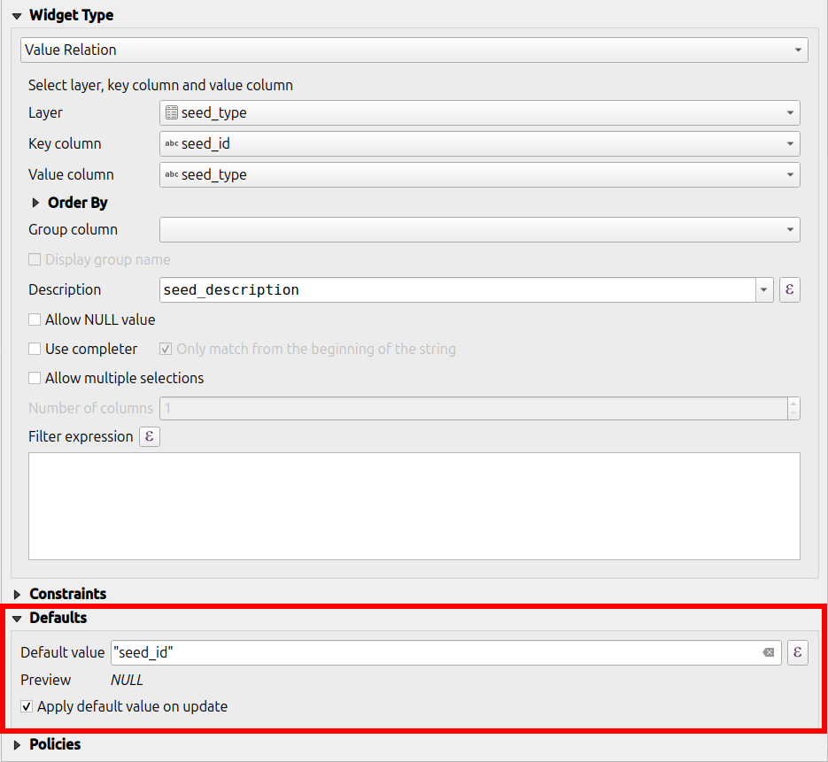

# Live default value

QField is supporting the "live" updating of default attribute value
when editing features.

## Configuration
:material-desktop-mac:{ .device-icon } Desktop preparation

To make it work, the attribute has to be set up with another attribute
dependency.

An example of attribute dependency settings

For an *image*:

!

For a *value relation*:

!

## Usage
:material-tablet-android:{ .device-icon } Fieldwork

"Live" default value is updating the default attribute values in real time when
editing features.

In the video below there is an example of "live" default value updates
when editing features on QField.

