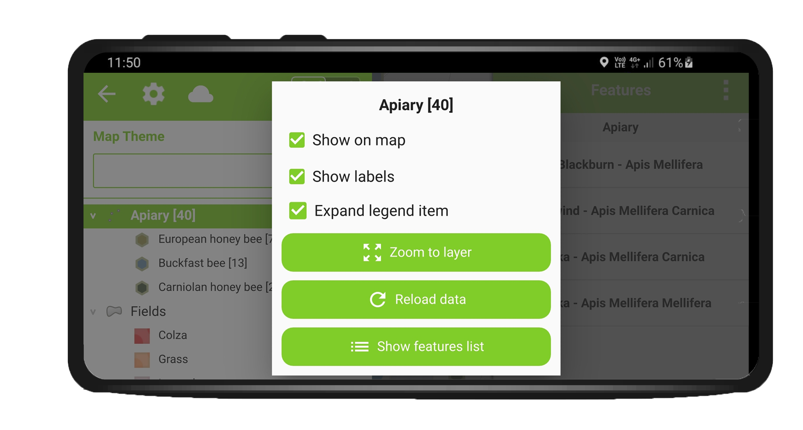
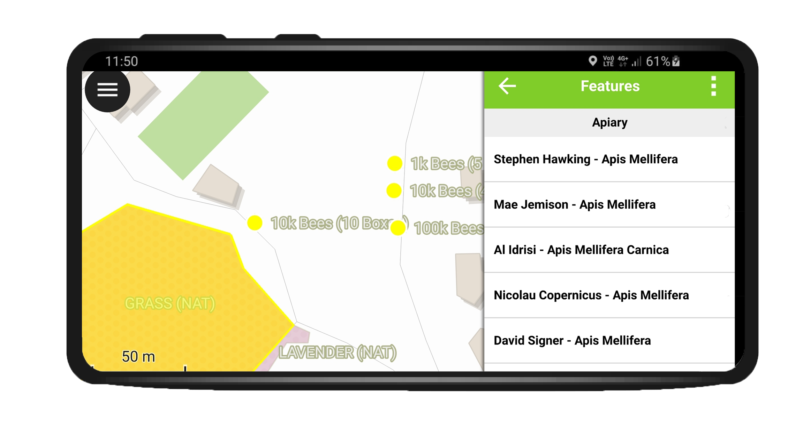
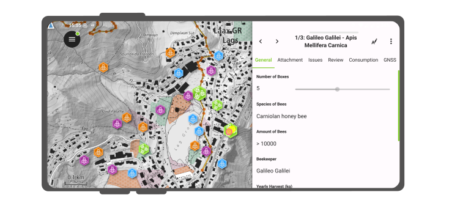
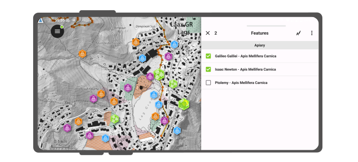
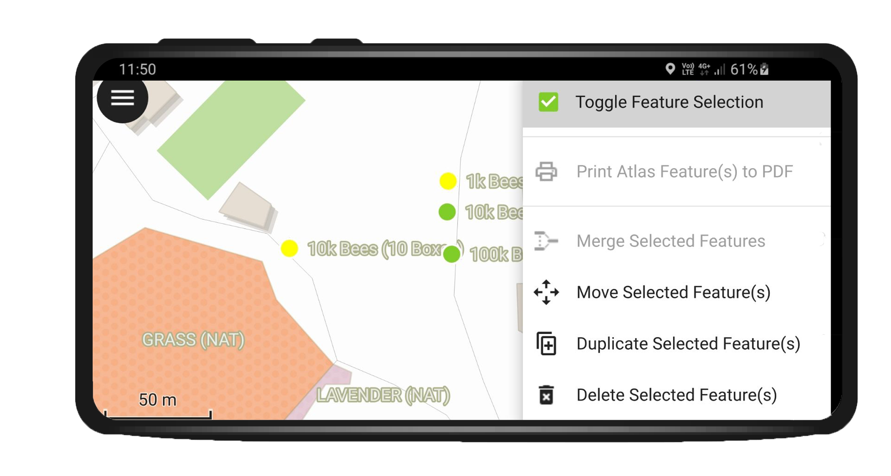

# Interact with the map

Here are described some of the possible interaction with the map possible in QField.

## Map legend
:material-tablet-android:{ .device-icon } Fieldwork

Open the *Main menu* and expend the layers list to display the legend
of the map.

On double-tap or long-press on a layer you get offered the following possibilities.

!

- *Show on map* to control visibility.
- *Show labels* to control the visibility of the labels.
- *Expand legend item* to show/hide the layer's sub-items.
- *Zoom to layer* to have all the layer items on the map.
- *Reload data* to get the current data of a layer with remote sources.
- *Show feature list* to show all the layer's features in the identification list.

## Identify features
:material-tablet-android:{ .device-icon } Fieldwork

Tap on a feature on the map to identify it. If several features are
located where you tapped (either because there are multiple features
really close one to another, or because several layers are overlapping),
they will all be listed in the menu that opens on the right of the
screen.

!

Tap on one of the listed feature to access its attributes.

1.  Tap the *arrows* to scroll through all the identified features.
2.  Tap the *centre button* to center the map on the selected feature.
3.  Tap the *edit button* to edit the attributes of the selected
    feature.
4.  Scroll through the *sub-menus* to access all the attributes.

!

### Select identified features

With long-press you can toggle the feature selection.

!

When features then are selected, you can perform the actions provided in the three-dot-menu on the top right.

!

### Exceptions to identified layers

Often it is not required to be able to query every layer. Some layers
are only present as basemap and their attributes are not of interest.

You can manage this layerlist in QGIS desktop in
*Project > Project Properties > Identify Layers* and uncheck the base layers.

## Measure tool
:material-tablet-android:{ .device-icon } Fieldwork

Open the *Main menu > Measure Tool*

