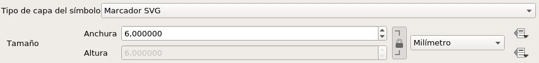
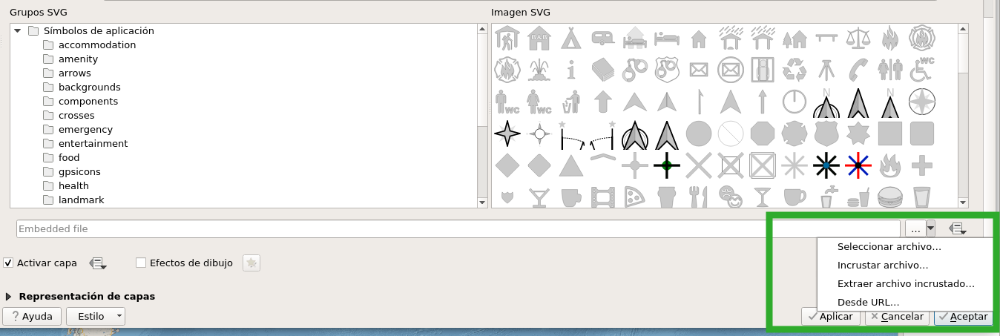
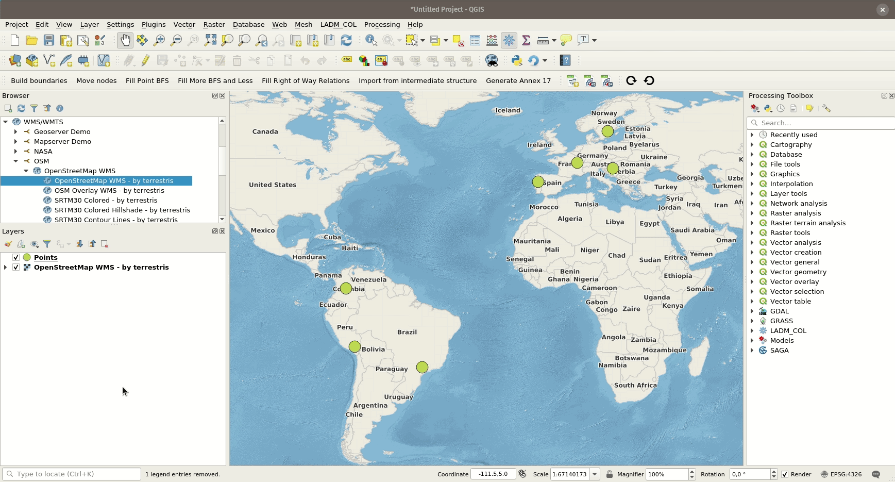

# Map styling

All style settings from QGIS are directly supported by QField. This
includes all renderer types like graduated, categorized, rule based,
2.5D as well as data defined symbology.

## Display Expression
:material-desktop-mac:{ .device-icon } Desktop preparation

In QField, objects are identified with a name. The expression to
generate this name can be defined by opening the attribute table in QGIS
and switching to the form view. Choose the appropriate field or an
expression in the list there. Starting from QGIS 3, this can be done
directly from the
*Vector Layer Properties > Display*{.interpreted-text
role="menuselection"} page.

The display expression is also used to search in layers.

!

## Read only, non-identifiable and searchable layers
:material-desktop-mac:{ .device-icon } Desktop preparation

Some layers in a project are just there for pure visual purpose. Such
layers should not show up when a user taps somewhere to identify
objects.

Some other layers serve as source of information and shouldn't be
modified by the user. It is possible to protect layers from editing
attributes or adding and deleting features.

It is also possible to configure which layers are searchable.

To configure identify, readonly and searchable behavior, go to the
*Project > Project Properties > Identify Layers*
page and activate the checkboxes to match your
desired behavior.

!

## Using additional fonts
:material-desktop-mac:{ .device-icon } Desktop preparation

In QField, you are able to use all the fonts you want.

There are two different possibilities to register additional fonts:

1.  By adding fonts (.ttf or .otf) on the device in the folder `<drive>:/Android/data/ch.opengis.qfield/files/QField/fonts` those will be made accessible to all projects and individual datasets.
2.  By adding fonts (.ttf or .otf) in the same folder as a given project
    file (.qgs or .qgz); those will be accessible only when viewing that
    project file.

!!! note
    Since QField 2 the font files needs to be stored in the app directory `<drive>:/Android/data/ch.opengis.qfield/files/QField/fonts` instead of the devices main directory `<drive>:/QField/fonts`.

## Custom SVG symbols
:material-desktop-mac:{ .device-icon } Desktop preparation

It is possible to embed SVG symbols directly within a QGIS projects.

1.  Choose the layer which will support SVG symbology and open its
    properties dialog.
2.  Open the section Symbology in *Properties > Symbology*
3.  In the *Symbol Layer Panel* choose *Simple marker*.
!
4.  Change the Symbol layer type in *Symbol layer type > SVG marker*`*.
!
5.  Scroll down the bottom panel.
6.  Click on the right side of the file selection button to open the
    drop down menu.
!
7.  Select Embed File and choose the SVG file in the file selection
    dialog.
8.  Apply the changes and click OK.
!
