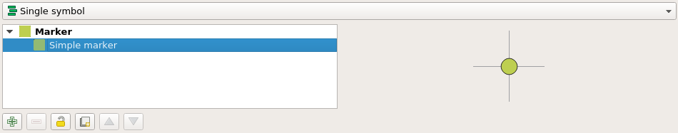

# Map styling

All style settings from QGIS are directly supported by QField.
This includes all renderer types like graduated, categorized, rule based,
2.5D as well as data defined symbology.

## Display Expression
:material-monitor: Desktop preparation

In QField, objects are identified with a name, which can be customised using expressions.

1. Open the attribute table in QGIS and switch to the form view.
2. Direct to *Vector Layer Properties > Display > Attribute*.

The display expression is also used to search in layers.

!

## Read only, non-identifiable and searchable layers
:material-monitor: Desktop preparation

Some layers in a project are just there for pure visual purpose.
Such layers should not show up when a user taps somewhere to identify objects.

Some other layers serve as source of information and shouldn't be modified by the user.
It is possible to protect layers from editing attributes or adding and deleting features.

It is also possible to configure which layers are searchable.

1. Direct to *Project > Properties > Data Sources* and activate the checkboxes to match your desired behavior.

!

## Using additional fonts
:material-monitor: Desktop preparation

QField enables you to use all the custom fonts you might want and need.
There are two different possibilities to register additional fonts:

**Addition of fonts through the local directory**

1. Direct to *Main Menu* > *About QField (accessible through the three dots)* to locate your local directory path.
2. Copy your font file (.ttf or .otf) in the directory `[App Directory]/QField/fonts`.
Those will be made accessible to all projects and individual datasets.

!

**Addition of fonts in subfolder of QGIS file**

1. Create a subfolder called **fonts** inside the same folder where your given project file (`.qgs` or `.qgz`). is stored. Those fonts will **only** be accessible when viewing that project.

## Custom SVG symbols
:material-monitor: Desktop preparation

It is possible to embed SVG symbols directly within a QGIS project.

1.  Choose the layer which will support SVG symbology and open its properties dialog.
2.  Open the section Symbology in *Properties > Symbology*
3.  In the *Symbol Layer Panel* choose *Simple marker*.
!
4.  Change the SymbSol layer type in *Symbol layer type > SVG marker*.
!
5.  Scroll down to the bottom panel.
6.  Click on the right side of the file selection button to open the drop down menu.
!
7.  Select ***Embed File*** and choose the SVG file in the file selection dialog.
8.  Apply the changes and click **OK**.
!
