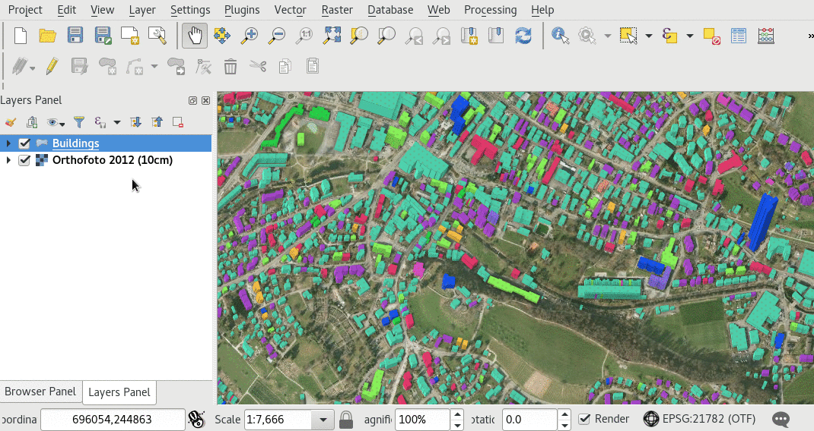
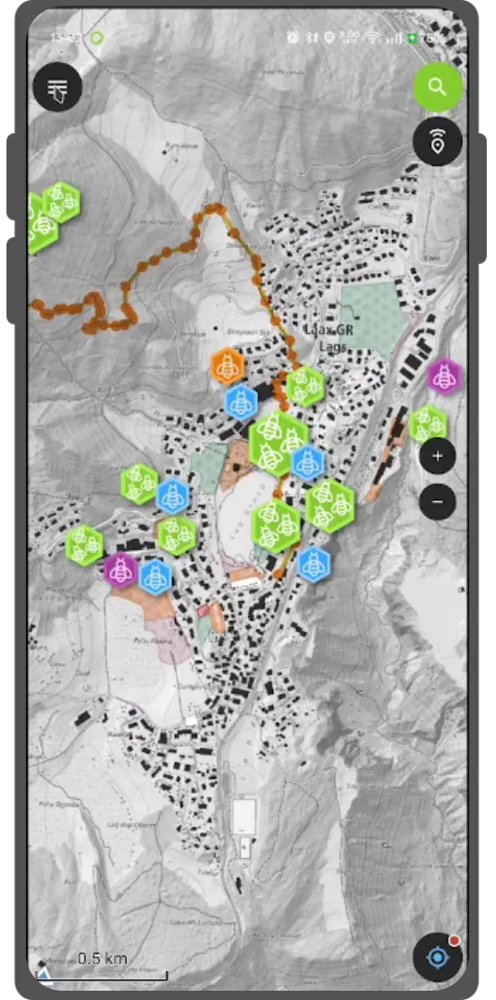

# Map themes
The beautiful thing about GIS is that maps are dynamic. Layers can
individually be shown and hidden and information can be presented more
or less prominently based on the task at hand.

This is what *Map Themes* are for.

## Creating a Map Theme
:material-desktop-mac:{ .device-icon } Desktop preparation

Creating a Map Theme in QGIS is a very simple task.

!

1.  Style the map and layers to your requirements
2.  Save it as a named Map Theme
3.  Load the project on your device and change the active Map Theme

## Change the active Map Theme
:material-tablet-android:{ .device-icon } Fieldwork

If you defined map themes for your project in QGIS, you can switch
between them from the Dashboard. Use the *Map Themes* combobox to chose
the active theme.

!
