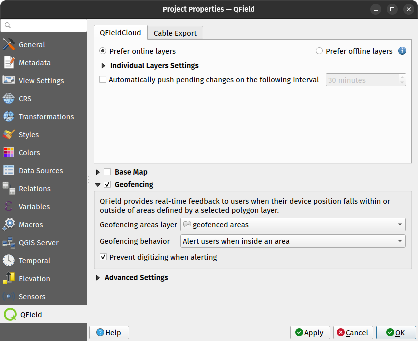

# Geofencing

QField includes built-in geofencing functionality to alert or inform users when their GNSS location enters or exits predefined polygon boundary areas.
You can also prohibit feature digitizing when a geofencing alert is active.
Configure geofenced boundaries in QGIS using QFieldSync.

## Defining Geofenced Areas
:material-monitor: Desktop preparation

!!! Workflow
    1. In QGIS, navigate to _Project > Properties... > QField_.
    2. Enable the **"Geofencing"** option.
    3. Select the polygon vector layer to use as a geofence boundary.
    4. Select a geofencing behavior:
        - **"Alert users when inside an area":** Displays an alert notification whenever a user enters a defined geofence polygon.
        - **"Alert users when outside all areas":** Displays an alert notification whenever a user exits defined geofence polygons.
        - **"Inform users when entering and leaving areas":** Displays notifications whenever a user enters or exits defined geofence polygons.
    5. (Optional) Enable options to prohibit adding new features inside or outside the selected geofence area.

!

## Geofencing Alerts in the Field
:material-tablet: Fieldwork

When QField triggers a geofencing alert, a glowing red circle displays in the bottom-right corner of the screen.
This visual cue remains active until the alert condition ends.
On supported mobile devices, haptic vibration alerts accompany on-screen notification messages indicating which geofenced areas were entered or exited.

When digitizing restrictions are enabled, QField automatically hides the digitizing toolbar while a geofencing alert is active to prevent accidental data entry outside or inside designated zones.
