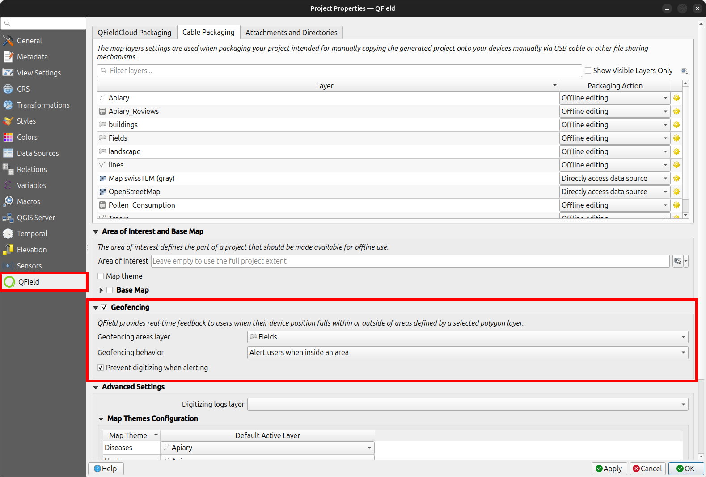

# Geofencing

QField has a built-in geofencing functionality that can alert or inform users when the position provided by their GNSS device enters and/or leaves areas defined through polygon features.
Digitizing of new features can also be prohibited when a geofencing alarm is turned on.
Defining geofenced areas on QGIS happens with the help of the QFieldSync plugin.

## Defining geofenced areas

!!! Workflow

     :material-monitor: Desktop preparation

     1. *Project* > *Project Properties* > *QField*
     2. Check the checkbox where it says "Geofencing"
     3. Select the polygon layer that you wish to use as a "fence"
     4. Select further the geofencing behaviour.
     There exist to options by default:
         - **Alert users when inside an area**: Whenever a user is entering one of the areas that define the geofenced area, the user will get a notification at the bottom of the screen.
         - **Alert users when outside all areas**: Whenever a user is stepping outside the area that define the geofenced area, the user will get a notification at the bottom
         - **Inform users when entering and leaving areas**: A combination of the two other options.
    !

     5. Check the checkbox if you do not want the users to add new features within (1st option) or outside (2nd option) of the selected area.

When QField turns its geofencing alert on, a glowing read circle will appear at the bottom right corner of your device's screen.
The visual queue will remain on the screen until the alert is turned off based on your selected behaviour.
In addition, on devices that supports vibration, a tactile alert will occur alongside a message informing users of which areas has been trespassed into.

If you enabled the digitizing prevention checkbox, you will notice that QField's digitizing toolbar will disappear while in alert mode to clearly inform users of the ongoing prohibition and avoid accidental data entry.
