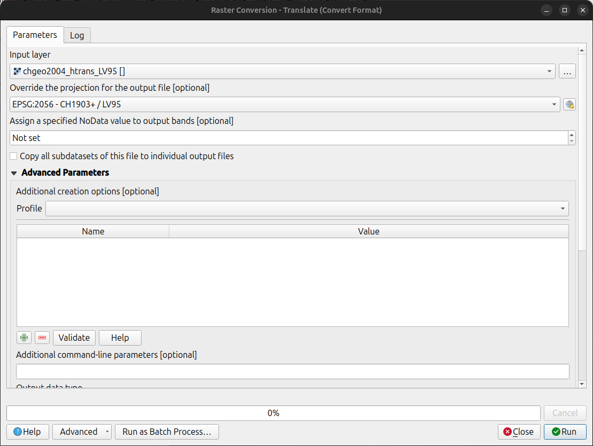
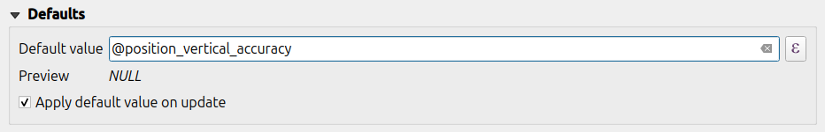
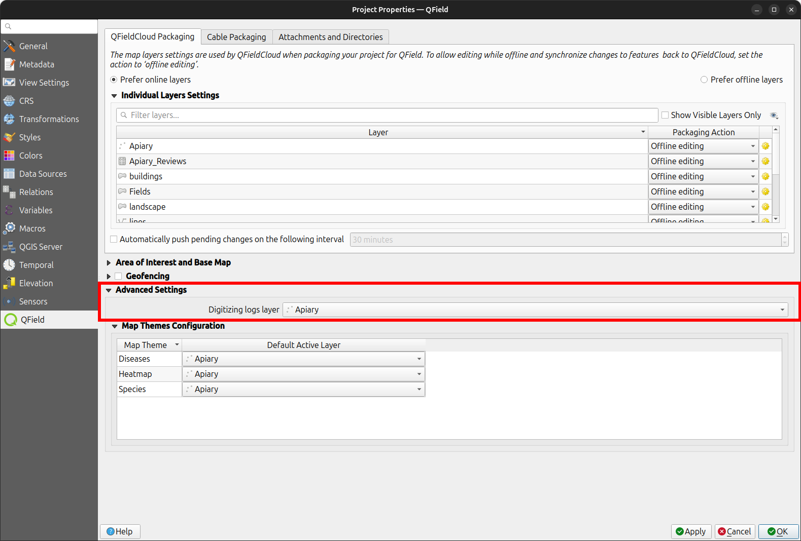
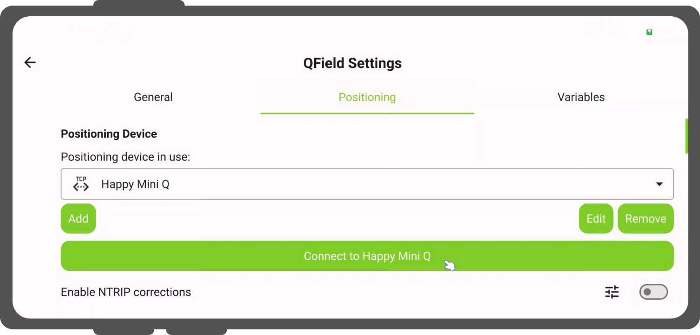

# Positioning (GNSS)

QField displays live positioning data using several sources:

- Internal mobile device GNSS (GPS, GLONASS, Galileo, or BeiDou), typically offering 5 m accuracy.
- External GNSS receivers via NMEA streams over Bluetooth, TCP, UDP, or serial connections, typically offering 1.5 m accuracy.
- External GNSS receivers with real-time NTRIP RTK corrections, providing centimeter-level accuracy.

!!! Tip
    Use an external GNSS antenna for high-accuracy surveying, as internal mobile GNSS hardware is limited to roughly 5 meters of accuracy.
    External receivers also provide accurate elevation measurements alongside 2D coordinates.

!!! Note
    QField requires external GNSS devices to output positioning data in the `EPSG:4326` (WGS 84) coordinate reference system.
    Customized device output CRSes are not supported and will cause coordinate shifts.

## Visualization

When positioning is active, QField displays your current location in blue on the map canvas:

- A blue dot represents your location when stationary.
- An arrow indicates your movement direction while traveling.
- A directional light beam indicates device compass orientation (when supported by internal magnetic compass hardware).
- A shaded circular buffer represents reported positioning precision.

## Configuration

Configure positioning parameters in QField settings under the **"Positioning"** tab.

!!! Workflow
    1. Open the **Side Dashboard** and tap the gear icon to open **Settings**.
    2. Switch to the **"Positioning"** tab.

### Enable NTRIP Corrections

QField functions as an RTK client to process differential corrections when connected to an RTK provider over NTRIP.

!!! Workflow
    1. Enable Bluetooth on your mobile device and pair your external GNSS receiver.
    2. In QField positioning settings, select and connect to your external receiver.
    3. Toggle the NTRIP connection switch.
        !
    4. Tap the gear icon next to the NTRIP switch and enter your RTK service credentials.
        !
    5. Save parameters and verify data transmission indicators (arrows display active data streaming).
        !

### Show Position Information

Lock the crosshair to your GNSS location to place vertices precisely at your position.
Select one of three position-following modes:

!

- **Follow position only:** Centers the map canvas on your location while keeping map orientation fixed.
- **Follow position and compass orientation:** Centers the map canvas and rotates the map so compass heading points up.
- **Follow position and your movement direction:** Centers the map canvas and rotates the map along your travel direction.

!!! Workflow
    1. Enable positioning.
    2. Tap the crosshair button on the map canvas to lock to your current position.

### Measure (M) Value

When digitizing features on vector layers with `M` coordinate dimensions, QField records measurement values for vertices digitized while locked to GNSS positioning.

By default, the `M` value records timestamps in milliseconds since epoch.
Change the `M` value source in positioning settings:

- Timestamp
- Ground speed
- Bearing
- Horizontal and vertical accuracy
- PDOP, HDOP, and VDOP

### Accuracy Requirement

Set minimum accuracy thresholds for feature digitizing.
Positioning quality displays using color-coded indicators (red for bad, yellow for ok, green for excellent) on the GNSS button.

!

Set accuracy thresholds in positioning settings.

!!! Note
    When **"Enable accuracy requirement"** is active, QField blocks digitizing vertices locked to GNSS positioning while accuracy indicators are red.

### Antenna Height Compensation

Enter antenna pole heights in positioning settings.
QField subtracts the antenna pole height from measured GNSS elevation values automatically.

### Altitude Correction and Vertical Grid Shift

Correct ellipsoidal heights to orthometric elevations using vertical grid shift files.

Place vertical grid shift files in the  QField app folder **[[App Directory]](../../how-to/project-setup/storage.md#5-qfield-app-directory)/QField/proj**.

Once installed, select the file under **"Vertical grid shift in use"** in positioning settings.
When using vertical grid shifts with external receivers, disable **"Use orthometric altitude from device"**.

Supported grid shift file formats include:

- GeoTIFF (`.tif`, `.tiff`)
- NOAA Vertical Datum (`.gtx`)
- NTv2 Datum Grid Shift (`.gsb`)
- Natural Resources Canada Geoid (`.byn`)

#### Example: Netherlands (ETRS89 to NAP)

!!! Workflow
    1. Download the official `nlgeo2018.gtx` grid file from the [NSGI Website](https://www.nsgi.nl/rdnaptrans). <!-- markdown-link-check-disable-line -->
    2. Copy the `.gtx` file into `[App Directory]/QField/proj`.

#### Example: Switzerland (CH1903+ / LV95)

!!! Workflow
    1. Download the Geoid OGD dataset from the [Swisstopo Geoid Download Page](https://cms.geo.admin.ch/ogd/geodesy/Geoid_OGD.zip). <!-- markdown-link-check-disable-line -->
    2. Extract `chgeo2004_htrans_LV95.agr` from the downloaded archive.
    3. Convert `.agr` to `.gtx` using QGIS:
        - **In QGIS GUI:** Open _Processing Toolbox > GDAL > Raster conversion > Translate (Convert format)_. Select `chgeo2004_htrans_LV95.agr` as input and save as `chgeo2004_htrans_LV95.gtx`.
            !
        - **Using terminal command:**
            ```bash
            qgis_process run gdal:translate --INPUT="/path/to/chgeo2004_htrans_LV95.agr" --OUTPUT="/path/to/chgeo2004_htrans_LV95.gtx"
            ```
        - **Using Python script:**
            ```python
            import processing
            processing.run("gdal:translate", {
                'INPUT': '/path/to/chgeo2004_htrans_LV95.agr',
                'OUTPUT': '/path/to/chgeo2004_htrans_LV95.gtx'
            })
            ```

:material-tablet: Fieldwork

!!! Workflow
    1. Copy `chgeo2004_htrans_LV95.gtx` into `[App Directory]/QField/proj` on your mobile device.
    2. Open the **Side Dashboard** and navigate to _Settings > Positioning_.
        !
    3. Select your grid file under **"Vertical grid shift in use"**.
    4. Enable positioning.
    5. Switch to digitize mode and tap the GNSS crosshair button to lock location.
        
    6. Long-press the **GNSS button** and toggle **"Show position information"** to inspect reprojected coordinates, altitude, and precision values.
        !

!!! Note
    Displaying raw WGS 84 coordinates instead of project CRS coordinates indicates that a valid GNSS fix has not yet been established.

## Positioning Variables

Store internal and external GNSS positioning details in attribute fields using QGIS expression variables.
Variables are commonly assigned as default values to record positioning quality metadata.

For example, record horizontal accuracy using `@position_horizontal_accuracy`.
Refer to the [Expression Variables Reference](../../reference/expression_variables.md) for a complete list.

Elevation handling based on vertical grid shift settings (with antenna compensation disabled):

| Vertical Grid Shift in use | point Z Value z(geometry) | GNSS Device z(@position_coordinate) | QField Display | QField Label                |
|----------------------------|---------------------------|--------------------------------------|----------------|-----------------------------|
| None                       | Z ellipsoidal device value| Z ellipsoidal device value           | Z ellipsoidal device value | Altitude: xxx.xxxx m       |
| Orthometric from device    | Z orthometric device value| Z orthometric device value           | Z orthometric device value | Altitude: xxx.xxxx m (ortho.) |
| USER_Shift_Grid.GTX <br> [vertical grid shift](#altitude-correction-vertical-grid-shift)        | Z shiftgrid value         | Z ellipsoidal device value           | Z shiftgrid value          | Altitude: xxx.xxxx m (grid) |

### Capturing Coordinates in Attribute Forms

Store longitude, latitude, and altitude automatically in feature forms using default expressions:

!!! Workflow
    1. In QGIS, navigate to _Vector Layer Properties... > Attribute Form_.
    2. Add decimal fields for coordinate storage (such as `longitude`, `latitude`, `altitude`).
    3. Assign default value expressions:
        - **Longitude:** `x(@position_coordinate)`
        - **Latitude:** `y(@position_coordinate)`
        - **Altitude:** `z(@position_coordinate)`

Coordinates populate automatically when digitizing new features while locked to GNSS positioning.

### Vertex Log Layer

Create a dedicated vertex log layer to record metadata for every digitized point:

!!! Workflow
    1. Add a point vector layer to your QGIS project with attribute fields configured for positioning variables.
        !
    2. Assign the **"digitizing logger"** role to the layer under _Project > Properties... > QField_.
        !
    3. Assign default expressions to log fields using `@position_*` variables.

## Using an External GNSS Receiver
:material-tablet: Fieldwork

QField supports external GNSS receivers over Bluetooth, TCP, UDP, and serial connections.

Manage and switch between positioning devices in the **"Positioning"** settings menu.

!

Supported receiver connection interfaces by operating system:

|             | :material-android: Android | :material-apple: iOS | :material-microsoft-windows: Windows | :material-linux: Linux | :material-apple: MacOS |
|-------------|----------------------------|----------------------|--------------------------------------|------------------------|------------------------|
| Bluetooth   | :material-check:           | :material-check:     |                                      | :material-check:       | :material-check:       |
| TCP         | :material-check:           | :material-check:     | :material-check:                     | :material-check:       | :material-check:       |
| UDP         | :material-check:           | :material-check:     | :material-check:                     | :material-check:       | :material-check:       |
| Serial port | :material-check:           |                      | :material-check:                     | :material-check:       | :material-check:       |

*(\*) Windows supports Bluetooth receivers via virtual COM serial ports created by the operating system.*

Supported NMEA sentences include GGA, RMC, GSA, GSV, GST, VTG, HDG, and HDT.

### External Receiver Logging

When connected to an external receiver, enable **"Log NMEA sentences from device to file"** to log raw NMEA sentences.
Logs save to **[[App Directory](../../how-to/project-setup/storage.md#5-qfield-app-directory)]/QField/logs**..

!

!!! Note
    Disable NMEA logging when troubleshooting is complete to prevent filling device storage.

## Mock Location
:material-tablet: Fieldwork

Provide positioning data to QField using third-party Android mock location apps (such as [Lefebure NTRIP Client](https://play.google.com/store/apps/details?id=com.lefebure.ntripclient)).
[Enable mock location](https://www.youtube.com/watch?v=v1eRHmMiRJQ) options in Android developer settings to use external mock location providers.

## Averaged Positioning Functionality
:material-tablet: Fieldwork

QField supports averaged positioning to calculate vertex locations across multiple sample fixes.

!!! Workflow
    1. Open the **Side Dashboard** and navigate to _Settings > Positioning_.
    2. Configure **"Averaged positioning minimum count"**.
        !
    3. Lock the coordinate cursor to your current position.
    4. Press and hold the **Add Vertex** button to begin averaging samples.
    5. A progress indicator displays the collected sample count until the minimum count requirement is satisfied and the vertex commits.

!

!!! Note
    Using `@gnss_*` or `@position_*` variables with averaged positioning records average values across all collected samples.
