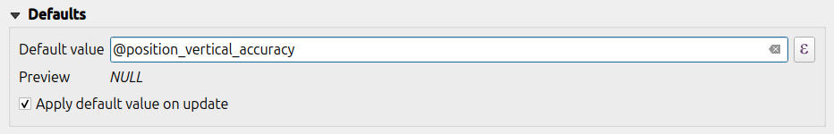
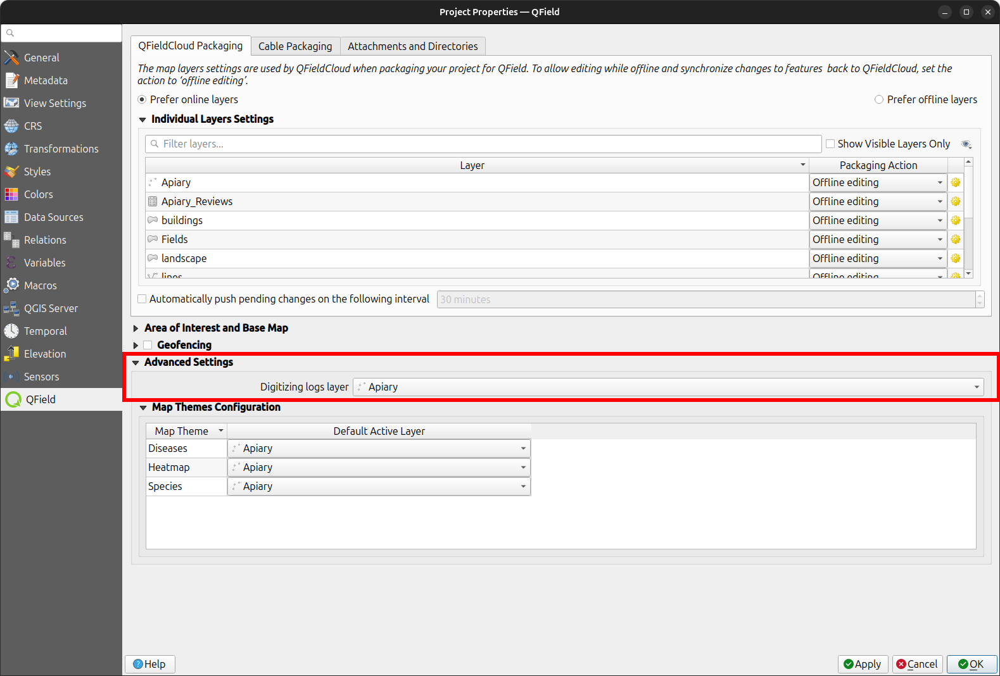

# Positioning (GNSS)

QField can make use of the internal GNSS (Global Navigation Satellite
System, like GPS, GLONASS, Galileo or Beidou). QField can also connect
to external antennas through NMEA streams over Bluetooth, TCP, or UDP
connection.

GNSS devices are also capable of measuring the altitude next to the current 2D
position on the earth surface.

## Visualization

When positioning is activated, your position will be shown in blue on the map.
Your location is visible either as a blue dot if you are still or as an arrow indicating your movement direction
if you are moving.

The blue beam indicates the current orientation of your device if the device has
a builtin magnetic compass.

A circle around your current position indicates the precision as reported by the
positioning device.

## Configuration

The following settings are available in QField settings' positioning tab.

### Measure (M) value

When digitizing a geometry onto a vector layer that contains an M dimension,
QField will add a measurement value to individual vertices whenever the
coordinate cursor is locked to the current position.

By default, the value will represent the captured position's timestamp (milliseconds
since epoch). You can change this value using the combo box in the settings'
positioning tab.

The available values to chose from are timestamp, ground speed, bearing, horizontal
accuracy and vertical accuracy as well as PDOP, HDOP and VDOP.

### Accuracy requirement

A minimum desired accuracy for measurements can be defined. The quality
will be reported in three classes, bad (red), ok (yellow) and excellent
(green). These colors will show up as a dot on top of the GNSS button.

The thresholds can be defined in the settings' positioning tab.

If the *Enable accuracy requirement* setting is activated, you will not
be able to collect new measurements with the coordinate cursor locked to
the current position with an accuracy value which is bad (red).

### Antenna height compensation

The height of the antenna pole in use can be defined in the settings.
Any measured altitude will be corrected by this value.

### Altitude correction / vertical grid shift

Altitude values can be corrected with vertical grid shift files to
calculate orthometric height.

Vertical grid shift files have to be made available to QField by putting
them into the QField app folder **[[App Directory](../../get-started/tutorials/get-started-qfs.md#package-for-qfield))]/QField/proj**.

Once the grid shift file is placed there, it is available in QField in
the *Positioning settings* under *Vertical grid shift in use*.

If you are using altitude correction and an external positioning device
is used, consider turning *Use orthometric altitude from device* off.

The formats currently supported are:

- GeoTIFF (.tif, .tiff)
- NOAA Vertical Datum (.gtx)
- NTv2 Datum Grid Shift (.gsb)
- Natural Resources Canada's Geoid (.byn)


!!! Workflow

    **Example:  Netherlands - ETRS89 to NAP**

    For transformations involving the Dutch **NAP (Normaal Amsterdams Peil)** vertical datum, you'll need the official grid file from NSGI.

    1. **Download the file**: Get `nlgeo2018.gtx` directly from the [NSGI website](https://www.nsgi.nl/rdnaptrans).<!-- markdown-link-check-disable-line -->
    2. Place the downloaded `.gtx` file into the directory **[App Directory](../../get-started/tutorials/get-started-qfs.md#package-for-qfield)/QField/proj**.
    This is independent of whether you are using QFieldCloud or not.

    **Example: Switzerland - CH1903+/LV95**

    To get precise altitude data for **Cadastral Surveying in Switzerland (LV95)**, you must use the geoid correction grid from Swisstopo.
    The official file comes in an `.agr` format and must be converted to `.gtx` (NTv2 Grid Shift File) before it can be used.
    Other raster formats like (.tiff) can also be used.

    1. Download the "Geoid OGD" dataset from Swisstopo under the following link **Download Link**: [Geoid OGD from Swisstopo](https://cms.geo.admin.ch/ogd/geodesy/Geoid_OGD.zip)<!-- markdown-link-check-disable-line -->.
    2. Unzip the archive to retrieve the file: `chgeo2004_htrans_LV95.agr`.
    3. Convert the file using the using the [gdal_translate](https://gdal.org/en/stable/programs/gdal_translate.html) algorithm with one of the following options:

        ***Method 1: QGIS Graphical User Interface (GUI)***

        1. In QGIS, open the Processing Toolbox panel.
        2. Navigate to *GDAL* > *Raster conversion* > *Translate (Convert format)* tool.
        3. Configure it with your needed requirements:
            - **Input layer**: Select your `chgeo2004_htrans_LV95.agr` file.
            - **Output file**: Click "Save to File..." and name your output file with a `.gtx` extension (or other format needed), for example, `chgeo2004_htrans_LV95.gtx`.
        4. Click **Run**. The other default settings are typically sufficient for this conversion.

        !

        **Method 2: Command Line (`qgis_process`)**

        For automation or users who prefer the command line, `qgis_process` is a great option.

        1. Open your terminal and run the following command, adjusting the paths to your files.
        ```bash
        qgis_process run gdal:translate --INPUT="/path/to/your/chgeo2004_htrans_LV95.agr"
            --OUTPUT="/path/to/your/chgeo2004_htrans_LV95.gtx"
        ```

        ***Method 3: PyQGIS Script***

        You can also perform the conversion programmatically within the QGIS Python Console or a standalone script.

        ```python
        import processing

        input_grid = '/path/to/your/chgeo2004_htrans_LV95.agr'
        output_grid = '/path/to/your/chgeo2004_htrans_LV95.gtx'

        processing.run("gdal:translate", {
            'INPUT': input_grid,
            'OUTPUT': output_grid
        })

        print(f"Successfully converted grid to: {output_grid}")
        ```

    :material-tablet: Fieldwork

    1. Copy the `chgeo2004_htrans_LV95.gtx` file to the directory **[App Directory](../../how-to/project-setup/storage.md#5-qfield-app-directory)/QField/proj** on your mobile device.

    2. Open the Site Dashboard
    3. Tap on the 3-dotted menu *(⋮)* and direct to *Settings* > *Positioning*

        !

    4. Enable your GNSS device.
    It will directly center to your current location once the **positioning information** is available.

    5. Change to ***edit mode*** and press on the target button - the cross in the center means it is using GNSS positioning.

        !

        A long press on the **GNSS button** will show the **positioning menu**.
        Inside the menu you can turn on the **Show position information** which will show the current coordinates that are reprojected into the CRS of your project along with the precision information.

     !

    !!! note
        If you see WGS 84 lat/lon information instead of information in your project CRS, you probably have no signal yet.

## Positioning variables

You can get the positioning information both of your internal and external device by specifically configuring your attribute form.

These variables are commonly used as part of [default values expressions](https://docs.qgis.org/latest/en/docs/user_manual/working_with_vector/vector_properties.html#default-values)<!-- markdown-link-check-disable-line -->
for fields to keep track of the quality of individual measured points.

A common use case is recording the horizontal accuracy, which can be done by using the variable `@position_horizontal_accuracy`.
For a complete listing of all available variables, refer to the [expression variables reference documentation](../../reference/expression_variables.md).

Information for GNSS Z value with Vertical grid shift in use:
- *Antenna height compensation=False*

| Vertical Grid Shift in use | point Z Value z(geometry) | GNSS Device z(@position_coordinate) | QField Display | QField Label                |
|----------------------------|---------------------------|--------------------------------------|----------------|-----------------------------|
| None                       | Z ellipsoidal device value| Z ellipsoidal device value           | Z ellipsoidal device value | Altitude: xxx.xxxx m       |
| Orthometric from device    | Z orthometric device value| Z orthometric device value           | Z orthometric device value | Altitude: xxx.xxxx m (ortho.) |
| USER_Shift_Grid.GTX <br> [vertical grid shift](#altitude-correction-vertical-grid-shift)        | Z shiftgrid value         | Z ellipsoidal device value           | Z shiftgrid value          | Altitude: xxx.xxxx m (grid) |

### Capturing longitude, latitude and altitude in attribute form

It is useful and not uncommon that the actual positioning values should be automatically stored inside the attribute form.
This applies for longitude, latitude and altitude.

!!! Workflow

    **Configuration of attribute form**

    1. In QGIS direct to your *Layer Properties* > *Attribute Form*
    2. (Optional): You have to add a field of decimal type to the form that can capture the data.
    Name it accordingly (eg. "longitude")
    3. Under the settings of the widget display of the corresponding field add the following default value:

        - ***Longitude:*** `x(@position_coordinate)`
        - ***Latitude:*** `y(@position_coordinate)`
        - ***Altitude:*** `z(@position_coordinate)`

    This will save the coordinate directly in the field when adding a new feature.

    !!! Note
        This only works if positioning is turned on.

### Vertex log layer

It is good practice to create a log layer of the collected vertices.
It enables you to keep track of the meta data for each vertex like [GNSS quality attributes](../../reference/expression_variables.md) and more.

!!! Workflow

    1. Add a point layer to the project and attributes configured to store this information.
        !
    2. Assign the role *digitizing logger* to a point layer.
    3. Go to > *Project* > *Properties...* > *QField*.
        !
    4. Set default values to the attributes using the positioning variables mentioned above.

## Using an external GNSS Receiver
:material-tablet: Fieldwork

QField supports connecting to external GNSS positioning devices via NMEA streams through Bluetooth, TCP,
or UDP connections.

Under the **Positioning** section, you are able to manage and switch between your internal and saved external GNSS devices.

!

The breakdown of connections support by platform is as follow:

|             | :material-android: Android | :material-apple: iOS | :material-microsoft-windows: Windows | :material-linux: Linux | :material-apple: MacOS |
|-------------|----------------------------|----------------------|--------------------------------------|------------------------|------------------------|
| Bluetooth   | :material-check:           |                      | *                                    | :material-check:       | :material-check:       |
| TCP         | :material-check:           | :material-check:     | :material-check:                     | :material-check:       | :material-check:       |
| UDP         | :material-check:           | :material-check:     | :material-check:                     | :material-check:       | :material-check:       |
| Serial port | :material-check:           |                      | :material-check:                     | :material-check:       | :material-check:       |

*(\*) Bluetooth support on Windows occurs through the virtual serial port automatically
created by the operating system when it connects to the GNSS device.*

The NMEA sentences currently supported are GGA, RMC, GSA, GSV, GST, VTG, HDG and HDT.

!!! note
    Make sure no other app like mock location providers are using the same connection.

### External receiver log

If you have selected an external receiver as the positioning device, you will find a switch `Log NMEA sentences from device to file`.
If this is activated, all NMEA sentences coming from external positioning devices will be logged to a file.

The logs will be placed in **[[App Directory](../../how-to/project-setup/storage.md#5-qfield-app-directory)]/QField/logs**.

!

!!! note
    Be aware that if the log is always turned on, it will fill up all the storage.


## Mock location
:material-tablet: Fieldwork

It is possible to provide a mock location via a separate android app to
QField. There are several options for this, one of them is [Android NTRIP Client](https://play.google.com/store/apps/details?id=com.lefebure.ntripclient).

To use this you have to [enable mock locations on your Android device](https://www.youtube.com/watch?v=v1eRHmMiRJQ).

## Averaged positioning functionality
:material-tablet: Fieldwork

!!! note
    The coordinate cursor must be locked to the current location via the [Lock to position button](../../how-to/data-collection/digitize.md#adding-point-features)

There is a function that allows you to digitize using averaged positions.

The survey will start by pressing and holding the add vertex button, which will start collecting positions.

During the collection, an indicator will appear on top of the coordinate cursor showing the number number of the collected positions.
If an averaged position minimum count requirement is active, a progress bar will also be present indicating the progress towards meeting that requirement.

!

1. To activate direct to  side *"Dashboard"* > *Settings* > *Positioning*
2. Shortly tap where you want to collect points and QField will automatically add the averaged position once the minimum count is met.
!

!!! note
    When using [`@gnss_*` or `@position_` variables](./gnss.md#positioning-variables) on averaged positions, the variable will also represent the average over all collected samples.
