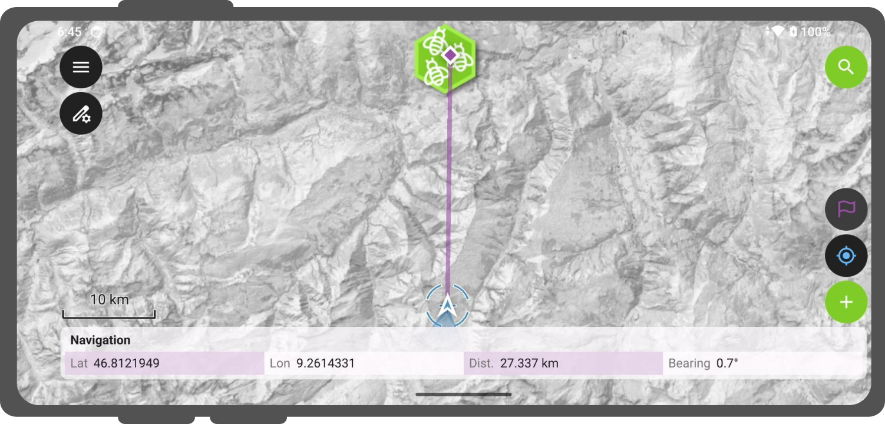
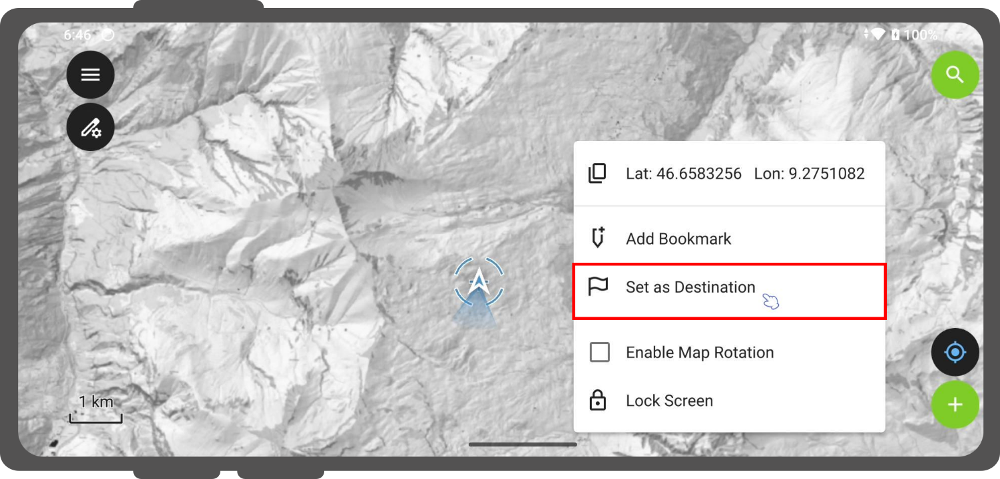
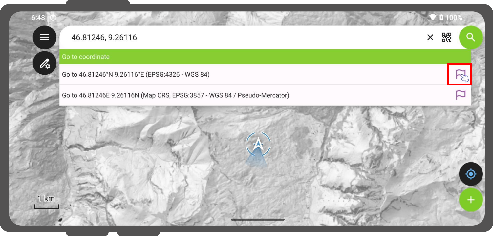
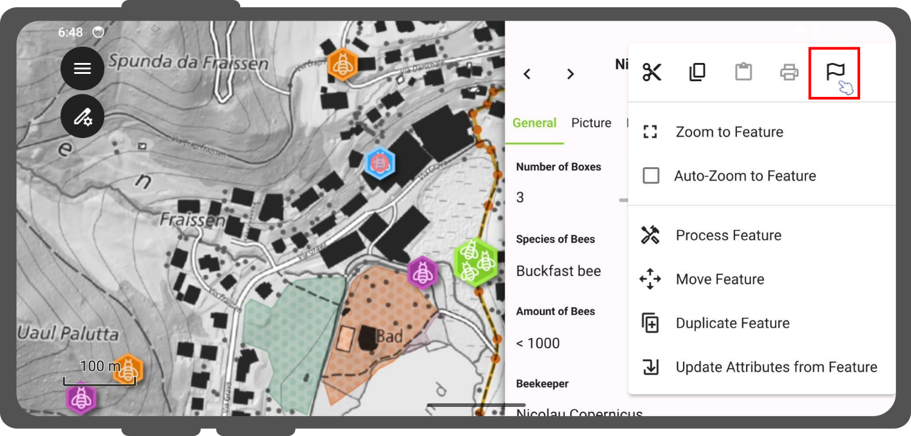
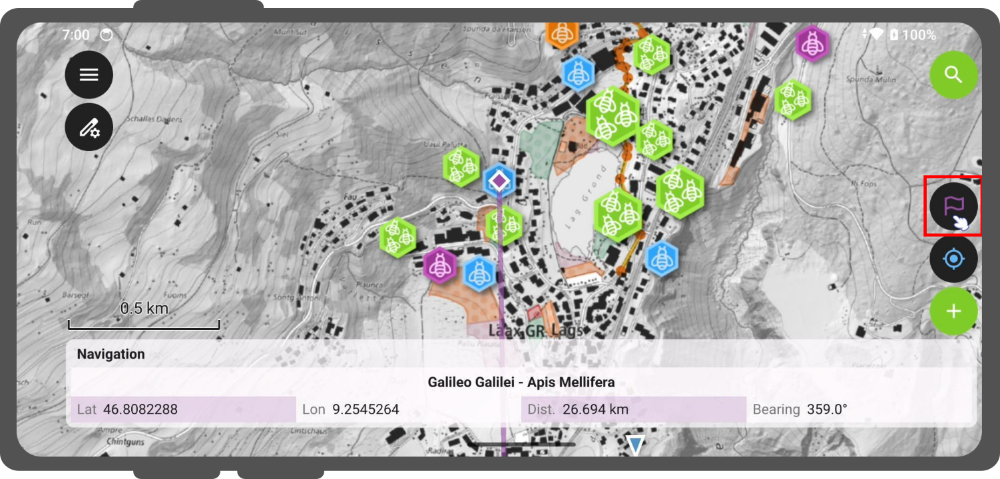
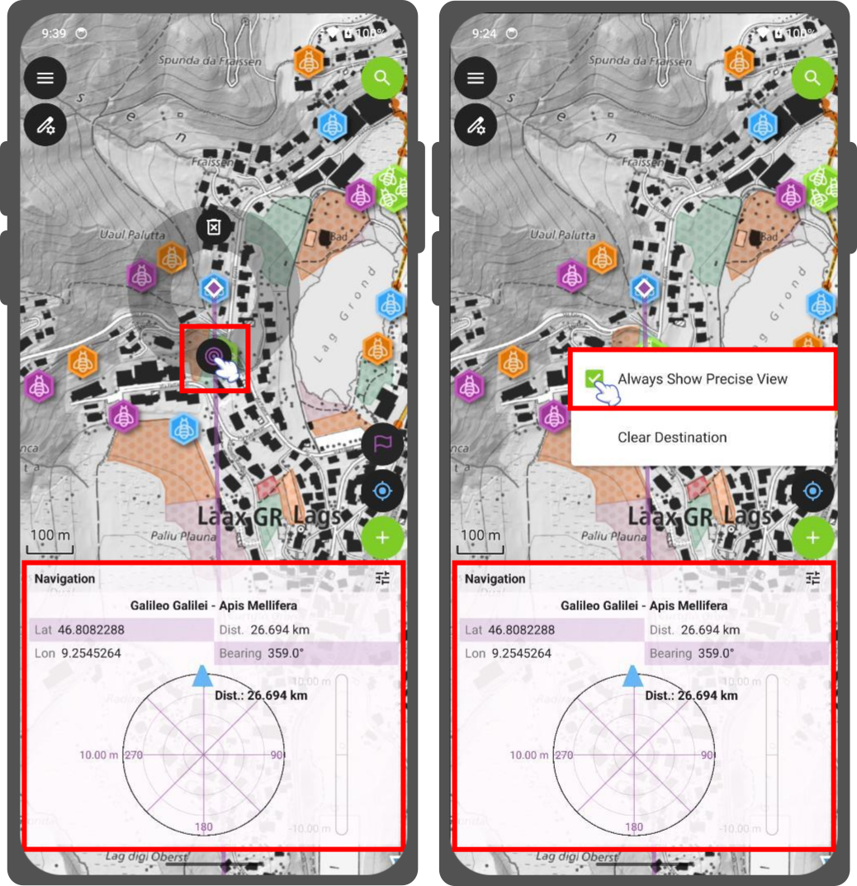
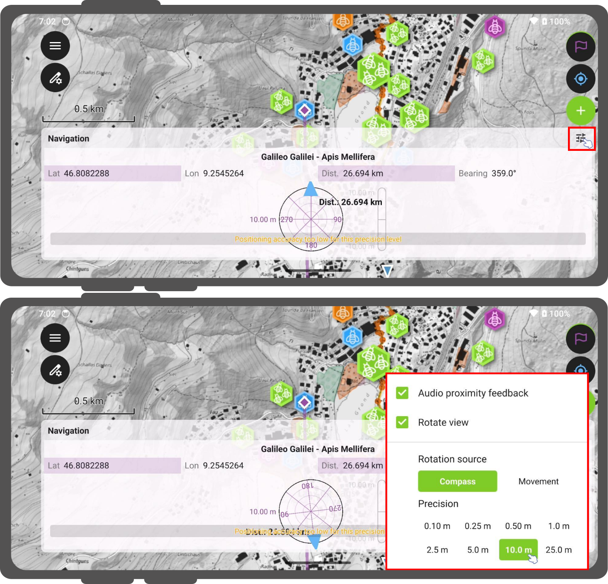

# Navigation

QField offers navigation functionalities to help orient yourself in the field and accurately reach a given destination.

## Activating navigation

Navigation is enabled when [a destination point has been set](#setting-a-destination-point) and positioning is active.
When turned on, a set of navigation overlays - a destination marker, a navigation panel, and a navigation control button - appear on the screen.

!

The navigation panel displays useful information such as the destination point coordinates as well as the current distance and bearing to it.

To disable *navigation*, you can clear the destination point by pressing long on the position/navigation button located on the side toolbar, or by directly interacting with the destination marker on the map canvas.

## Setting a destination point
:material-tablet: Fieldwork

There are several options to set a navigation destination point:
- **Map Context Menu:** Press long on the part of the map to which you wish to navigate to and select the *Set as Destination* action within the pop-up menu.

!

- **Search Bar / Feature Search:** Type specific coordinates in the search bar and tap the resulting flag icon.
Alternatively, search for a specific feature attribute and tap the flag navigation icon next to it in the drop-down list.

!

- **Feature Form Menu:** Open any feature form and select the *Set Feature as Destination* action from the 3-dotted menu *(⋮)*.

!

- **Feature Geometry Routing:** When selecting multi-vertex features (lines, polygons) as a destination, a target navigation bar appears. You can use the left and right buttons to cycle through the vertices of the feature.
Long-pressing on these buttons will cycle through vertices rapidly, which is useful for complex shapes.

### Destination Marker Actions (Pie Menu)

You can also directly access shortcut actions by tapping or long-pressing on the destination flag marker directly on the map.
This opens a **pie menu** overlay with the following options:

- **Clear Destination:** Deletes the active destination point and cancels navigation.
- **Always Show Precise View:** Toggles whether the precision target target dial remains constantly visible.

The pie menu dynamically tracks the screen location of your destination flag, remaining locked to the target through map pans, zooms, and rotations.

!!! Tip

    It is advisable to clear any distanation when finishing a mapping session.
    Otherwise QField may memorize that a destination was set and lead to random errors when opening QField in the next session or with a different project.

## Recenter to destination
:material-tablet: Fieldwork

QField allows for its map to automatically keep track of the current device location and destination and re-center the map extent around those two points.

To activate this auto tracking feature, you can simply tap on the positioning button and the navigation control button.
Both buttons should show their auto tracking mode active by having their background color turn to blue and purple.

!

This can be described as a simple *staking mode* functionality.

## "Stakeout" precise view
:material-tablet: Fieldwork

QField has an integrated precise view dial to help you guide precisely to your target location.
The precise view diagram appear below the main navigation panel to preserve screen space when full GNSS details are shown.
It automatically expands and collapses depending on your need.

The precise view appears when the distance between your current location and the destination falls below your chosen precision threshold, and the positioning device has an accuracy level less than half of that threshold.

!

Your target will turn green when your location reaches the target.
QField considers the target as reached when the distance between your current position and the destination *minus* your current positioning accuracy is less than 1/10th of your chosen precision threshold.

!!! Example

    If your precision threshold is set to 1 meter and your GNSS accuracy is 0.05 meter, the view turns green when you are within 15cm of the destination.

### Precise View Audio Feedback

When your distance to the destination falls within the precision threshold, QField emits an acoustic ping.
The spacing between pings decreases as you get closer to the destination, providing real-time audio proximity feedback.

### Configuration Settings

!!! Workflow

    You can modify the precision threshold and enable the audio feedback from a configuration menu.

    1. To open it, tap the **Setting button (☰)** located in the header of the navigation panel.
    !

Within this menu, you can configure:

- **Audio proximity feedback:** Toggle the acoustic proximity pings on or off.
- **Rotate view:** Toggle whether the entire precision dial rotates dynamically. When unchecked, the dial locks into a static **North-Up** orientation.
- **Rotation source:** Choose the sensor input used when *Rotate view* is enabled:
    - *Compass:* The dial rotates dynamically using your device's internal magnetic compass.
    - *Movement:* The dial uses GNSS-derived heading calculations. This orientation method is gated at a minimum speed threshold of **0.8 km/h** to filter out stationary noise and jitter. When you stand still, the dial freezes cleanly at your last valid heading. Devices lacking native speed tracking data automatically fall back to standard heading validity flags.
- **Precision Picker:** You can choose your position threshold.
