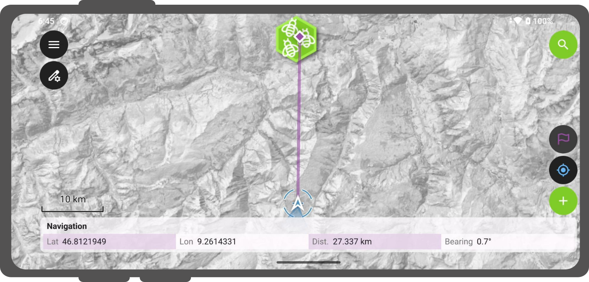
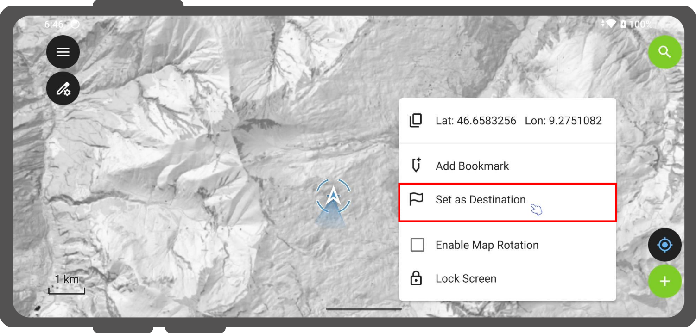
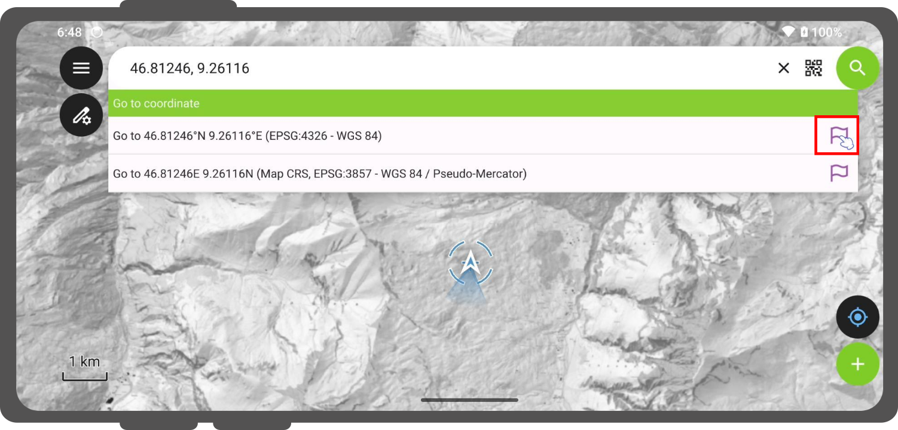
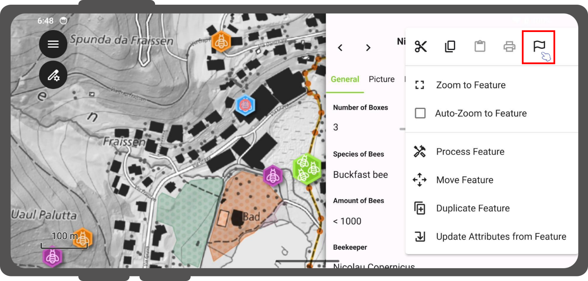
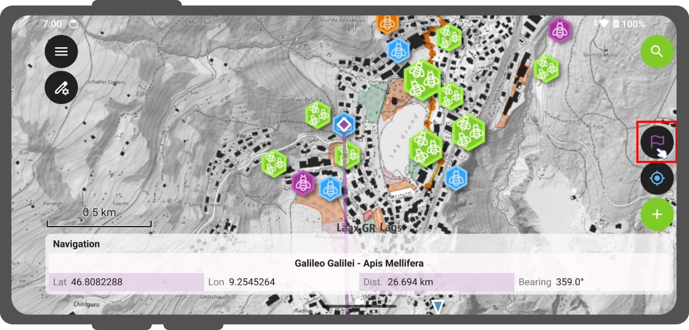
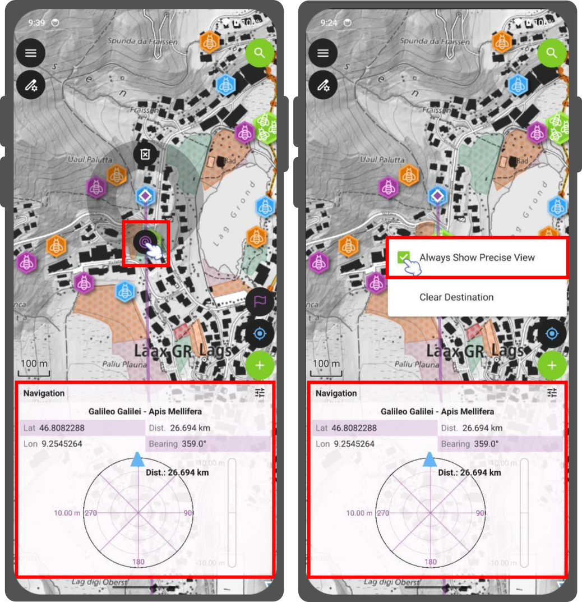
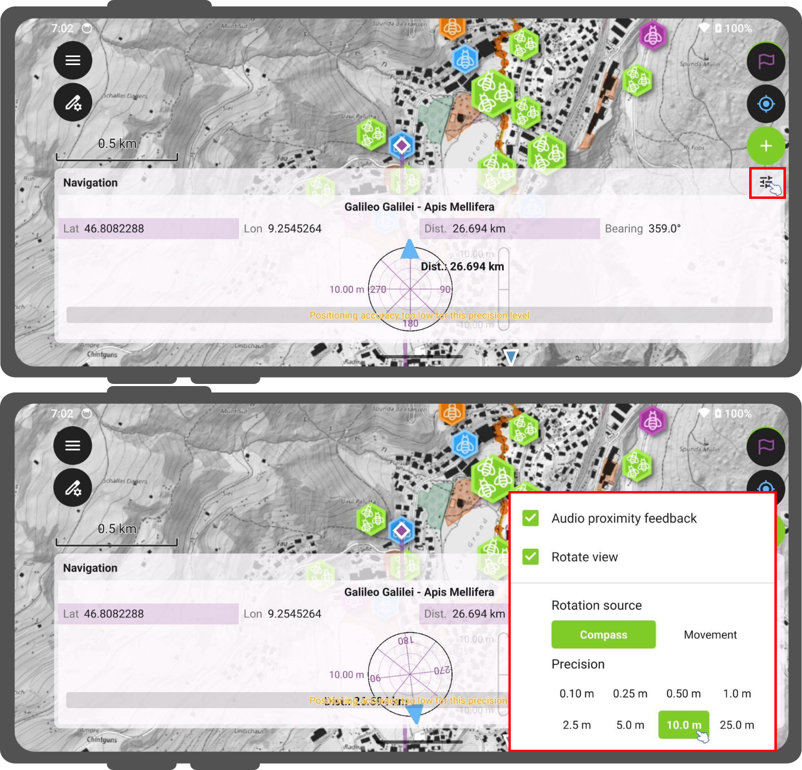

# Navigation

QField provides built-in navigation tools to help locate features and reach precise target destinations in the field.

## Activating Navigation

Navigation activates when a [destination point is set](#setting-a-destination-point) and positioning is enabled.
When navigation is active, QField displays navigation overlays: a destination marker on the map canvas, a top navigation panel, and a navigation control button on the side toolbar.

!

The navigation panel displays destination coordinates, distance, and heading bearing.

To cancel navigation, long-press the positioning button on the side toolbar or tap the destination marker on the map canvas and select clear options.

## Setting a Destination Point
:material-tablet: Fieldwork

Set navigation destinations using four methods:

- **Map Context Menu:** Long-press a location on the map canvas and tap **"Set as Destination"**.
    !
- **Search Bar:** Enter coordinates into the search bar or search for a feature, then tap the navigation flag icon next to the result.
    !
- **Feature Form Menu:** Open a feature attribute form, tap the three-dotted menu *(⋮)* in the title bar, and tap **"Set Feature as Destination"**.
    !
- **Feature Geometry Routing:** When setting a multi-vertex feature (line or polygon) as a destination, a target routing bar displays. Use left and right arrow buttons to cycle through individual vertices. Long-press arrow buttons to cycle through vertices rapidly.
    

### Destination Marker Pie Menu Actions

Tap or long-press the destination flag marker on the map canvas to open a pie menu:

- **"Clear Destination":** Removes the active destination and cancels navigation.
- **"Always Show Precise View":** Toggles whether the precise stakeout target dial remains visible continuously.

The pie menu anchors dynamically to the destination flag during map panning, zooming, and canvas rotation.

!!! Tip
    Clear active destinations when concluding field mapping sessions to prevent persistent navigation targets across future project loads.

## Recenter to Destination
:material-tablet: Fieldwork

QField can auto-track and dynamically center the map extent around both your current GNSS location and active target destination.

!!! Workflow
    1. Tap the positioning button on the side toolbar.
    2. Tap the navigation control button on the side toolbar.
    Both buttons highlight blue and purple to indicate active auto-tracking.

!

## Stakeout Precise View
:material-tablet: Fieldwork

QField features a stakeout precise view dial to guide users precisely to target coordinates.
The precise view diagram expands below the main navigation panel when approaching destinations.

The precise view expands automatically when the distance between your GNSS location and target destination falls below your configured precision threshold, provided GNSS accuracy is less than half of that threshold.

!

The target dial turns green when you reach target coordinates.
QField evaluates the target as reached when distance minus GNSS positioning accuracy is less than 1/10th of your precision threshold.

!!! Example
    When your precision threshold is set to 1.0 meter and your GNSS accuracy is 0.05 meters, the target dial turns green within 0.15 meters of the destination.

### Precise View Audio Feedback

When your distance to the target falls within the precision threshold, QField emits acoustic proximity pings.
Ping frequency increases as distance to target decreases.

### Navigation Settings

Configure precision thresholds and audio feedback options in the navigation panel settings menu.

!!! Workflow
    1. Tap the settings menu icon (**☰**) in the top header of the navigation panel.

!

Configure the following options:

- **"Audio proximity feedback":** Toggles acoustic proximity pings on or off.
- **"Rotate view":** Controls dynamic rotation of the precision dial canvas. When disabled, the dial locks to a static North-Up orientation.
- **"Rotation source":** Selects sensor input for dial rotation:
    - **Compass:** Rotates the dial dynamically using internal magnetic compass hardware.
    - **Movement:** Rotates the dial using GNSS movement heading calculations. Movement calculations activate at speeds above 0.8 km/h to filter out stationary position jitter.
- **Precision picker:** Selects the target distance precision threshold.

