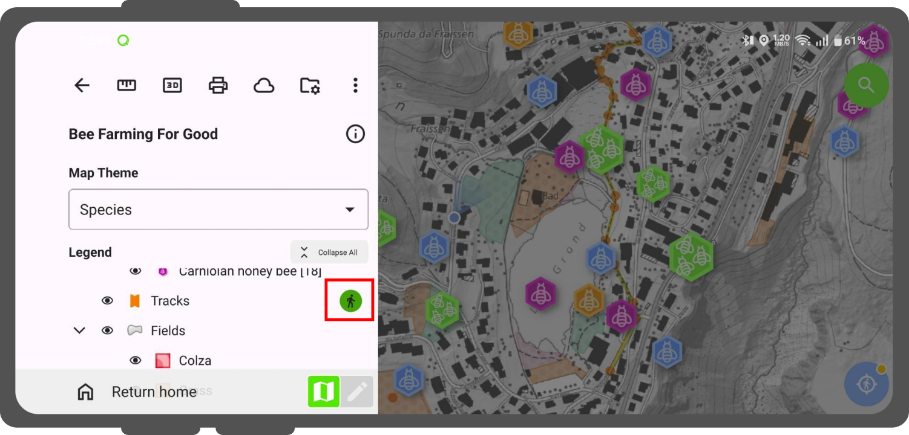
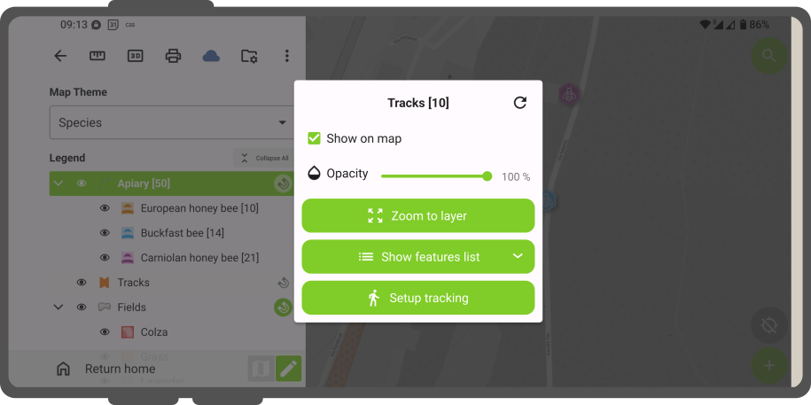
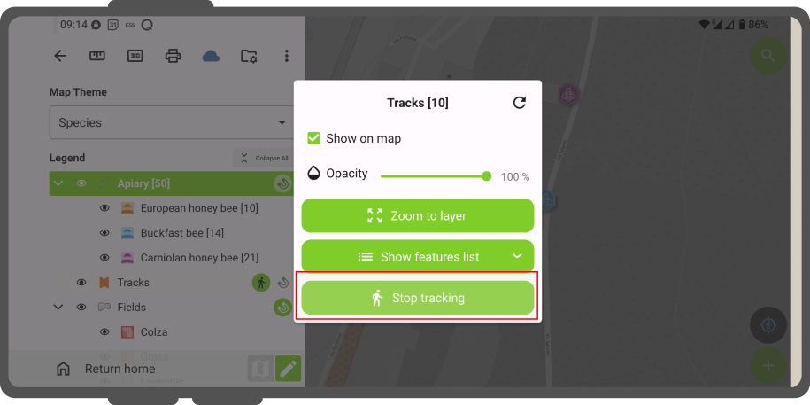
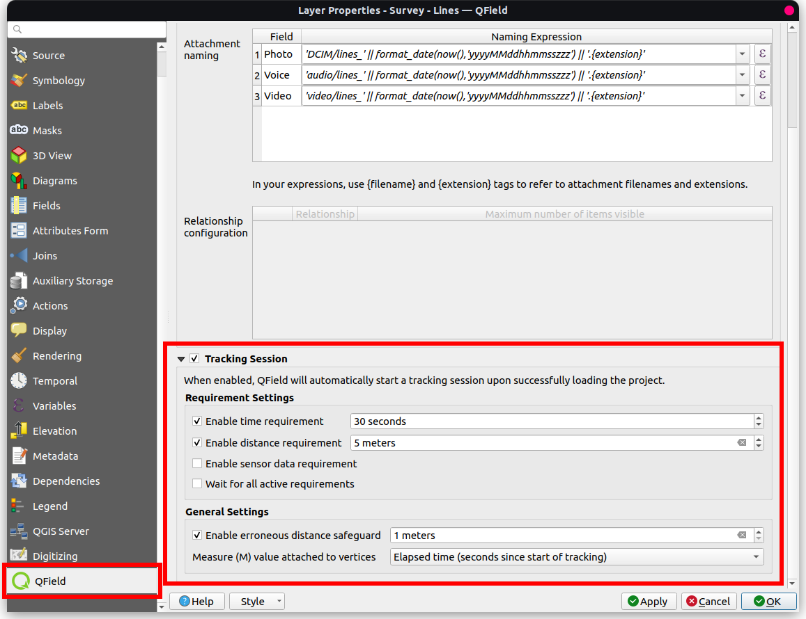
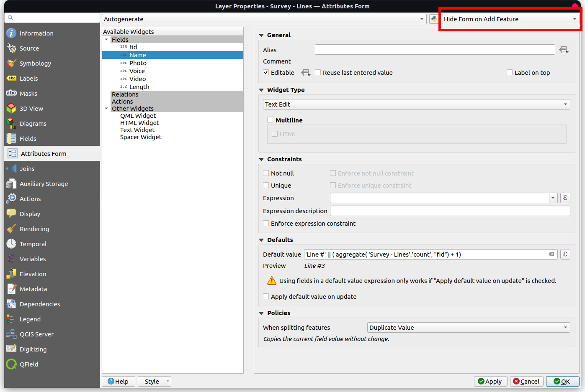

# Tracking

## General Settings
:material-tablet: Fieldwork

QField supports tracking GNSS locations by creating point, line, or polygon features while browsing maps, editing layers, or running in the background.
Positioning must be enabled to start a tracking session.

Configure vertex recording intervals using two requirements:

- **Time requirements:** Records position vertices at fixed time intervals (such as every 30 seconds), conserving battery power and maintaining consistent logs.
- **Distance requirement:** Records position vertices or point features only after moving a specified minimum distance, removing stationary jitter.

!

- **Erroneous distance:** Filters out bad GNSS readings by defining a maximum tolerated distance threshold from the previously recorded vertex. Positions exceeding this distance threshold are discarded.

!

Tracking behavior by geometry type:

- **Line and polygon layers:** Creates a single vector feature per tracking session, forming geometry from recorded position vertices.
- **Point layers:** Creates a new point feature for each recorded position vertex, reusing remembered attribute values across points.

Starting a tracking session displays a tracking badge next to tracked layers in the **Side Dashboard**.

!!! Tip
    You can run multiple tracking sessions simultaneously across different vector layers.

!

Features save automatically as each vertex is recorded.
QField renders a red rubberband line on the map canvas during active tracking sessions to visualize recorded paths.

If tracked layers support $M$ coordinate dimensions, QField records elapsed time (in seconds since tracking start) in each vertex $M$ value.

### Setting Up a Tracking Session

!!! Workflow
    **Option 1: Via the Side Dashboard**

    1. Open the **Side Dashboard** and long-press the target vector layer.
    2. Tap **"Setup tracking"** to open configuration settings.
        !
    3. Tap **"Start tracking"**.
    4. Enter feature attribute values in the attribute form.
    5. To stop tracking, open the **Side Dashboard**, long-press the layer tracking badge, and tap **"Stop tracking"**.
        !

!!! Workflow
    **Option 2: Via the Location Pie Menu**

    1. Tap your current location marker on the map canvas.
    2. Tap the walking figure tracking icon in the pie menu overlay.
        !

## Resuming Previous Tracking Sessions

If QField closes or restarts during an active tracking session, QField prompts to resume or replace the session upon reopening.

- **Resume:** Appends newly recorded vertices to the existing line or polygon feature from the previous session.
- **Start a new session:** Discards incomplete features from previous unclosed sessions and initiates a fresh tracking session.

## Automatic Tracking Sessions

Configure vector layers to initiate position tracking sessions automatically when loading projects in QField.
If feature forms are enabled, attribute forms open automatically upon project load.
If layer properties are set to **"Suppress attribute form"**, tracking initiates immediately without displaying form prompts.

!!! Workflow
    :material-monitor: Desktop preparation

    1. In QGIS, navigate to _Vector Layer Properties... > QField_.
    2. Enable **"Tracking Session"** and define time or distance requirements.
        !
        !
    3. (Optional) To bypass feature form prompts when auto-tracking begins, navigate to _Vector Layer Properties... > Attribute Form_ and select **"Suppress attribute form"**.
        !
