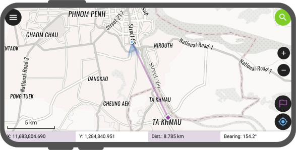
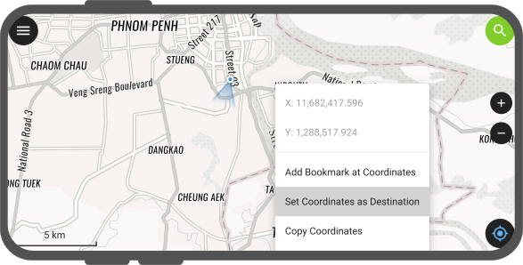
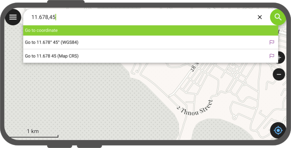
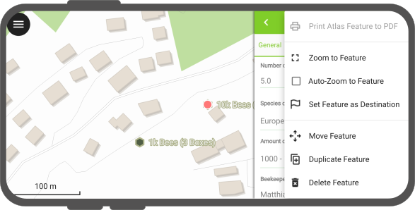
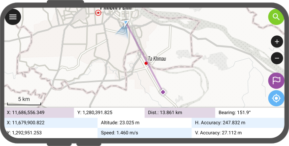

# Navigation

QField offers navigation functionalities to help orient yourself in the field and accurately reach a given destination.

## Activating navigation

Navigation is enabled when [a destination point has been set](#setting-a-destination-point) and positioning is active.
When turned on, a set of navigation overlays - a destination marker, a navigation panel, and a navigation control button - appear on the screen.

!

The navigation panel displays useful information such as the destination point coordinates as well as the current distance and bearing to it.

To disable *navigation*, clear the destination point by pressing long on the navigation control button located at the bottom right corner.

## Setting a destination point
:material-tablet: Fieldwork

There is several options to set a navigaation destination point.
A quick way is to simply tap and hold on any part of the map and select the *Set as Destination* action within the popped up menu.

!

You can also set the destination point by typing in specific coordinates in the search bar and tapping on the resulting flag navigation icon.
You can also search for a specific feature and tap on the flag navigation icon which will also be present in the resulting list of features.

!

You can also set a destination point by opening the feature form menu and selecting the *Set Feature as Destination* action.

!

Finally, you can also set a destination selecting a specific feature, a purple feature bar title appears as part of the navigation information panel.
For single points, a destination name is displayed (matching a given vector layer's display name field / expression).

For multipoint or {multi,single}{line,polygon}, new navigation buttons are located on the left and right of the destination name.
Those buttons allow users to cycle through vertices of the feature picked as navigation destination.
Tapping and holding onto these buttons will cycle through vertices (comes in handy when you have a feature with a large vertex count).

!

## Auto tracking of current location and destination
:material-tablet: Fieldwork

QField allows for its map to automatically keep track of the current device location and destination and re-center the map extent around those two points.

To activate this auto tracking feature, you can simply tap on the positioning button and the navigation control button.
Both buttons should show their auto tracking mode active by having their background color turn to blue and purple.

!

This can be described as a simple *staking mode* functionality.

## "Stakeout" precise view
:material-tablet: Fieldwork

QField's "stakeout" precise view panel appears when the distance between the current location and the destination is less than a pre-defined threshold (by default 5 meters) and the positioning device has an accuracy that is less than half of that threshold.
The precise view visibility threshold value can be modified by pressing long on the bottom-right navigation button and selecting the *Precise View Settings* menu item.

!

The precise view will turn green when the current location is considered to have hit the target.
This state considers both the positioning device accuracy as well as the precise view threshold value, whereas QField will consider having hit the target when the distance between the current location and the destination *minus* the positioning device's accuracy is less than 1/10th of the precise view threshold.
E.g.: if your precise view threshold is set to 1 meter and your positioning device accuracy is 0.05 meter, the view would turn green when the position is less than 15cm from the destination.

When the distance to destination falls within the precise view threshold, QField emits an audio feedback in the form of a ping with reducing intervals as the current location gets closer to the destination. The audio feedback can be disabled by long-pressing on the bottom-right navigation button, selecting the *Precise View Settings* menu item, and unchecking *Enable Audio Proximity Feedback*.

It is also possible the precise view to always be visible by long-pressing on the bottom-right navigation button, selecting the *Precise View Settings* menu item, and checking *Always Show Precise View*. When enabled, the precise view will appear whenever a navigation destination has been set and will act as a visual compass providing an arrow on the edge of the precision target.
