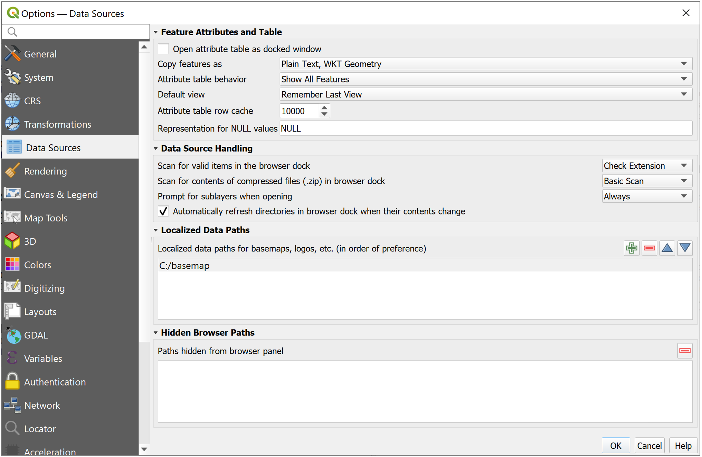
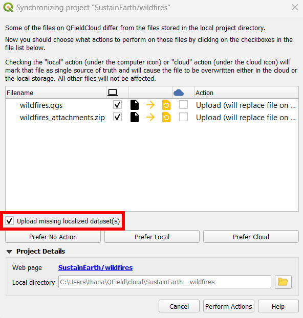
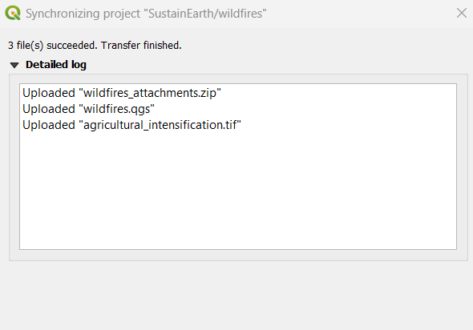
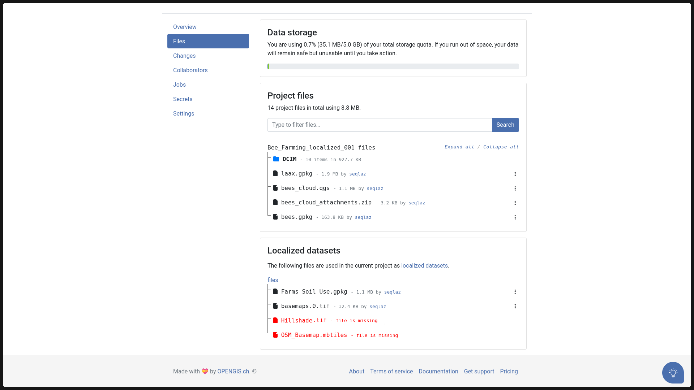
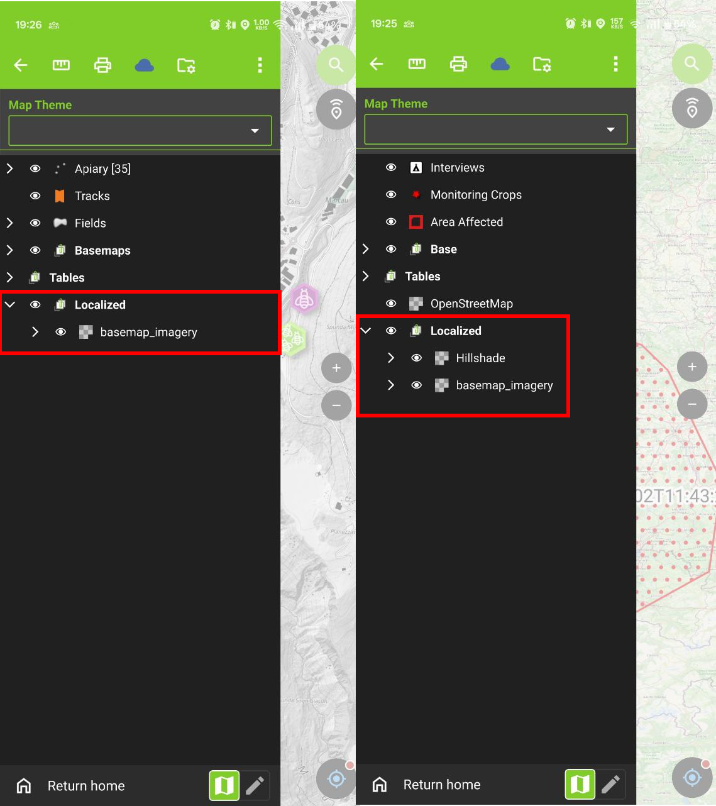
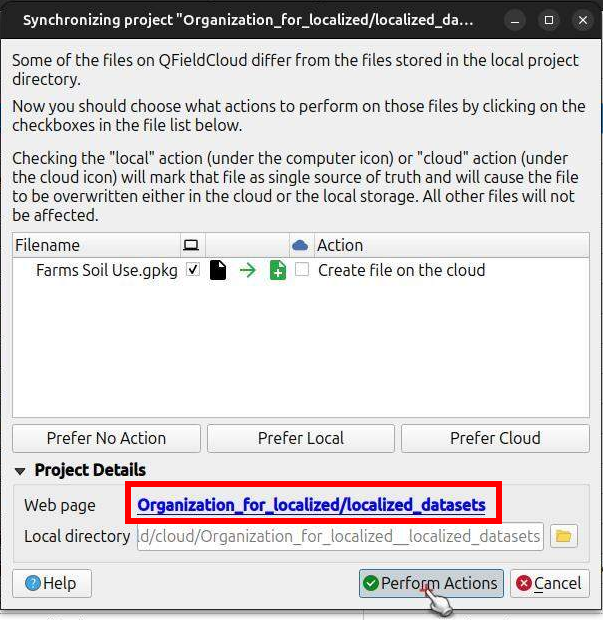

# Shared datasets

It is possible to use layers stored in a single location—referred to as a localized data path—across multiple projects. This can help reduce storage requirements for large datasets such as orthophoto raster files, land use vector files, etc., as well as ease the management of dataset updates.

There are two main approaches to using shared local datasets: a manual copying method for into devices running QField, and a more integrated approach using QFieldCloud.

## Managing Localized Data Paths in QGIS

When building projects for QField, make sure the datasets you want to share across multiple projects are within localized data paths in QGIS.

:material-monitor: Desktop preparation

In QGIS, go to the Options dialog's data sources panel, where you will find a localized data paths section. From there, you can add a number of paths within which datasets will be treated as shared datasets. This must be done as a preliminary step to building your projects, including those to be uploaded to QFieldCloud.

!

## Managing Shared Datasets with QFieldCloud

QFieldCloud allows users to seamlessly manage shared datasets across multiple projects by integrating QGIS’s localized data paths functionality. This is particularly useful for large data layers (e.g., base maps, environmental data, administrative boundaries) that are reused in many QFieldCloud projects.

The Localized Datasets feature allows cloud projects to reference single, shared datasets stored in a designated QFieldCloud project named **`shared_datasets`**. This special type of project can be created by the user in advance or automatically during file upload using QFieldSync. It does not need to contain a QGIS project file (`.qgs`/`.qgz`) for the **`shared_datasets`** project, but only the datasets to be accessed by other cloud projects.

The file structure within the **`shared_datasets`** project will reflect the structure of the localized path from which the datasets originate. For example, if your QGIS Localized Data Path is `./GIS_Common/BaseData/` and you have a file `./GIS_Common/BaseData/Administrative/boundaries.gpkg`, it will appear as `Administrative/boundaries.gpkg` within the **`shared_datasets`** cloud project.

!!! note
    Only collaborators whose user role is “manager” or “admin” (directly assigned or as organization owners or admin) can add files to the **`shared_datasets`** project.

## 1. Prepare Your QGIS Project with Localized Datasets

**Follow the same [Desktop Preparation (QGIS)](#managing-localized-data-paths-in-qgis)** steps outlined above.

- Critically, make sure the Localized Data Paths in QGIS Options are correctly configured to point to the location of these shared datasets on your computer. This tells QFieldSync which files to treat as "localized" for cloud handling.
- Ensure your localized layers are part of your QGIS project and their paths are relative to one of the configured localized data paths.

## 2. Upload Localized Datasets to QFieldCloud

### Create or Configure Your Cloud Project

- In QFieldCloud, create a new project or choose an existing one. For details, see [Getting Started with QFieldCloud](../get-started/tutorials/get-started-qfc.md#create-and-configure-your-cloud-project).

### Synchronize with QFieldSync

- In QGIS, open your project and use the QFieldSync plugin to upload it to your QFieldCloud project.
- At the beginning of the synchronization process, you will see a new **Upload missing localized dataset(s)** checkbox. Ensure this option is checked. If you hover over the checkbox, you will see the list of files that will be uploaded. This checkbox is only available for users with the permission to add files to the **`shared_datasets`** project.

!

- Click on the **Perform Actions** button to proceed. During the upload phase, a list of the localized and regular project datasets will appear as they are being transferred.

- This instructs QFieldSync to find the actual data files referenced by your Localized Data Paths and upload them to the **`shared_datasets`** cloud project.

### Review Upload Log

- After the synchronization completes, you can check the QFieldSync log. It will detail the files uploaded, including localized datasets that were sent to QFieldCloud.

!

## 3. Localized datasets within QFieldCloud web interface

Once uploaded, these localized datasets will appear in two key places on the QFieldCloud web interface:
* Within the dedicated **`shared_datasets`** project itself.
* Referenced in the **Files** tab of any regular cloud project that utilizes them.

### Localized Datasets on projects

- Open your project in the QFieldCloud web interface.
- Go to the **Files** tab.
- You will find a section named **Localized datasets**. This area lists all datasets that have been identified and uploaded as shared/localized resources for your projects.

!

### Check Dataset Status

For any cloud project containing localized datasets, QFieldCloud’s web interface will indicate those missing on the cloud (i.e., referenced by the project but not yet uploaded into the **`shared_datasets`** project) using red color.

This can be fixed by synchronizing the project again from QGIS with QFieldSync, ensuring the "Upload missing localized dataset(s)" option is checked (as described in step [Synchronize with QFieldSync](#synchronize-with-qfieldsync)). Alternatively, if you have the necessary permissions, you can manage the **`shared_datasets`** project directly (see section [Synchronizing directly the shared_datasets project](#5-synchronizing-directly-the-localized_datasets-project)).

Similarly, if you configure a new QGIS project to use localized files that are *already present* in your QFieldCloud **`shared_datasets`** project, QFieldSync is smart enough to recognize this. The "Upload missing localized dataset(s)" checkbox may not appear, or if it does, QFieldSync will not re-upload datasets that already exist and are up-to-date in the **`shared_datasets`** project.

## 4. Viewing projects in QField

Once the cloud projects are configured and synchronized to QFieldCloud:

- Users can simply download these cloud projects to QField or synchronize pre-existing ones, just like any other QFieldCloud project.
- A key benefit is that the download of these shared localized datasets is managed efficiently by QField. Each shared dataset will be downloaded to the device **only once**, even if multiple projects use it. This saves storage space and synchronization time.

!

## 5. Synchronizing directly the **`shared_datasets`** project

Instead of relying on individual project synchronizations to populate the **`shared_datasets`** project, users with appropriate permissions can manage its content more directly.

### Using QFieldSync

Users with 'manager' or 'admin' permissions for the **`shared_datasets`** project can manage its content directly using QFieldSync:

1.  In QFieldSync, check out the **`shared_datasets`** project from QFieldCloud to a local directory on your computer.
2.  Ensure this local directory is one of the paths configured in your QGIS *Options > Data Sources > Localized Data Paths*.
3.  You can now add, update, or remove files within this local directory.
4.  Use QFieldSync (with the **`shared_datasets`** project selected) to synchronize these changes directly to the cloud.

!

!

### Using the QFieldCloud-CLI

Administrators can further automate the synchronization of the **`shared_datasets`** project by using QFieldCloud’s official CLI tool, `qfieldcloud-cli` (which is part of the [qfieldcloud-sdk](https://pypi.org/project/qfieldcloud-sdk/) Python package).

The tool can be used to synchronize QFieldCloud files from a local directory. It automatically checks if there is any version change of the file contents.

- [Login to QFieldCloud](https://opengisch.github.io/qfieldcloud-sdk-python/examples/#log-in-to-qfieldcloud) using the CLI

```console
$ qfieldcloud-cli login USER PASSWORD
Log in super_user…
Welcome to QFieldCloud, USER.
QFieldCloud has generated a secret token to identify you. Put the token in your in the environment using the following code, so you do not need to write your username and password again:
export QFIELDCLOUD_TOKEN="TOKEN_HERE"
$ export QFIELDCLOUD_TOKEN="TOKEN_HERE"
```

- [List the QFieldCloud projects](https://opengisch.github.io/qfieldcloud-sdk-python/examples/#list-your-projects) and get the project ID of the **`shared_datasets`** project:

```console
$ qfieldcloud-cli list-projects
Listing projects…
Projects the current user has access to:
| ID                                   | OWNER/NAME           | IS PUBLIC |
---------------------------------------------------------------------------
| 90e83606-dce8-4b0d-854a-388904d8a739 | USER/shared_datasets | 0         |
```

!!! note
    Your project ID will be different

[Upload the shared datasets](https://opengisch.github.io/qfieldcloud-sdk-python/examples/#upload-local-files-to-qfieldcloud) from your local source directory to the **`shared_datasets`** project:

```console
qfieldcloud-cli upload-files 'YOUR_PROJECT_ID' "./path/to/your/local/shared/data/"
```

You can set up this [command as a regular cronjob that runs periodically](https://opengisch.github.io/qfieldcloud-sdk-python/examples/#schedule-and-trigger-a-package-job) (e.g., daily), or trigger it manually based on other conditions, to keep your shared datasets on QFieldCloud up-to-date.

### Using Manually Copied Datasets in QField

To use these shared datasets manually in QField, locate the QField app directories on your device:

- In QField, open any project.
- Reveal the side dashboard by clicking on the hamburger icon, and open the main menu by clicking on the 3-dot button.
- Select the 'About QField' menu item.
- The application directory locations will be at the bottom just below the 'App directories' path (paths differ by operating system).
Once you have located the directory, copy your shared dataset files into the `[App Directory]/QField/basemaps` folder on your device. QField will automatically scan this folder for basemaps and other recognizable data.

!
