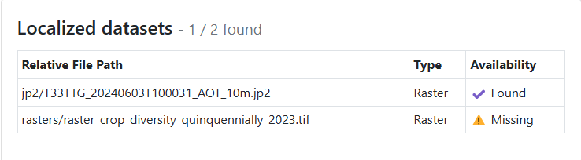

# Shared local datasets

It is possible to use a layer which is stored outside the project folder.

This is useful if a basemap is used in more than one project, for example a large orthophoto.
In this case, you can share this dataset among different projects.
Also large vector data files that are not modified can be shared that way. The features and their attributes remain identifiable.

## Add a layer outside of exported project folder
:material-monitor: Desktop preparation

In QGIS, open  *Options > Data Sources > Localized Data Paths*.
In there, add the path to the external data.

!

To use layers from localized data paths on your device, add the datasets to the folder `<drive>:/Android/data/ch.opengis.qfield/files/QField/basemaps`.

!!! note
    Since QField 2, the basemaps files needs to be stored in the app directory `<drive>:/Android/data/ch.opengis.qfield/files/QField/basemaps` instead of the devices main directory `<drive>:/QField/basemaps`.

## Managing Shared Datasets with QFieldCloud

QFieldCloud significantly enhances the management of shared localized datasets. This allows you to upload these common datasets once and use them on multiple cloud projects:

### 1. Prepare Your QGIS Project with Localized Datasets

**Follow the same [Desktop Preparation (QGIS)](#add-a-layer-outside-of-exported-project-folder)**:

- Critically, make sure the Localized Data Paths in QGIS Options are correctly configured to point to the location of these shared datasets on your computer. This tells QFieldSync which files to treat as "localized" for cloud handling.
- Ensure your localized layers are part of your QGIS project.

### 2. Upload Localized Datasets to QFieldCloud

**Create/Configure Your Cloud Project**:

- In QFieldCloud, create a new project or choose an existing one. For details, see [Getting Started with QFieldCloud](../get-started/tutorials/get-started-qfc.md#create-and-configure-your-cloud-project).

**Synchronize with QFieldSync**:

- In QGIS, open your project and use the QFieldSync plugin to upload it to your QFieldCloud project.
- During the synchronization process (when uploading changes), you will see an option: "Upload missing localized dataset(s)", ensure this checkbox is ticked.

!

- This instructs QFieldSync to find the actual data files referenced by your Localized Data Paths and upload them to a shared storage area within your QFieldCloud account.

**Review Upload Log**:

- After the synchronization completes, you can check the QFieldSync log. It will detail the files uploaded, including any localized datasets that were sent to QFieldCloud.

!

### 3. Review Shared Datasets in QFieldCloud

**Navigate to Localized Datasets**:

- Open your project in the QFieldCloud web.
- Go to the Files tab.
- You will find a section named Localized datasets. This area lists all datasets that have been identified and uploaded as shared/localized resources for your projects.

!

**Check Dataset Status**:

- In this section, QFieldCloud will indicate the status of these datasets (e.g., "Found," "Missing").
- *Found*: The dataset was successfully uploaded and is available.
- *Missing*: The dataset was referenced in a project as localized, but QFieldSync could not find it at the specified Localized Data Path during upload, or it was intentionally excluded (by unchecking the upload option for it). Projects relying on a "missing" dataset may not display correctly on devices until the dataset is successfully uploaded to QFieldCloud or copied to the mobile devices.

!
