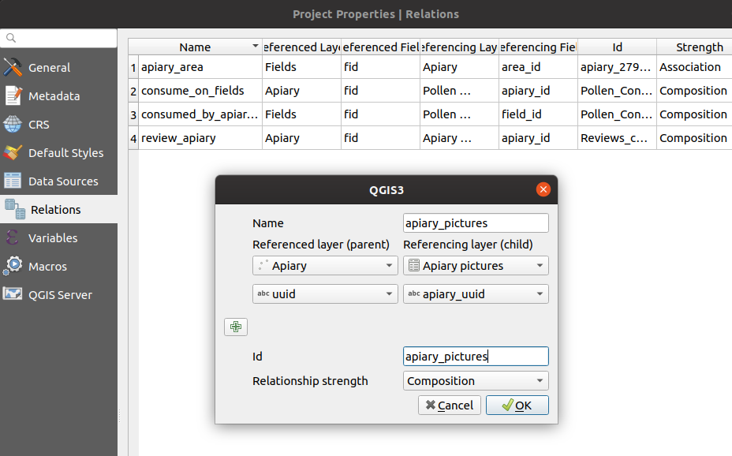

# Use pictures

In QField a field with *Attachment* widget can be used to:
-   show and take photos
-   show links to external files like pdfs or documents

To configure the Widget, please refer to the [Attributes Form Documentation](../attributes-form/#configure-attachmentpictures-widget)

## Add a series of pictures to a feature
:material-desktop-mac:{ .device-icon } Desktop preparation

You can add one or more pictures to a feature. Here is an example on how to proceed.

### Tables
You will need two tables. One table where the features are stored and one with a list of pictures.

#### Apiary
| Field      | Type       |
|------------|------------|
| `id`       | Text (UUID)|
| `geometry` | Geometry   |
| `...`      |            |

#### Apiary_pictures
| Field       | Type       |
|-------------|------------|
| `id`        | Text (UUID)|
| `apiary_id` | Text (UUID)|
| `path`      | Text       |
| `...`       |            |

### Relations
Create a relation with:

-   `apiary` Referenced layer
-   `id` Referenced field
-   `apiary_picture` Referencing layer
-   `apiary_id` Referencing field
-   `strength` Composition

!

### Widgets

#### Apiary
Set the default value of the field id to `uuid()` or use the *UUID Generator* widget. No need to show it in the form.

!

Set the relation widget to *many to one relation* and add the relation to the form

!

#### Apiary picture
Set the widget type of the field path to *Attachment* and add it to the form

!

## Geotagging
:material-tablet-android:{ .device-icon } Fieldwork

Some mobile devices will require Open Camera to be installed in order to enable geotagging.

To enable geotagging perform the following steps:

1.  In QField, go to the *settings* and make sure *Use native Camera* is
    activated
2.  Install the [Open Camera app](https://play.google.com/store/apps/details?id=net.sourceforge.opencamera&hl=en&gl=US)
    on your mobile device
3.  Within the Open Camera settings, make sure geotagging is enabled
4.  Within you mobile device settings, set the default camera app to Open Camera
5.  Completed! Open Camera will now be utilized while taking pictures with QField

## Maximum picture size

The maximum height and width can be configured in *QFieldSync plugin > Project configuration*

The advanced settings allow to rescale the photos to a maximum width/height.

## Configurable picture path
:material-desktop-mac:{ .device-icon } Desktop preparation

QFieldSync gives the possibility to configure the path of picture
attachments.

1.  Go to *QFieldSync plugin > Project configuration*
2.  Select the table "Photo Naming"
3.  Choose the layer, the field and configure the expression

Use expressions to configure the path of the attachments. By default,
pictures are saved into the "DCIM" folder with a timestamp
as name.

!

!!! note
    QGIS 3.14 or newer is required for this functionality
