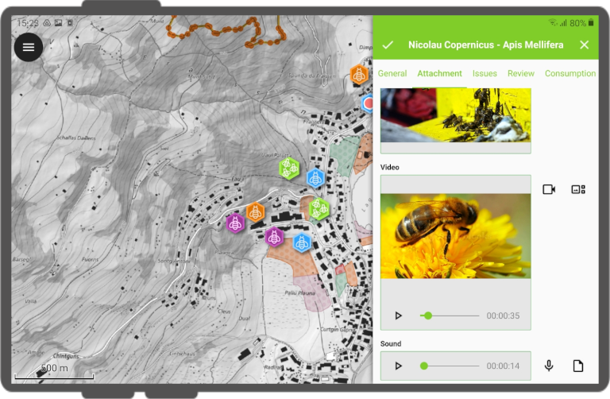

# Use attachment

In QField, a field with *Attachment* widget can be used to:

-   show and take photos
-   show and record videos
-   listen and record sound clips
-   show links to external files like PDFs or documents

!

To configure the Widget, please refer to the [Attributes Form Documentation](./attributes-form.md#configure-attachmentpictures-widget)

## Add a series of pictures to a feature
:material-monitor: Desktop preparation

One or more pictures can be added to the feature. Here is an example of how to proceed.

### Tables
It is necessary to set up two tables. One table where the features are stored and one with a list of pictures.

#### Apiary
| Field      | Type       |
|------------|------------|
| `id`       | Text (UUID)|
| `geometry` | Geometry   |
| `...`      |            |

#### Apiary_pictures
| Field       | Type       |
|-------------|------------|
| `id`        | Text (UUID)|
| `apiary_id` | Text (UUID)|
| `path`      | Text       |
| `...`       |            |

### Relations
Create a relation with:

-   `apiary` Referenced layer
-   `id` Referenced field
-   `apiary_picture` Referencing layer
-   `apiary_id` Referencing field
-   `strength` Composition

!

### Widgets

#### Apiary
Set the default value of the field id to `uuid()` or use the *UUID Generator* widget. No need to show it in the form.

!

Set the relation widget to *many to one relation* and add the relation to the form

!

#### Apiary picture
Set the widget type of the field path to *Attachment* and add it to the form

!

## Geotagging
:material-tablet: Fieldwork

Some mobile devices will require for native camera mode to be turned off to enable geotagging.

To enable geotagging in case your native OS camera does not support this functionality, follow these steps:

1.  In QField, go to the *settings* and make sure *Use native Camera* is
    deactivated
    on your mobile device
3.  Completed! QField's own QML-based camera will now be utilized while taking pictures
   
## Saving Geotags (EXIF) automatically
:material-monitor: Desktop preparation

Sometimes you might be interested in automatically storing Geotags such as the latitude, longitude, orientation, etc. This information is also known as EXIF tags.

To store the EXIF information, follow these steps:

1.  Add an attribute per EXIF tag in the table that contains the pictures.
2.  In the pictures form, configure the default value of each attribute to the corresponding
   *EXIF* expression !,
    and make sure *Apply on update* is activated.
4.  The EXIF tags that QField can capture are listed in the QGIS documentation (link above).
    However, this list might slightly varies depending on the mobile characteristics.
5.  Capturing EXIF tags requires to access the full physical path of the picture. Be sure of reflecting this in the QGIS expression.
   For example, the expression * exif(@project_folder + '/' + "path", 'Exif.Image.Orientation')* retrieves the orientation of the picture stored in *path*.
7.  Completed! QField's now capture and store the EXIF tags in the pictures table while taking pictures.

## Maximum picture size
:material-monitor: Desktop preparation

The advanced settings allow rescaling the photos to a maximum width/height in *QFieldSync plugin > Project configuration*

## Configurable attachment path
:material-monitor: Desktop preparation

QFieldSync provides the possibility to configure the path of picture attachments.

1.  Go to *QFieldSync plugin > Layers Properties*
2.  Choose the layer, the field and configure the expression

Use expressions to specify the path of the attachments. By default, pictures are saved into the "DCIM" folder, audio are saved into the "audio" folder and videos are saved into "video" with a timestamp as name.

!

Additional directories can be synchronized with pictures or other attachments. Extra paths can be configured in _Attachment directories_. All paths are relative to the project directory.

!

!!! note
    QGIS 3.14 or newer is required for this functionality
