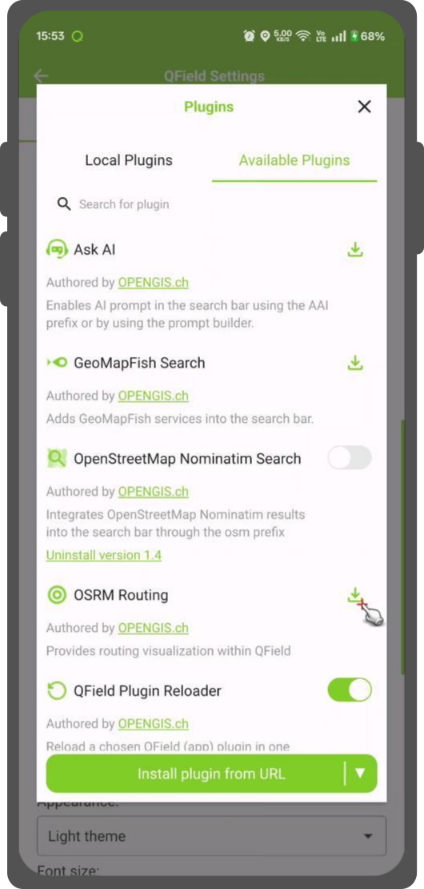

# Plugins

QField has a QML/Javascript plugin framework through which additional functionalities and
features can be scripted.

## Types of plugins

Plugins can be served in two ways:

- as a project-specific plugin that will be active for the duration of a given project session;
- as an application plugin that will be activated when QField launches.

!!! note
    A permission dialog is shown prior to activating a plugin, providing you with the possibility
    of granting or denying individual plugins.

### Project plugins

Project plugins are deployed as a sidecar file to a given project file and must share the same
file name with a .qml extension. For example, if your project file is “tree_inventory_qfield.qgs”,
the plugin’s main QML file must be “tree_inventory_qfield.qml”.

For cloud projects, you simply add the relevant QML file into your local cloud project folder
and upload the newly added file on QGIS using qfieldsync. This method insures a smooth plugin
deployment and update to devices on the field.

For non-cloud projects, refer to the QField [storage handling documentation page](../get-started/storage.md)
to learn how to import projects onto devices.

### Application plugins

Application plugins are installed through a plugins popup accessed from QField’s Settings
panel. Simply hit the ‘Install plugin from URL’ button and paste in a URL pointing to a
zipped plugin file.

!

Once installed, the plugin will appear in the plugins list found in the popup, with a switch
to toggle the activation of the plugin.

## Plugin authors

Scripting QField plugins require basic knowledge of QML and Javascript. Qt offers a
useful [introductory tutorial](https://doc.qt.io/qt-6/qml-tutorial.html) worth reading.

Once you’ve familiarized yourself with the QML environment, you are set to go. This is a minimal
example that will display a toast message upon successfully loading a QField plugin:

```
import QtQuick

import org.qfield 1.0
import Theme 1.0

Item {
  Component.onCompleted: {
    iface.mainWindow().displayToast('Hello world!')
  }
}
```

Much like QGIS plugins, QField offers an ‘iface’ object exposing a number of functionalities
plugins can leverage.

The `iface.mainWindow()` function points at the QML ApplicationWindow instance, where plugins
can parent their popups and items via `iface.mainWindow().contentItem` and have access to
functionality such as displaying toast messages using `iface.mainWindow().displayToast(text)`.

The `iface.mapCanvas()` functions provides access the map canvas item and its properties,
including the crucial `iface.mapCanvas().mapSettings` object where the extent, scale, etc. can be retrieved and modified.
It can also be used to parent items as overlays to the map canvas.

The `iface.findItemByObjectName()` function allows plugins to access items with QField’s
application window through a matching object name. You can see these items by viewing
the [relevant source code](https://github.com/opengisch/QField/blob/master/src/qml/qgismobileapp.qml).

In addition, several iface functions allow plugins to harmoniously add elements within the
QField interface: `iface.addItemToPluginsToolbar(item)`, `iface.addItemToMainMenuActionsToolbar(item)`,
and `iface.addItemToCanvasActionsToolbar(item)`. Using these functions insure that items added
by multiple plugins will happily co-exist.

In addition a number of utility classes are available to plugin authors allowing for project
layer fetching, vector layer editing, and more. To familiarize yourself with these, visit
QField’s source code’s [utilities classes directory](https://github.com/opengisch/QField/tree/master/src/core/utils).

### Creating a zipped plugin

A valid zipped plugin must contain a main.qml file at the root of the zip archive, which
will be used by QField to activate the plugin. An optional metadata.txt can also be used
to provide basic details such as the plugin name, brief description, and author name.
A sample typical `metadata.txt` content would look like this:

```
[general]
name=Hello World Plugin
description=This is simple and brief description.
author=OPENGIS.ch
icon=logo.svg
```
