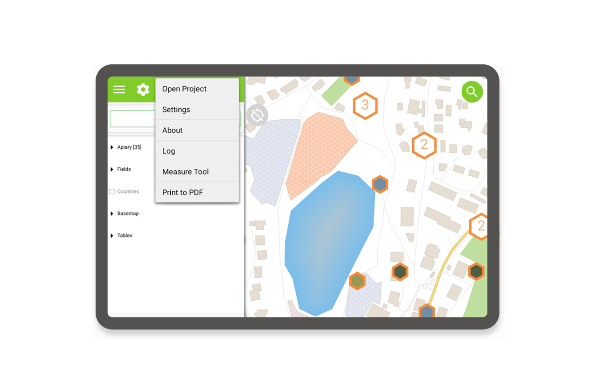
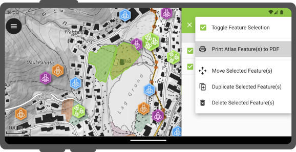

# Print to PDF

It's possible to export laid out maps as PDF document through project print layouts
configured within QGIS.

## Usage
:material-tablet: Fieldwork

Printing to PDF is available through QField's main menu in the side dashboard.

!

If the opened project has a single print layout defined, selecting the 'Print to PDF'
menu will immediately launch an export of the layout to PDF. If more than one print
layout is present, a submenu will appear listing all the available layouts to choose from.

Once the print layout has been exported, QField will allow users to open and view the
created PDF document.

!

## Feature-Driven Atlas Print

You can also print an atlas-driven layout by selecting features from vector layers acting
as coverage layers. To do so, identify features on the map by tapping on the canvas and
hold-press on a feature in the list to toggle the (mutli-)feature selection mode. Once the
desired features are selected, click on the *Menu ( ⁝ )* button and select *Print Atlas
Feature(s) to PDF*.

!

It is possible to print a single atlas feature through the feature form by clicking on the
*Menu ( ⁝ )* button and selecting the *Print Atlas Feature to PDF*.
