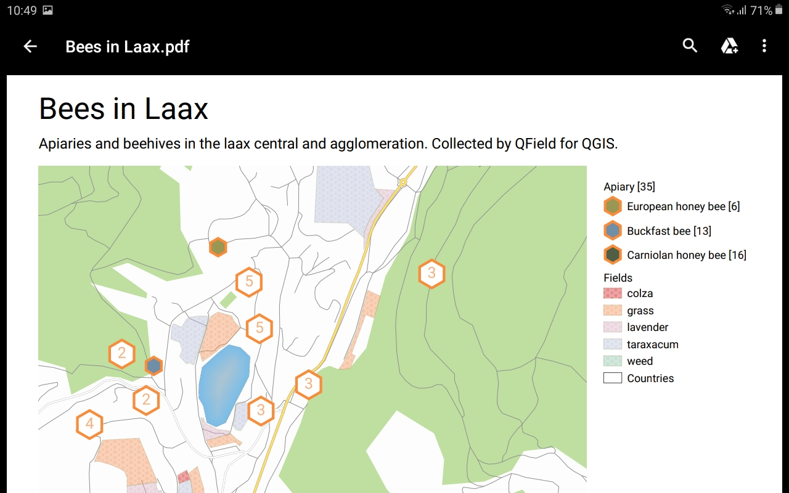

# Print to PDF

It's possible to export the maps and other items to a PDF document using the QGIS Print Layouts.

## Usage
:material-tablet-android:{ .device-icon } Fieldwork

If the project has at least one print layout defined, printing is
available over the menu.

!

After selecting the print layout, the PDF document is created and stored
in the project's directory.

By choosing the PDF reader app, the document can be opened directly.

!

Done.

!

A video demonstration of how the complete workflow looks:

## Atlas Print

You can also print an atlas by selecting the features. Choose features on the map, select them in the list and print them: *Menu ( ⁝ ) Button > Print Atlas Feature(s) to PDF*.

Or you can print one single feature directly in the form with *Menu ( ⁝ ) Button > Print Atlas Feature to PDF*.