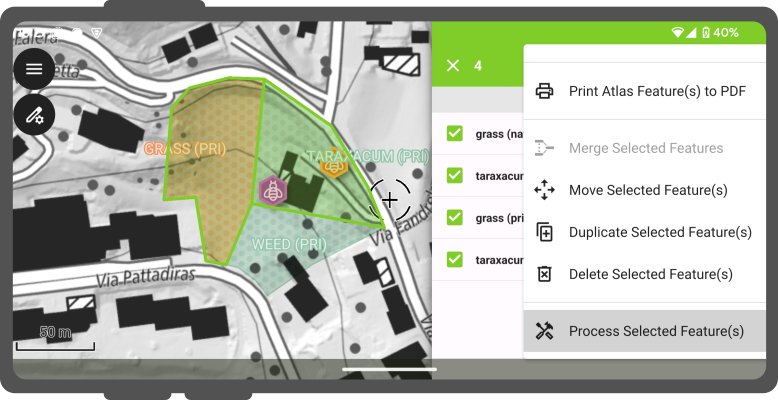
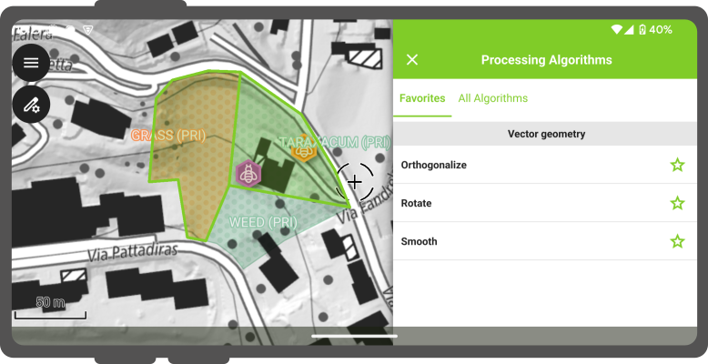
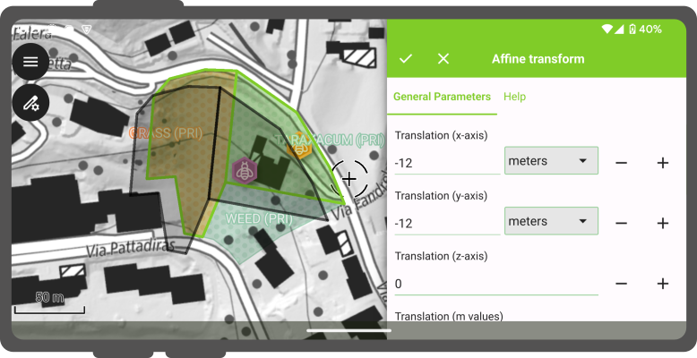

# Processing Algorithms

QField offers access to a number of processing algorithms to modify digitized features and their geometries.

## Showing available algorithms

Running algorithms against your features is done through the features list drawer. First, identify one or more features by tapping on the map canvas and toggle multi-selection mode by long pressing on one of the identified features. Once you've checked all features to be processed, click on the 3-dot menu and select the _Process Selected Feature(s)_ item.

!

By default, only the algorithms which are flagged as favorites will be shown. Clicking on the _All algorithms_ tab will show the full list where you can add or remove favorites.

!

## Running an algorithm

When an algorithm has been selected, a list of parameters will be displayed, regrouped into general and advanced ones within two distinct tabs. A third tab is available to access the algorithm's help content. For most algorithms, a live preview of the manipulated geometry will be overlayed on top of the map canvas offering an immediate feedback while parameters.

!

Once parameters are set to your liking, click on the check button within the drawer's title bar to run the algorithm.
