# Attribute Form

Configure feature attribute forms in your QGIS project before performing fieldwork.
Form configuration in QGIS for QField operates similarly to standard QGIS projects, with specific mobile optimizations.

## Attribute Form Configuration

To configure an attribute form, open vector layer properties by navigating to _Vector Layer Properties... > Attribute Form_ in QGIS.

Select appropriate widget types based on the expected behavior of each attribute.
The table below summarizes attribute widget types supported in QField.

| Widget type        | Support          | Notes                                                                                                                                                                                                  |
|--------------------|------------------|--------------------------------------------------------------------------------------------------------------------------|
| Attachment         | :material-check: | This field is combined with camera integration, to know more jump to [Attachment (photo settings)](#attachment-widget)   |
| Color              | :material-check: |                                                                                                                          |
| Date / Time        | :material-check: |                                                                                                                          |
| Checkbox           | :material-check: |                                                                                                                          |
| Hidden             | :material-check: |                                                                                                                          |
| Range              | :material-check: | Editable spinbox and slider                                                                                              |
| Relation Editor    | :material-check: |                                                                                                                          |
| Relation Reference | :material-check: |                                                                                                                          |
| Text Edit          | :material-check: |                                                                                                                          |
| Value Map          | :material-check: | Combobox or radio button (the latter unique to QField)                                                                   |
| Value Relation     | :material-check: | Combobox or radio button (the latter unique to QField)                                                                   |
| UUID Generator     | :material-check: |                                                                                                                          |

QField also supports container widgets:

| Widget type        | Support          | Notes                                                                                                                                                                                                  |
|--------------------|------------------|--------------------------------------------------------------------------------------------------------------------------|
| QML widget         | :material-check: |                                                                                                                          |
| HTML widget        | :material-check: |                                                                                                                          |
| Text widget        | :material-check: |                                                                                                                          |
| Spacer widget      | :material-check: |                                                                                                                          |

For other attribute widget types not yet supported, consider [sponsoring an implementation](../../get-started/contribute.md#feature-sponsoring).

## General Attribute Settings

Configure general form options in QGIS under _Vector Layer Properties... > Attribute Form_:

- **"Drag and drop designer":** Organize form layouts using containers such as tabs and groups.
Incorporate conditional visibility rules and default values to enhance form interactivity.
Read more in the [QGIS Drag and Drop Designer Documentation](https://docs.qgis.org/latest/en/docs/user_manual/working_with_vector/vector_properties.html#vector-attributes-menu). <!-- markdown-link-check-disable-line -->
- **"Hide attribute form upon":** Suppress feature forms by changing settings from **"Show form on Add Feature"** to **"Suppress attribute form"**.
When adding new features in QField, attribute forms will not display.
Ensure all layer constraints are met automatically when suppressing attribute forms.
- **"Editable":** Toggle whether an attribute field is editable in the widget display settings.
- **"Remember last values":** Preserves previously entered attribute values for newly created features.
While QGIS applies this rule globally when enabled, QField provides interactive controls to toggle this option on or off during data collection.
- **"Default values":** Pre-fills attribute fields using QGIS expressions.
QField supports positioning variables (such as [GNSS variables](../../reference/expression_variables.md#positioning-and-gnss-variables)) and [QFieldCloud variables](../../reference/expression_variables.md#qfieldcloud).

!


## Feature Form Wizard Mode

QField supports **"Wizard Mode"** for feature forms containing multiple root tabs.
When enabled, forms transform into a step-by-step, linear sequence.

Wizard Mode provides a guided workflow for field workers filling out complex forms, enforcing data constraints sequentially across form pages.

!!! Note
    Wizard Mode requires organizing form fields into multiple tabs.

### Configuring Wizard Mode
:material-monitor: Desktop preparation

Organize your feature form into tabs using the **"Drag and drop designer"** in QGIS before enabling Wizard Mode.

!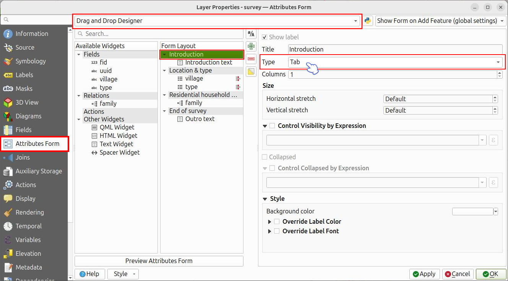

!!! Workflow
    1. Open your project in QGIS.
    2. Navigate to _Project > Properties... > QField_ or click the settings icon in the QFieldSync panel.
    3. Enable **"Enable QField feature forms' wizard mode"**.
    4. Save your project and synchronize it to QFieldCloud.

!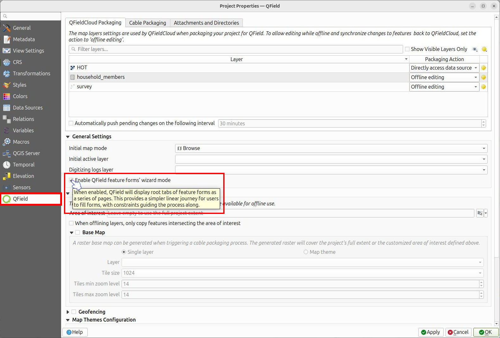

### Using the Wizard in the Field
:material-tablet: Fieldwork

When opening a feature form with Wizard Mode enabled, the interface displays one tab page at a time.

**Navigating Pages:**
A navigation bar appears at the bottom of the attribute form:

- **Previous page / Next page:** Navigate through form tabs sequentially using the navigation buttons.
- **Progress Ring:** Displays form completion progress between navigation buttons.

**Constraint Validation:**

Wizard Mode evaluates QGIS form constraints on a page-by-page basis:

- **Visual Feedback:** Progress indicators and navigation buttons change color based on validation status.
Indicators turn red when hard constraints fail and yellow or orange when soft constraints trigger warnings.
- **Blocking Progression:** Failing a hard constraint displays an error message ("Hard constraints not satisfied") and blocks navigation to subsequent pages until corrected.

**Saving the Feature:**

Wizard Mode hides the top-right **"Save"** button.

- On the final form page, the **"Next page"** button transforms into a **"Save"** button.
- Tapping **"Save"** evaluates form constraints one last time, commits the feature, and displays a confirmation message ("Changes saved").


## Working with Relations
:material-monitor: Desktop preparation

For detailed information on setting up layer relations in QGIS, refer to the [QGIS Relations Documentation](https://docs.qgis.org/latest/en/docs/user_manual/working_with_vector/joins_relations.html#setting-relations-between-multiple-layers). <!-- markdown-link-check-disable-line -->

## Value Map Widget Configuration

Control automatic transitions from button interface displays to scrollable lists when configuring Value Map widgets.

!

!!! Workflow
    1. Navigate to _Vector Layer Properties... > QField_.
    2. Under **"Feature Form Settings"**, enable the option and set the maximum item threshold to trigger toggle button interfaces.

!

!

## Attachment Widget
:material-monitor: Desktop preparation

The **"Attachment"** widget stores file paths for feature media and documents.

Use the Attachment widget to:

- Capture photos or select pictures from the gallery.
- Record audio clips.
- Record video files.
- Link external documents (such as PDF files).
- Draw sketches directly in QField.

!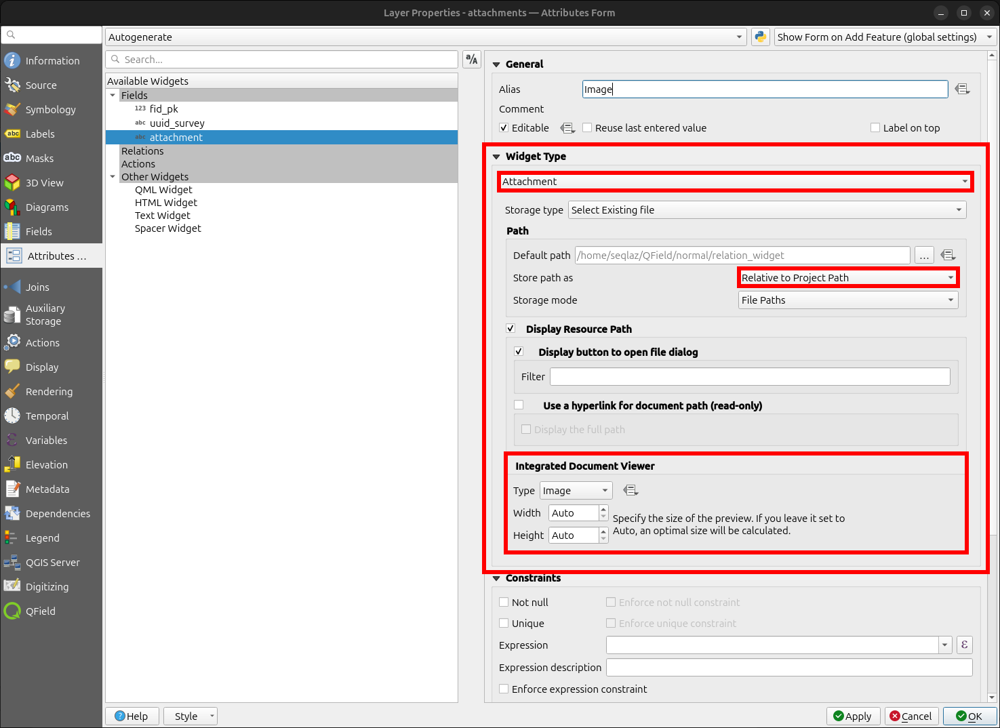

!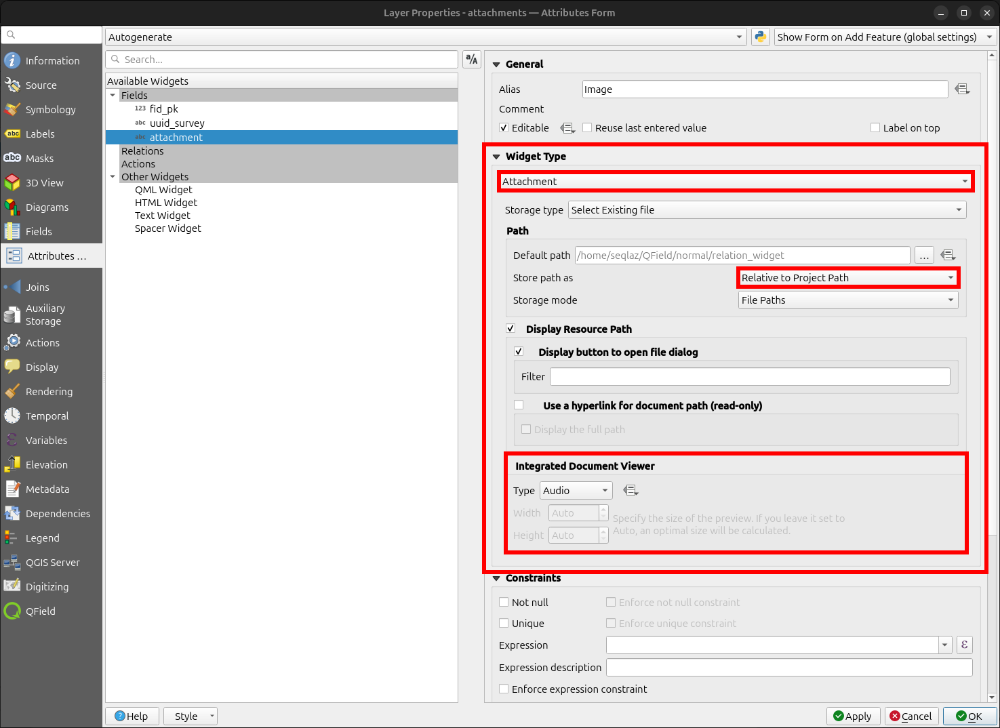

!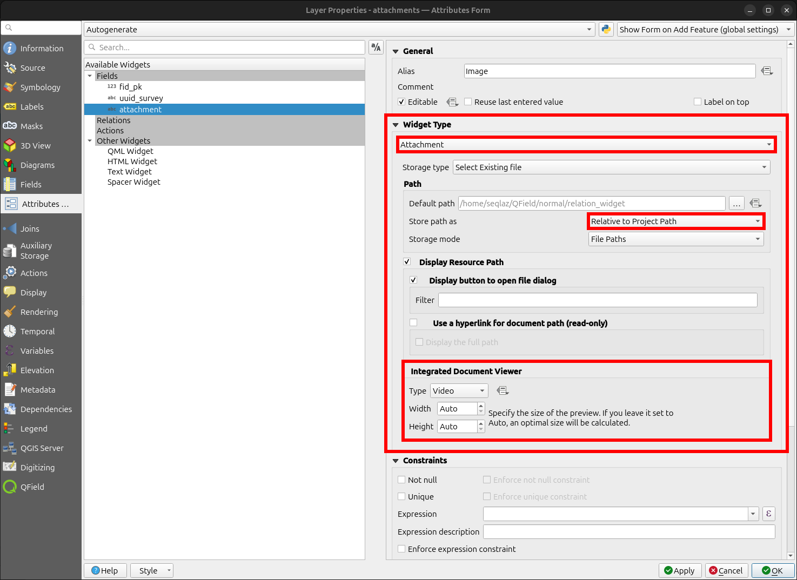

!!! Note
    Set attachment file paths to relative.
    QField stores media files in project subdirectories referenced by text attribute fields.

Tap the camera, video, microphone, or document icon to add media attachments.
QField displays the default media button configured in QGIS inside the attribute form.

!

Copy media subdirectories when synchronizing projects manually.

QField displays file names for document attachments by default.
Enabling the **"Hyperlink"** option on Attachment widgets displays file paths as external hyperlinks.

!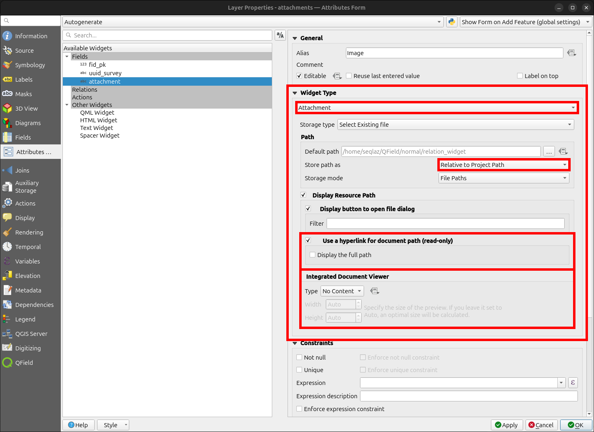

### Setting a Specific Attachment Path
:material-monitor: Desktop preparation

Configure media attachment file paths in QFieldSync.
By default, QField saves photos to `DCIM`, audio recordings to `audio`, and videos to `video` using timestamped file names.

!!! Workflow
    1. Navigate to _Vector Layer Properties... > QField_.
    2. Configure attachment file naming expressions under **"Attachments Settings"**.

!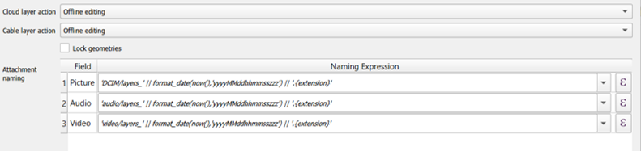

## Value Relation Widget
:material-monitor: Desktop preparation

The **"Value Relation"** widget displays values from a related layer in a combobox or toggle button layout.

The Value Relation widget supports toggle button interfaces similar to Value Map widgets.

Configure the following parameters:

- **Layer:** Select the layer containing lookup values.
- **Key column:** Select the attribute column containing saved key values.
- **Value column:** Select the attribute column displaying readable labels during data collection.
- **Order by Value:** Sort displayed values by key, value, or a specified column.
- **Group column:** Group lookup values using another attribute column (such as grouping tree species by genus).
When grouped, QField displays the widget as a list regardless of toggle button settings.
- **Allow NULL value:** Allows leaving the field blank.
- **Use Completer:** Enables auto-complete searching across available lookup values.
- **Allow multiple selections:** Allows selecting multiple lookup values for a single feature.


### Group Value Configuration

!!! Workflow
    1. Select the attribute column used to organize items into groups.
    2. (Optional) Enable **"Display group name"** to display group titles as distinct section headers.

!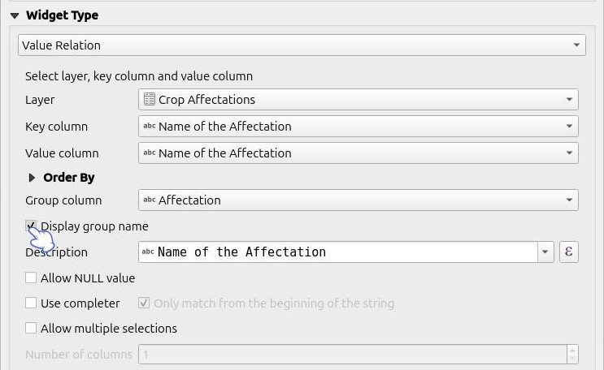

!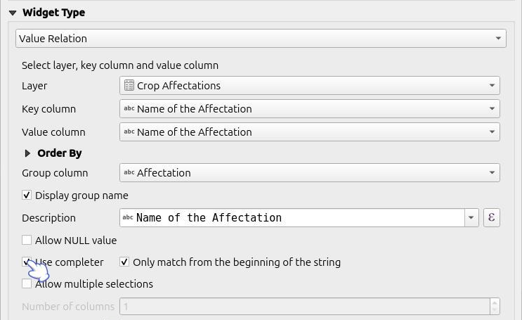

!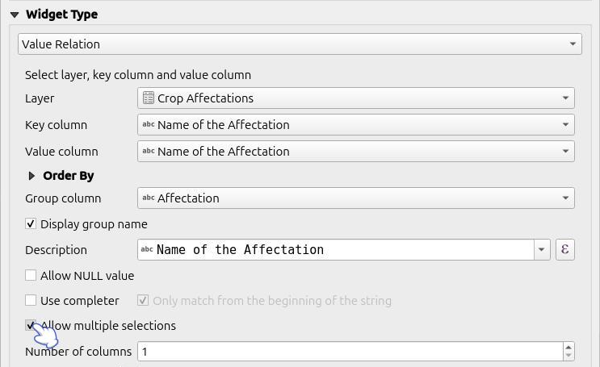

!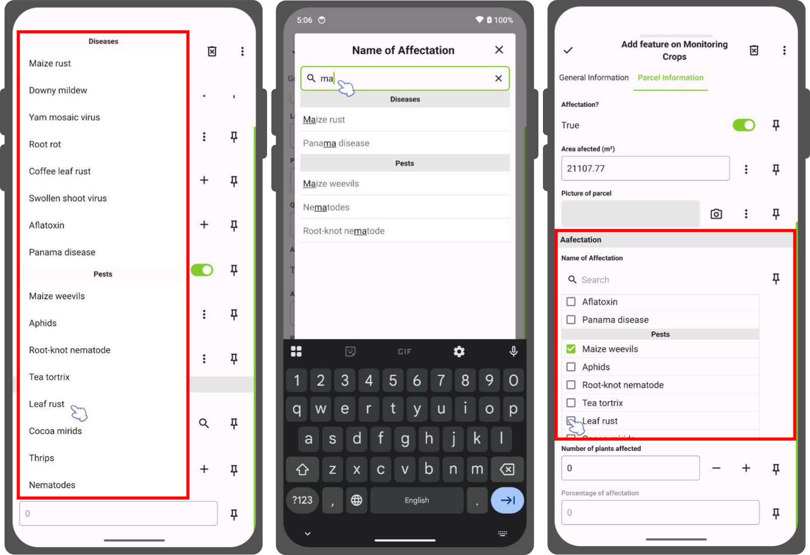

### Use Auto Complete

!!! Workflow
    1. Navigate to _Vector Layer Properties... > Attribute Form_.
    2. Set the widget type to **"Value Relation"**.
    3. Enable **"Use completer"**.

!

!

## Conditional Visibility
:material-monitor: Desktop preparation

Hide form containers or fields based on QGIS expressions.
Use conditional visibility when specific attributes are required only under certain conditions.

### Example: Disease Attribute Visibility

!!! Workflow
    1. Create a container group in the attribute form designer.
    2. Define a visibility expression for the group (for example, display the group only when a feature is marked as sick).
    3. Add conditional attribute fields into the container group.

!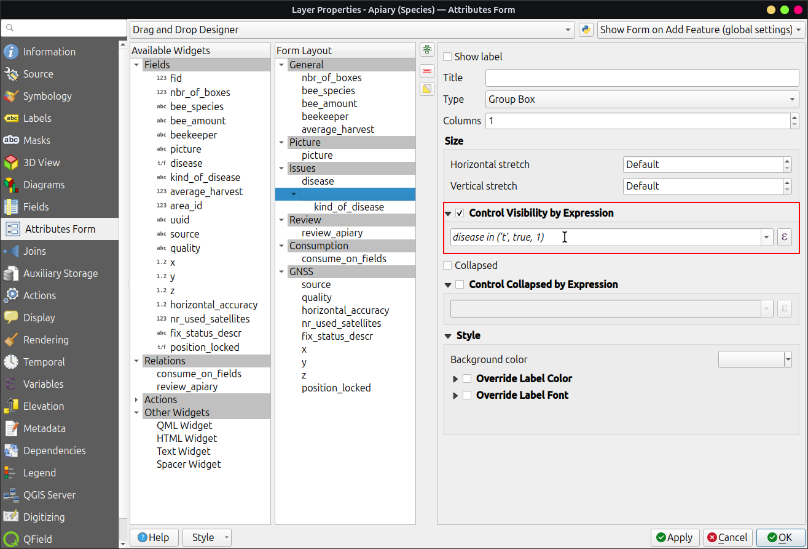


## Conditional Row Styling
:material-monitor: Desktop preparation

QField supports QGIS conditional row styling to provide visual feedback in list views (such as identify results or relation lists).
Use expressions to change background colors, text colors, and font styles based on feature data.

!!! Note
    QField supports full row styling in feature lists.

!!! Workflow
    1. Open your project in QGIS.
    2. Right-click your vector layer in the Layers panel, select **"Open Attribute Table"**, and click **"Conditional Formatting"**.
    3. Switch to the **"Full row"** tab at the top of the Conditional Formatting panel.
    4. Click **"New Rule"**.
    5. Enter an evaluation expression (such as `"status" IS 'Good'`).
    6. Configure visual formatting options:
        - **Background color**
        - **Text color**
        - **Font styles** (Italic, Underline, Strikeout)
    7. Click **"Done"** to save the rule.
    8. Save your QGIS project and synchronize it to QField.

!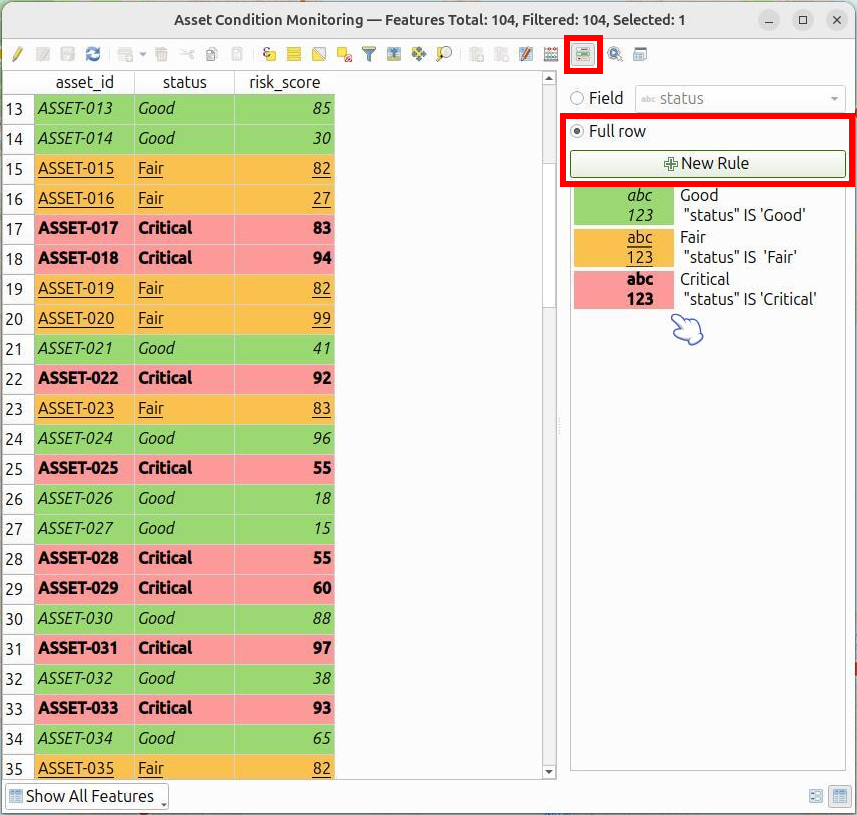

:material-tablet: Fieldwork

When viewing feature lists in QField (such as identify results or relation lists), items automatically apply defined conditional formatting rules.

!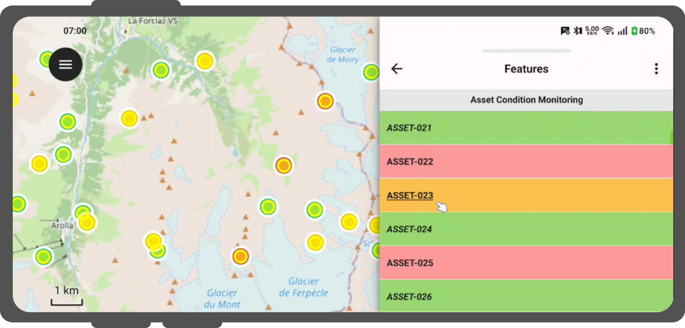

## Define Constraints
:material-monitor: Desktop preparation

Attach expression rules as attribute constraints.
Features require satisfying all constraints before saving edits.
Add custom description messages to inform users when constraints fail.

!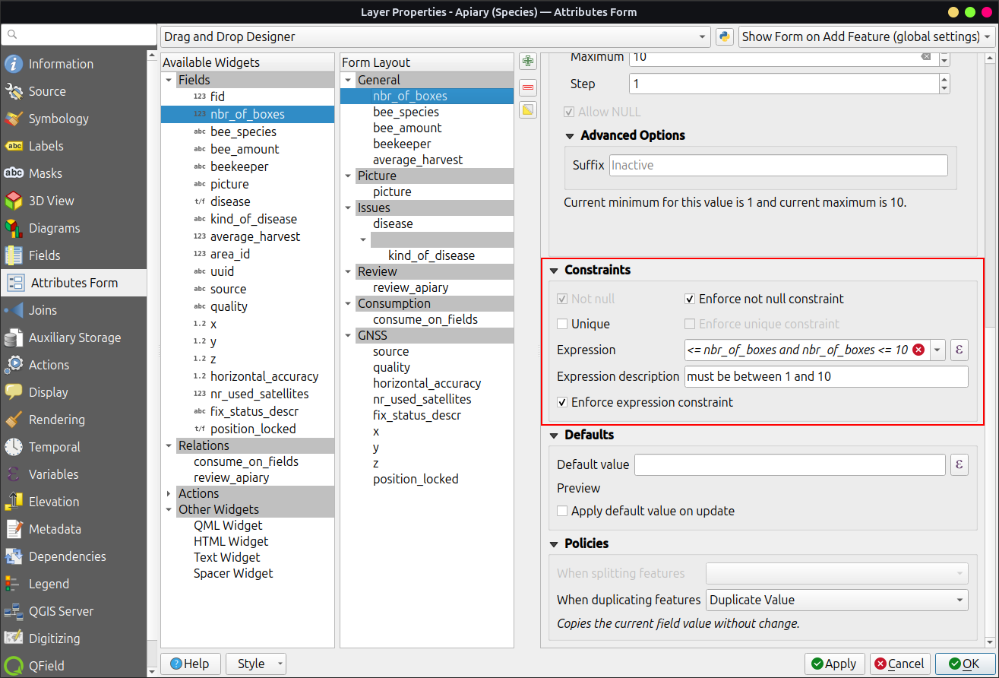

Examples of constraint expressions:

- Restrict elevation values:
    ```sql
    "elevation" < 5000
    ```
- Require non-null identifiers:
    ```sql
    "identifier" IS NOT NULL
    ```

## Define Default Values
:material-monitor: Desktop preparation

Configure default values to pre-fill attribute forms when digitizing new features.
Default values remain editable in the form unless fields are locked.

!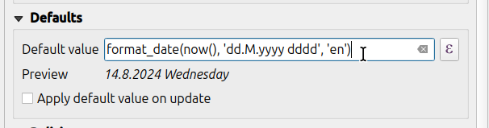

!!! Attention
    Avoid enabling **"Apply default value on update"** for primary key fields.

## Working with Expressions

Use Layer Names rather than Layer IDs when building expressions for QField.
QFieldSync conversion jobs may assign new internal Layer IDs, causing expressions referencing static Layer IDs to fail.
Referencing Layer Names ensures consistent expression evaluation across project exports.

!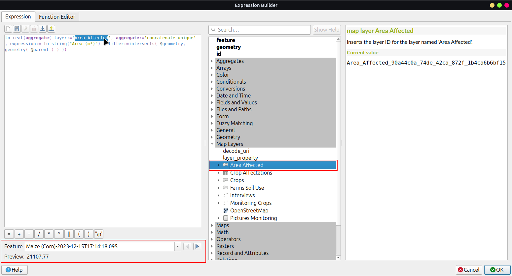

## Additional Variables

Read the [GNSS Positioning Documentation](../navigation-and-positioning/gnss.md) to store location details in attributes.

QFieldCloud provides two expression variables for attribute default values and conditional visibility:

- `@cloud_username`: Returns the username of the logged-in QFieldCloud account.
- `@cloud_useremail`: Returns the email address of the logged-in QFieldCloud account.

Examples of expression variables:

- Insert horizontal accuracy:
    ```sql
    @position_horizontal_accuracy
    ```
- Insert current timestamp:
    ```sql
    now()
    ```
- Insert digitized geometry length:
    ```sql
    length($geometry)
    ```
- Insert custom device variable:
    ```sql
    @operator_name
    ```
- Assign region codes based on spatial intersection:
    ```sql
    aggregate( layer:='regions', aggregate:='max', expression:="code", filter:=intersects( $geometry, geometry( @parent ) ) )
    ```
- Transform positioning coordinates to project CRS:
    ```sql
    x(transform(@position_coordinate, 'EPSG:4326', @project_crs))
    y(transform(@position_coordinate, 'EPSG:4326', @project_crs))
    ```
- Extract snapped feature attributes:
    ```sql
    with_variable(
      'first_snapped_point',
      array_first( @snapping_results ),
      attribute(
        get_feature_by_id(
          @first_snapped_point['layer'],
          @first_snapped_point['feature_id']
        ),
        'id'
      )
    )
    ```

## Define QML Widgets

Integrate custom QML widgets to execute advanced form actions.

!!! Example
    A QML button widget for external map navigation:

    ```qml
    import QtQuick
    import QtQuick.Controls

    Button {
        width: 200
        height: width/5
        text: "Open in Maps"
        onClicked: {
            Qt.openUrlExternally(expression.evaluate("'geo:0,0?q=' || $y || ',' || $x"));
        }
    }
    ```

    The `geo` URI above is adapted to work with Android. For Apple Maps the URI can be changed to `'geo:' || $y || ',' || $x`.

    !
