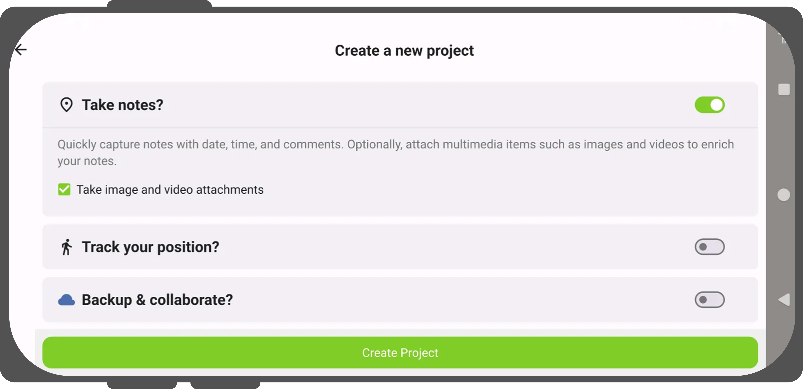

# Create a new project in QField

It is possible to create a simple project to collect notes with or without attachments and tracking yourself during the note taking.
You can choose between several basemaps and turn it into a cloud project if needed.

!!! Workflow

    1. Launch the QField Application on your mobile device
    2. Select the big plus sign on the right hand side of the landing page.
    !

    3. A new window will open where you can configure your project to your needs.

    You can select the basemap that you want:

    - OpenStreetMap
    - Dark Gray
    - Light Gray
    - Blank
    - Your custom basemap via an URL

    !

    4. If you want to add attachments to your note layer, check the checkbox.
    5. You can also track yourself by toggling the switch button.
    If needed and start the tracking on project launch.
    6. If you want to immediately connect to QFieldCloud and turn it into a cloud project, toggle the switch button.
    If you choose to cloudify your project you will be asked to login with your QFieldCloud credentials.
    Once you are logged in, the project will immediately be synchronized with QFieldCloud.

    !
