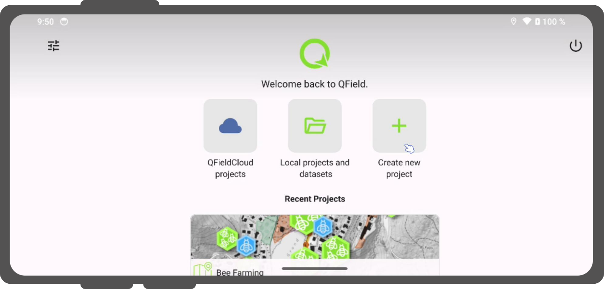
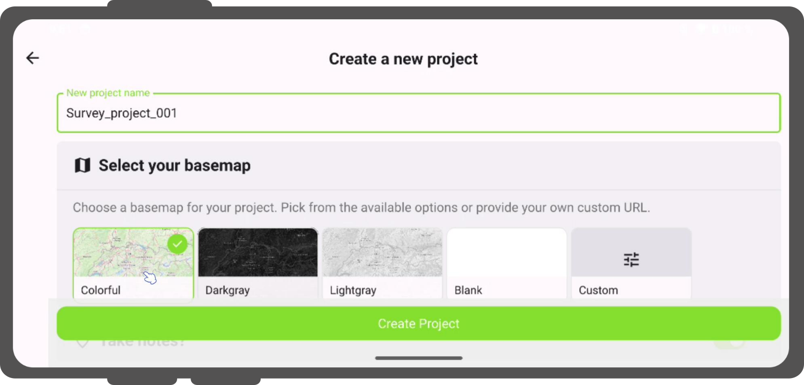
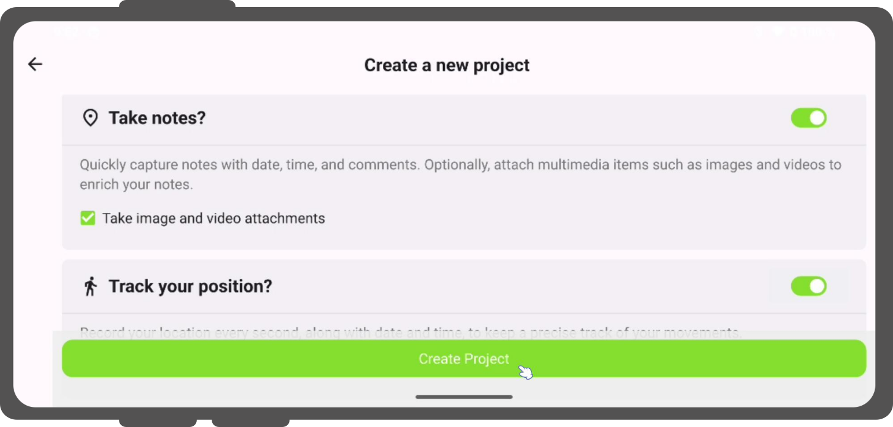

# Create a new project in QField

It is possible to create a simple project to collect notes with or without attachments and track yourself during note-taking directly within QField on your mobile device.
You can choose between several basemaps and turn it into a cloud project if needed.

## Creating a local project

!!! Workflow

    1. Launch the QField application on your mobile device.
    2. Select the big plus sign on the right-hand side of the landing page.
    !

    3. A new window will open where you can configure your project to your needs.

    You can select your preferred basemap:

    - OpenStreetMap
    - Dark Gray
    - Light Gray
    - Blank
    - Your custom basemap via a URL

    !

    4. If you want to add attachments to your note layer, check the checkbox.
    5. You can also track yourself by toggling the switch button (and optionally start tracking automatically on project launch).
    6. If you want to immediately connect to QFieldCloud and turn it into a cloud project upon creation, toggle the cloud switch button. If you choose this option, you will be prompted to log in with your QFieldCloud credentials, and the project will immediately synchronize to the cloud.

    !

## Converting an existing local project to QFieldCloud ("Cloudify")
:material-tablet: Fieldwork

If you initially created your project as a local project on your device, you can convert it into a QFieldCloud project at any time.

!!! Workflow

    1. Open your local project in QField.
    2. Open the **Side Dashboard** and tap the **QFieldCloud button** icon.
    3. If you are not signed in yet, log in with your QFieldCloud account credentials.
    4. In the QFieldCloud panel, locate the **Cloudify project** card.
    5. Tap the **Cloudify project** button.
    6. QField will automatically package your local layers, create the project on QFieldCloud under your account or organization, and upload all initial project files and datasets.
    !

Once converted, your project will benefit from seamless cloud synchronization, changes tracking, and multi-user collaboration!
