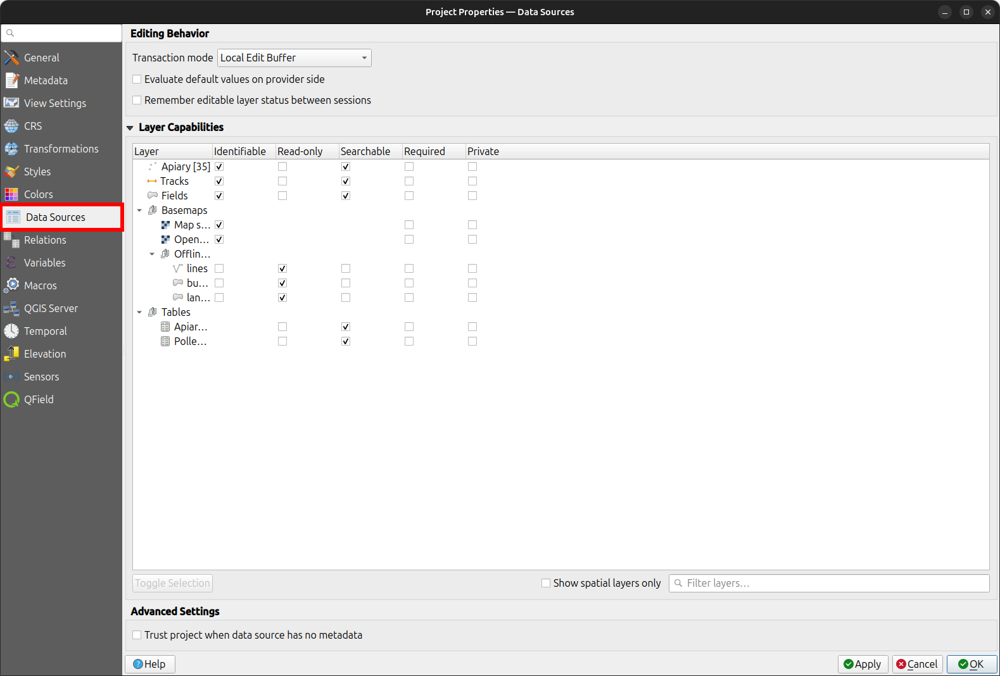
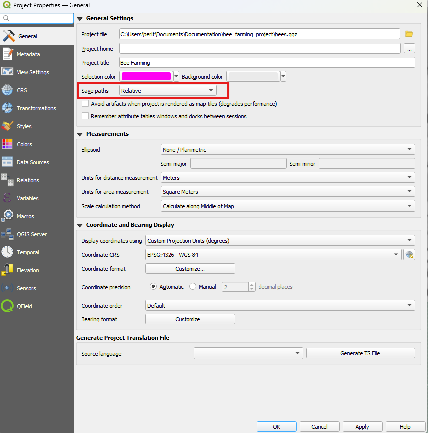

# Data Source & Project Paths

Save and store projects and layers using multiple methods and formats.
Save all project-related data in the same directory as your QGIS project file unless using [Shared Datasets](../../how-to/advanced-how-tos/shared-datasets.md).
When working with projects containing many lookup tables, hide specific layers from field collectors to streamline the user experience.

## Data Source Configuration

Hide layer attributes or lookup tables during field data collection by configuring layer capabilities.

!!! Workflow
    :material-monitor: Desktop preparation

    1. In QGIS, navigate to _Project > Properties... > Data Sources_.

    !

    Configure layer capabilities using the following options:

    - **"Identifiable":** Unchecking this option prevents features in the layer from being identified in QGIS and QField.
    - **"Read-Only":** Checking this option prevents adding, editing, or deleting features in the layer.
    - **"Searchable":** Checking this option includes layer attributes in search bar queries and expression evaluations.
    - **"Required":** Checking this option keeps the layer visible and prevents users from toggling its visibility on the map canvas.
    - **"Private":** Checking this option hides the layer from the project legend and layer tree.

## Relative Project Path

Set all file paths for datasets and attachments to relative to make your project portable across devices.
To manually transfer and synchronize your QGIS project to QField or another client, use relative file paths for your QGIS project file (`.qgs` or `.qgz`).

!!! Workflow
    :material-monitor: Desktop preparation

    1. Navigate to _Project > Properties... > General_.
    2. Ensure **"Save paths"** is set to **"Relative"**.
    3. Ensure all required dataset files are located in the same directory as the QGIS project file or within subdirectories.

!

Learn more about preparing projects for fieldwork in the [QFieldCloud Get Started Guide](../../get-started/tutorials/get-started-qfc.md) or [QFieldSync Get Started Guide](../../get-started/tutorials/get-started-qfs.md).
