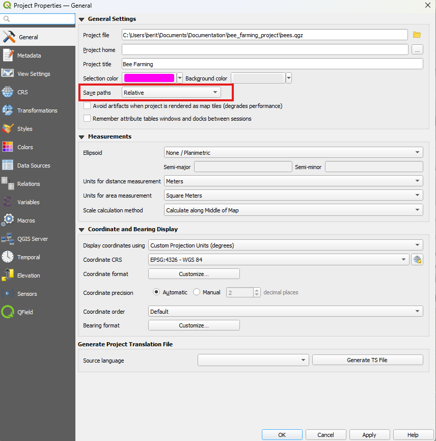

# Data Source  & project paths

You can save and store your projects and layers in multiple ways and formats.
It is common best practice to save all your project related data in the same folder as the QGIS project unless you are making use of [shared datasets](../../how-to/advanced-how-tos/shared-datasets.md).
Furthermore, while working in a project with many domain tables etc. it may be preferable to hide some of the layers from the collector's eyes to make the user experience more manageable.

## Data source configuration

Often, you do not need to access the attributes of all the feature layers or view the value relation tables of your projects.
You can achieve that by setting the right "layer capabilities".

!!! Workflow

    :material-monitor: Desktop preparation

    1. In the menu toolbar click on *Project* > *Properties...* > [*Data Sources*](https://docs.qgis.org/latest/en/docs/user_manual/introduction/qgis_configuration.html#data-sources-properties) <!-- markdown-link-check-disable-line -->
    !
         - **Identifiable**: If unchecked the objects of the layer can no longer be identified in QGIS and QField
         - **Read-Only**: If checked a layer can no longer be added, edited or deleted.
         - **Searchable**: If checked the attributes of the layer can be found in the search bar and be accessed for expressions.
         - **Required**: If checked the layer will always be visible and cannot be turned off by any user in the map canvas.
         - **Private**: If checked the layer is hidden from the project's legend or layer tree.

## Relative Project path

It is a good practice to set all your file paths of your datasets and attachments to "relative" making your project easily transferrable.
To manually transfer and synchronize your QGIS project to QField or another client, you will need such a portable version of your QGIS project file (`.qgs`, `.qgz`).

!!! Workflow

    :material-monitor: Desktop preparation

    1. Direct to *Project* > *Properties* > *General*
    2. Insure that the  *Save paths* is set to *Relative*
    !
    3. Insure also that all required data files are in the same folder as the QGIS project or in a subfolder.

You can learn more how to prepare your projects for fieldwork in [Get Started with QFieldCloud (recommended)](../../get-started/tutorials/get-started-qfc.md) or [Get Started with QFieldSync](../../get-started/tutorials/get-started-qfs.md) tutorials.
