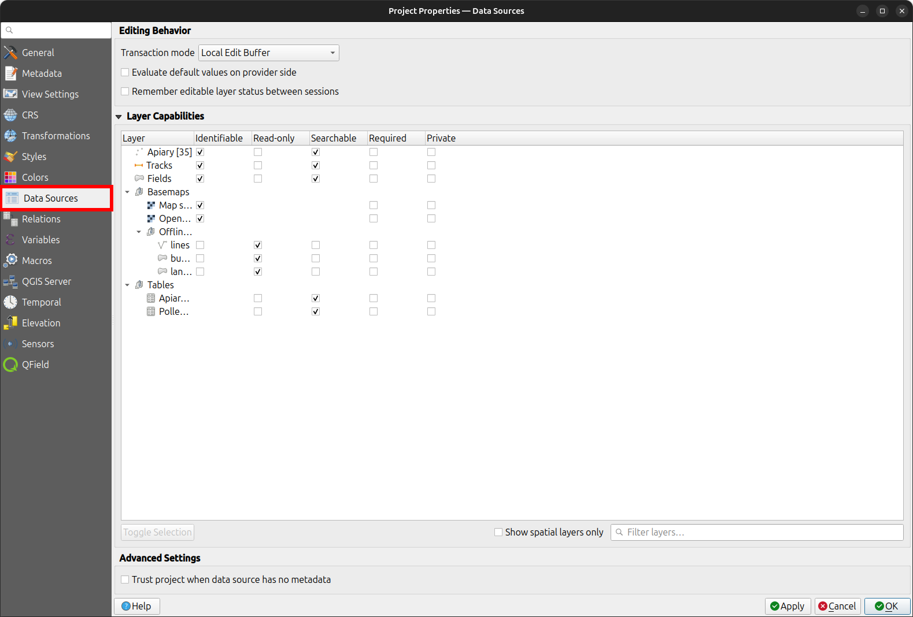

# Data Source Configuration
:material-monitor: Desktop preparation

Frequently, you do not need to access the attributes of all the feature layers or view the value relation tables of your projects.
You can achieve that by setting the right "layer capabilities".

1. In the menu toolbar click on *Project* > *Properties...* > [*Data Sources*](https://docs.qgis.org/latest/en/docs/user_manual/introduction/qgis_configuration.html#data-sources-properties)

!

- **Identifiable**: If unchecked the objects of the layer can no longer be identified in QGIS and QField
- **Read-Only**: If checked a layer can no longer be added, edited or deleted.
- **Searchable**: If checked the attributes of the layer can be found in the search bar and be accessed for expressions.
- **Required**: If checked the layer will always be visible and cannot be turned off by any user in the map canvas.
- **Private**: If checked the layer is hidden from the project's legend or layer tree.
