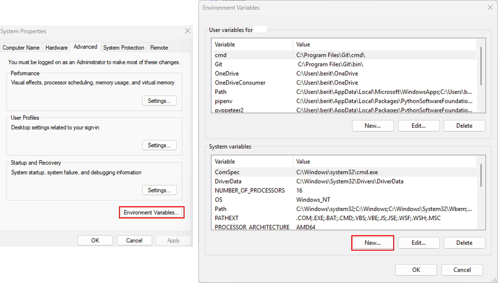

# Working with PostgreSQL

## PostgreSQL in QField

Working with databases can be much easier when working in a multi-user environment or when working in a variety of projects that require more complex data structures.
With QField you can easily work within a database but there are a few steps that need to be taken before the smoothless fieldwork can begin.
This page goes through the different options and gives step-by-step instructions on how this can be achieved.

## Connection to PostgreSQL in QGIS

In QGIS there are two options in which you can connect to your database.

1. **Direct Connection:** When connecting to a PostgreSQL database, you can store all information including the credentials inside the QGIS Project directly.
2. **Using a PG Service File:** Using a service file that holds the connection parameters to all your databases as an individual service name.
Independently on working with our without QFieldCloud, we highly recommend to make use of this option due to data safety.

### Direct Connection using Simple Authentication

You can create a PostgreSQL connection directly inside QGIS.
**NOTE:** We do not recommend this option due to data safety reasons.
It is not safe to store your database credentials in the QGIS Project File.

!!! Workflow

    1. In your Browser right-click on the *PostgreSQL Elephant* > *New Connection*
    2. In the window give your connection a name and add the service information in the dialogue (host, dbname, port, SSL mode)
    3. In the "Authentication section", add a new *Authentication* if you have not yet connected to your database and saved the credentials.
    4. Test the connection and when successful click ok.
    5. Create a new project on QFieldCloud, choosing the **second** option to keep the connection to your database.
    6. Configure the layers and the project according to your needs and synchronize with QFieldCloud.

    If you have added the access credentials in the "Authentication" section as described above, QField will be able to directly start editing and adding new features.

    !

### Connection via PG service

It is possible to connect to postgreSQL via a service using a service file.
A service is stored inside the `pg_service.conf` file where all the required information to access your database is stored.
Instead of storing the hostname, port, database name and more into the QGIS Project file, these can be stored separately.
Using services is very useful, when you work with multiple database connections during your everyday work to quickly change and connect to the different instances.

Read more about PostgreSQL services in the [QGIS documentation](https://docs.qgis.org/latest/en/docs/user_manual/managing_data_source/opening_data.html#postgresql-service-connection-file).

There exists a useful plugin, which supports in the easy creation and configuration of the service file - [the PG Service Parser Plugin](https://github.com/opengisch/qgis-pg-service-parser-plugin).
We recommend using this plugin and will show you below how to use it.

!!! Workflow

    :material-monitor: Desktop Preparation

    1. Direct to *Plugins* > *Manage and Install Plugins*
    2. Search for "PG service parser" (icon of the PostgresSQL Elephant) and install it.
    3. Once installed, in the QGIS toolbar, the same icon should appear.
    4. Upon clicking on the icon a new window will appear.
    5. If you never set-up a service file before, the plugin will automatically create a new file in a proper default directory, which ensures QGIS will be able to read it.
    !

    6. Click on "Create file at default location" and leave the default name.

    Now you can configure the database information which will be stored as a PG service.

    **Create service**

    1. Click on the green plus within the PG service parser plugin
    2. Add the different setting options by clicking on each required option and click "OK"
    3. Edit the database information by double-clicking on the different sections.
    4. Once you are done, click on the Update service button so save the configuration.
    5. Keep the window open, as we will use it in the next section.

    !

    **Connection to PostGIS via service**

    1. Within the dialog of the PG service parser plugin, go to the QGIS Connections tab.
    2. If needed, select the service you'll use to connect to PostGIS.
    3. Click on the green plus to add a new connection.
    4. Click on "OK" to accept a default connection name or enter your preferred name for the connection, which could contain spaces.
    5. Double click on the new entry displayed and click on the Test Connection button. If successful, click OK.
    **Note:** You can edit connection details to "also list tables with no geometry" or "Use estimated table metadata" to customize your connection.
    6. Once you are done, you can close the plugin dialog.

    The new QGIS Connection will appear in your browser, listed under the PostgreSQL item.

## Connection to PostGIS in QField

If you have connected to PostGIS using the PG Service file and, it is also necessary to add the service file either on your mobile device directly or within QFieldCloud as a "Secret".

### Configuration on Mobile Device

If you copy your projects via cable to your device, you will also have to copy the service file to the right directory on your device.
Generally, the QField directory for Android can be found under `/Android/data/ch.opengis.qfield/files/QField.`
!!! Note

    **1.** Due to the restrictions of Android, you will only be able to access the directory when being connected via cable to the computer.
    The only other possible option you have is to set your device to root (not recommended).
    **2.** Unlike on *NIX systems where the file is named .pg_service.conf, the file on Android is named pg_service.conf without a leading dot sign (.).

### Configuration on QFieldCloud

QFieldCloud support `pg_service.conf` configurations too.
You need to configure your PostgreSQL layers with "Offline editing" cloud action and store your service settings on QFieldCloud Project's Secrets page.

Read more [how to configure PostgreSQL service](../../reference/qfieldcloud/secrets.md) in the QFieldCloud documentation.

## Creating a `pg_service.conf` File for PostgreSQL Connection in QGIS and Secrets

Before beginning, ensure that your PostgreSQL database allows connections from QFieldCloud.
Refer to [Technical specs](../../reference/qfieldcloud/specs.md) for instructions.

### Setup `pg_service.conf` File

We first need to set up a configuration file.
There are many options to organize this, [read more in the PostgreSQL documentation](https://www.postgresql.org/docs/current/libpq-pgservice.html)<!-- markdown-link-check-disable-line --> or follow the description below.

1. **Create a Configuration File**:

   - On Windows:
     Create a file named `pg_service.conf` and store it in a convenient location.

   - On Linux/MacOS/Unix:
     Create a file named `.pg_service.conf` in your home folder (`~`).

2. **Define Connection Parameters**:

   Within the file, specify connection parameters for your PostgreSQL database using the following format:

   ```ini
   [SERVICE_NAME]
   host=your_host_or_ip
   port=your_port
   dbname=your_database_name
   user=your_username
   password=your_password
   ```

   Replace placeholders (`your_host_or_ip`, `your_port`, `your_database_name`, `your_username`, `your_password`) with actual connection details and save the file.

### Additional Configuration Steps for Windows

1. **Set Environment Variable**:
   To ensure QGIS recognizes `pg_service.conf`, create an environment variable pointing to its location:

    1. Navigate to *This PC* or *My Computer* > *Properties* > *Advanced System Settings* > *Environment Variables*.
    2. Add a new variable:
          - Variable name: `PGSERVICEFILE`
          - Variable value: `C:\Users\<YourUsername>\AppData\Roaming\postgresql\pg_service.conf` (or your `pg_service.conf` file path).

    !

    **Set Environment Variable in QGIS**

    1. Direct to *Settings* > *Options* > *System*
    2. Under the *Systems* tab, find the *Environment* Section, enable the *Use custom variables* and add the file location to your pg service file as shown in the image below.

!

1. **Test the Connection in QGIS**: Open QGIS and set up a new PostgreSQL connection using the service name defined in `pg_service.conf` (e.g., `[MY_QGIS_DB]`) in the connection details.
QGIS will read configuration from `pg_service.conf` automatically.

   - Open QGIS.
   - Go to *Layer* > *Add Layer* > *Add PostGIS Layers...*
   - In *Create a New PostGIS Connection*, select "Service" from the drop-down menu.
   - Enter the service name from `pg_service.conf` (e.g., `[NINJA_DB]`) in the "Service" field.
   - Click "OK" to connect to your PostgreSQL database using configurations from `pg_service.conf`.

!

1. **Add Parameter to QFieldCloud Secrets**: Navigate to the project's secrets page and copy the service directly from `.pg_service.conf` to the secret.
Follow [Secrets](../../reference/qfieldcloud/secrets.md) for guidance.

!
