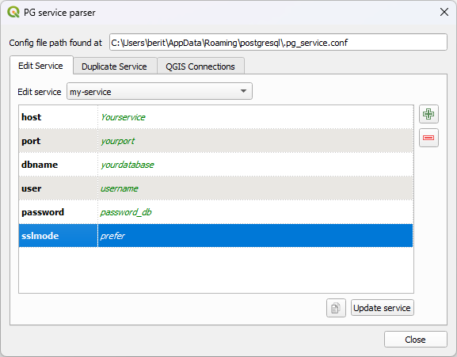
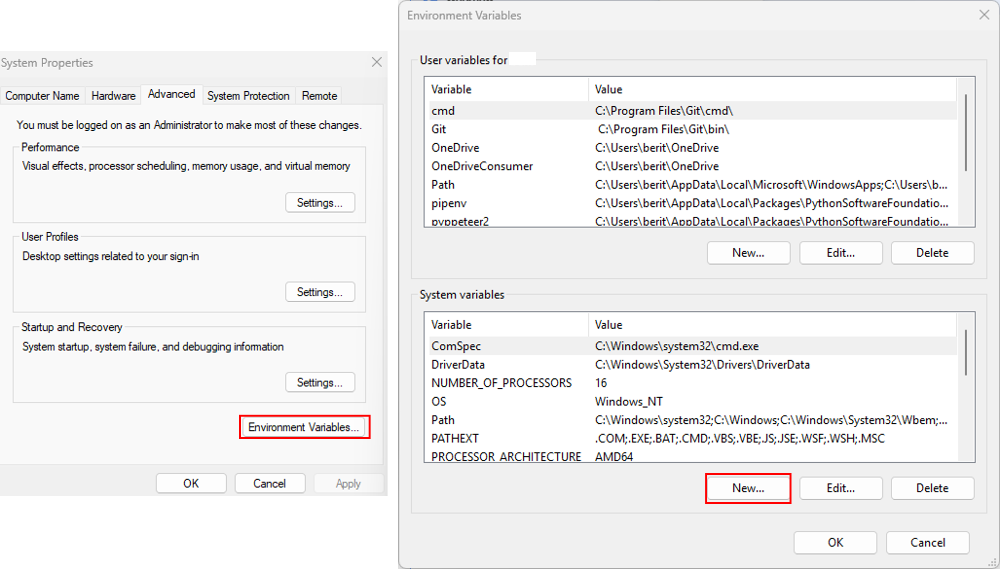

# Working with PostgreSQL

## PostgreSQL in QField

Working with databases simplifies data management in multi-user environments and complex project structures.
QField allows connecting directly to PostgreSQL databases after completing initial configuration steps.
This page provides step-by-step instructions to configure PostgreSQL database connections for QField and QFieldCloud.

## Connection to PostgreSQL in QGIS

QGIS supports two methods to connect to a PostgreSQL database:

- **Direct Connection:** Stores connection parameters and credentials directly inside the QGIS project file.
- **Using a PG Service File:** Stores database connection parameters separately in a central service configuration file.

We recommend using PG service files for security rather than storing unencrypted database credentials inside project files.

### Direct Connection Using Simple Authentication

You can create a PostgreSQL connection directly inside QGIS.

!!! Warning
    We do not recommend storing database credentials directly in QGIS project files due to data security risks.

!!! Workflow
    1. In the QGIS Browser panel, right-click **"PostgreSQL"** and select **"New Connection..."**.
    2. Enter a connection name and specify connection parameters (such as host, database name, port, and SSL mode).
    3. Under the **"Authentication"** section, click **"Add"** to store user credentials if not previously saved.
    4. Click **"Test Connection"** and click **"OK"** when the connection succeeds.
    5. Create a new project on QFieldCloud, selecting the direct connection option to maintain database access.
    6. Configure project layers and synchronize the project to QFieldCloud.

If you stored access credentials in the **"Authentication"** section, QField can edit and digitize features directly.

!

### Connection via PG Service

Connect to PostgreSQL using a service configuration file.
A `pg_service.conf` file stores parameter definitions to access databases under named service entries.
Using service files avoids storing hostnames, ports, database names, and passwords directly inside QGIS project files.
Service files allow quickly switching between multiple database instances across different projects.

Read more about PostgreSQL service connection files in the [QGIS Documentation](https://docs.qgis.org/latest/en/docs/user_manual/managing_data_source/opening_data.html#postgresql-service-connection-file). <!-- markdown-link-check-disable-line -->

The [PG Service Parser Plugin](https://github.com/opengisch/qgis-pg-service-parser-plugin) simplifies creating and managing service configuration files in QGIS.

!!! Workflow
    :material-monitor: Desktop preparation

    1. Navigate to _Plugins > Manage and Install Plugins..._.
    2. Search for **"PG service parser"** and click **"Install Plugin"**.
    3. Click the **"PG service parser"** icon in the QGIS toolbar to open the plugin window.
    4. Click **"Create file at default location"** to generate a new `pg_service.conf` file in the default directory.

!

!!! Workflow
    :material-monitor: Desktop preparation

    1. Click the green plus (**"+"**) icon inside the PG Service Parser plugin dialog.
    2. Select required connection parameters and click **"OK"**.
    3. Double-click parameter sections to enter your database details (such as host, port, database name, user, and password).
    4. Click **"Update service"** to save your service configuration.

!

!!! Workflow
    :material-monitor: Desktop preparation

    1. Open the **"QGIS Connections"** tab inside the PG Service Parser dialog.
    2. Select the target service entry.
    3. Click the green plus (**"+"**) icon to add a new connection.
    4. Accept the default connection name or enter a custom name.
    5. Double-click the new connection entry and click **"Test Connection"**.
    6. Click **"OK"** when the connection succeeds, then close the plugin dialog.

The new connection appears under the **"PostgreSQL"** entry in the QGIS Browser panel.

## Connection to PostGIS in QField

When using a PG service file to connect to PostGIS, you must provide the service configuration file on your mobile device or save it in QFieldCloud as a project secret.

### Configuration on Mobile Devices

When transferring projects via USB cable, copy your service configuration file directly to the QField application directory on your mobile device.
The QField application directory on Android is located at `Android/data/ch.opengis.qfield/files/QField`.

!!! Note
    - Android restrictions require connecting your device to a computer via USB cable to access app directories.
    - Unlike Unix systems where the file is named `.pg_service.conf`, Android uses `pg_service.conf` without a leading dot.

### Configuration on QFieldCloud

QFieldCloud supports `pg_service.conf` configurations using project secrets.
Set PostgreSQL layers to the **"Offline editing"** cloud packaging action and save your service settings on the QFieldCloud project secrets page.

Read more about [configuring PostgreSQL service secrets](../../reference/qfieldcloud/secrets.md) in the QFieldCloud documentation.

## Creating a `pg_service.conf` File for PostgreSQL Connections

Ensure your PostgreSQL database allows connections from QFieldCloud servers before setting up database access.
Refer to [Technical Specifications](../../reference/qfieldcloud/specs.md) for server IP requirements.

### Setting up the `pg_service.conf` File

Create and populate a service configuration file on your operating system.
Read more in the [PostgreSQL Documentation](https://www.postgresql.org/docs/current/libpq-pgservice.html). <!-- markdown-link-check-disable-line -->

1. **Create the Configuration File:**
    - **Windows:** Create a file named `pg_service.conf` in your user profile or application folder.
    - **Linux / macOS / Unix:** Create a file named `.pg_service.conf` in your home directory (`~`).
2. **Define Connection Parameters:**
    Add your database parameters using the following format:

    ```ini
    [SERVICE_NAME]
    host=your_host_or_ip
    port=your_port
    dbname=your_database_name
    user=your_username
    password=your_password
    ```

    Replace placeholder values with your actual database parameters and save the file.

### Additional Configuration Steps for Windows

Create an environment variable on Windows to ensure QGIS and system tools locate `pg_service.conf`.

!!! Workflow
    1. Open _This PC > Properties > Advanced system settings > Environment Variables_.
    2. Add a new system or user variable:
        - **Variable name:** `PGSERVICEFILE`
        - **Variable value:** `C:\Users\<YourUsername>\AppData\Roaming\postgresql\pg_service.conf` (or your custom `pg_service.conf` file path).

!

**Setting Environment Variables in QGIS:**

!!! Workflow
    1. Navigate to _Settings > Options... > System_.
    2. Under the **"Environment"** section, enable **"Use custom variables"**.
    3. Add the `PGSERVICEFILE` variable name and file path.

!

Refer to the [QGIS System Settings Documentation](https://docs.qgis.org/latest/en/docs/user_manual/introduction/qgis_configuration.html#system-settings) for additional details. <!-- markdown-link-check-disable-line -->

### Using Client Certificates

Use client certificates to verify user identities when connecting to PostgreSQL servers by defining SSL parameters in `pg_service.conf`.

```ini
[SERVICE_NAME]
host=your_host_or_ip
port=your_port
dbname=your_database_name
user=your_username
password=your_password
sslcert=client.crt
sslkey=client.key
sslrootcert=server.crt
```
These parameters must point to valid certificate and key files and placed directly alongside your `pg_service.conf` file within the QField data folder. For more information on this identification method, refer to the [PostgreSQL documentation](https://www.postgresql.org/docs/current/libpq-ssl.html#LIBPQ-SSL-CLIENTCERT).
