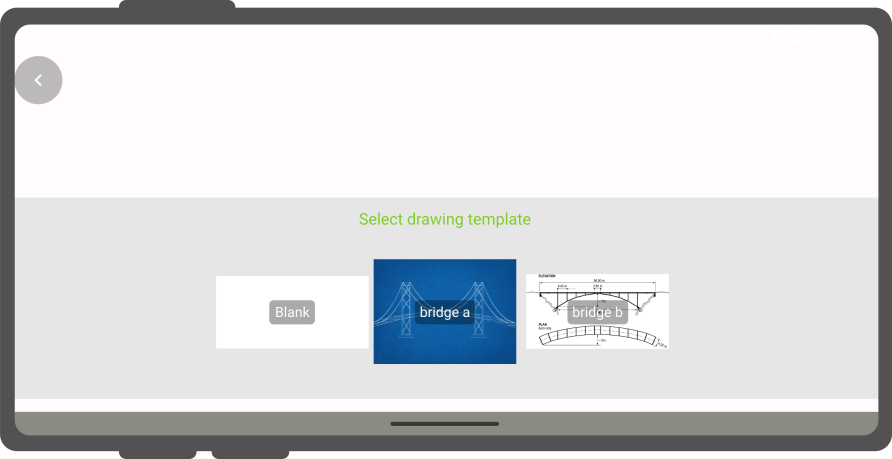

# Use attachment

In QField, a field with *Attachment* widget can be used to:

- Show and take photos
- Show and record videos
- Listen and record sound clips
- Show links to external files like PDFs or documents

!

To configure the widget, please refer to the [Attributes Form Documentation](./attributes-form.md#attachment-widget)

## Add a series of pictures to a feature
:material-monitor: Desktop preparation

It is also possible to add more pictures to the feature either by having several attachment field  attributes or by creating a relation to a separate table where the image paths are shown.
In this section we will show you an example how this is done.
A relation to a second layer needs to be set in the QGIS properties so that when adding images or other formats, these are stored in the related table.

!!! Workflow

    1. Create two tables following the style as shown below.
    One table where the features are stored and one with a list of pictures.

        ***Apiary:***

        | Field      | Type       |
        |------------|------------|
        | `id`       | Text (UUID)|
        | `geometry` | Geometry   |
        | `...`      |            |

        ***Apiary_pictures:***

        | Field       | Type       |
        |-------------|------------|
        | `id`        | Text (UUID)|
        | `apiary_id` | Text (UUID)|
        | `path`      | Text       |
        | `...`       |            |

### Relations

Create a relation with:

- `apiary` Referenced layer
- `id` Referenced field
- `apiary_picture` Referencing layer
- `apiary_id` Referencing field
- `strength` Composition

!

### Attribute Form configuration

Once you have created the relation the relation can be properly configured in the feature layer's attribute forms.
In the apiary layer we have to specify a default value to create a unique id.
For the apiary_picture layer, you will have to change the widget type to *Attachment*

!!! Workflow

    **Apiary**

    1. Direct to *Properties* > *Attribute Form*
    2. For the uuid field choose between the *Text Edit* or *UUID Generator* widget.
    3. Set the default value to `uuid('WithoutBraces')`.
    4. Hide it from the view as it should not be edited by the user.

    !

    Set the relation widget to *many to one relation* and add the relation to the form

    !

    **Apiary_picture**

    1. Direct to *Properties* > *Attribute Form*
    2. Set the widget type of the field `path` to *Attachment*
    3. Add it to the form layout.

    !

## Drawing and sketching

QField has an in-app drawing and sketching functionality enabling you to directly sketch over and annotate images captured while in the field as well as drawing on top of a blank canvas or over a template.


### Drawing templates

On top of annotating captured images, QField supports drawing from image templates.
The following two methods are available to add templates:

- The first method is to create a `drawing_templates` folder located alongside a project file and populate it with images.
Whenever that project is loaded, QField will register all images within that folder as drawing templates.
- Alternatively, you can add images into the `drawing_templates` folder found inside your QField app folder.
If you are not familiar with that app folder, its location is shown at the bottom of the About QField overlay.

Templates shipped alongside projects as well as the QField app folder will be shown when users choose "Draw a sketch" by pressing the 3-dotted menu *(⋮)* of the attachment widget.

!

## Geotagging
:material-tablet: Fieldwork

QField's internal; camera will automatically geotag your pictures.

Information about location and direction of the pictures will therefore be baked into the image file.

!!! note
    While with older Android versions it was possible to use other apps like the amazing OpenCamera app for taking pictures and preserving EXIF information from there, this is no longer with recent Android versions.
    Is recommended to disable  *Use native Camera* in the *settings* to preserve [EXIF](../../reference/exif.md) information.

## Image Stamping

QField allows you to add image stamping.
This is configured directly from the QFieldSync plugin in QGIS.
With this functionality you can add detailed and formatted information when taking photos in the field.

### Styling Settings

:material-monitor: Desktop preparation

Navigate to the *Project* > *Properties* > *QField* > *Attachments and Directories* sub-panel and click on "Settings" for "Customize image stamping details".

!

You can add the following settings:

- **Font and Alignment**: You have full control over the appearance of the stamped text, including the font style (color, size, drop shadow) and horizontal alignment (left, center, or right).

- **Image Decoration**: Add a custom image overlay, such as a logo or a watermark, on top of the captured image.

- **Force Stamping**: This option enforces image stamping, ensuring that all images collected for the project have the required information overlaid, regardless of the individual QField app settings.

- **Stamp Details**: Craft a multiline string using QGIS expressions to define the information stamped on the image.
A default template is provided to get you started, which includes common variables like date, time, and GNSS information.

***Default Template***:

```sql
[% format_date(now(), 'yyyy-MM-dd @ HH:mm') %]
Latitude [% coalesce(format_number(y(@gnss_coordinate), 7), 'N/A') %] | Longitude [% coalesce(format_number(x(@gnss_coordinate), 7), 'N/A') %] | Altitude [% coalesce(format_number(z(@gnss_coordinate), 3) || ' m', 'N/A') %]
Speed [% if(@gnss_ground_speed != 'nan', format_number(@gnss_ground_speed, 3) || ' m/s', 'N/A') %] | Orientation [% if(@gnss_orientation != 'nan', format_number(@gnss_orientation, 1) || ' °', 'N/A') %]
```

!

*Example*

!

## Fetching Geotags (EXIF) from the image file into the attribute table
:material-monitor: Desktop preparation

Sometimes you might be interested in automatically storing Geotags such as the latitude, longitude, orientation, etc.
This information is also known as EXIF tags.

To store the EXIF information, follow these steps:

1. Add an attribute per EXIF tag in the table that contains the pictures.
2. In the pictures form, configure the default value of each attribute to the corresponding
*EXIF* expression [See QGIS EXIF function](https://docs.qgis.org/latest/en/docs/user_manual/expressions/functions_list.html#exif),
and make sure *Apply on update* is activated.
3. The EXIF tags that QField can capture are listed in the QGIS documentation (link above).
However, this list might slightly vary depending on the mobile characteristics.
4. Capturing EXIF tags requires accessing the full physical path of the picture.
Be sure to reflect this in the QGIS expression.
For example, the expression `exif(@project_folder + '/' + "path", 'Exif.Image.Orientation')` retrieves the orientation of the picture stored in *path*.
For more tags visit the [QField EXIF reference documentation](../../reference/exif.md) and the [exiv library documentation](https://exiv2.org/tags.html).
5. Completed! QField now captures and stores the EXIF tags in the pictures table while taking pictures.

## Maximum picture size
:material-monitor: Desktop preparation

The advanced settings allow rescaling the photos to a maximum width/height in *Project* > *Properties* > *Attachments and Directories*

!

## Configurable attachment path
:material-monitor: Desktop preparation

QFieldSync provides the possibility to configure the path and the file names of picture attachments.

1. Go to Vector Layer *Properties* > *QField*
2. Choose the layer, the field and configure the expression

Use expressions to specify the path of the attachments.
By default, pictures are saved into the "DCIM" folder, audio are saved into the "audio" folder and videos are saved into "video" with a timestamp as name.

!

Additional directories can be synchronized with pictures or other attachments.
Extra paths can be configured in _Attachment and Directories_ tab in the QFieldSync settings under *Project* > *Properties* > *QField*.
All paths are relative to the project directory.

!
