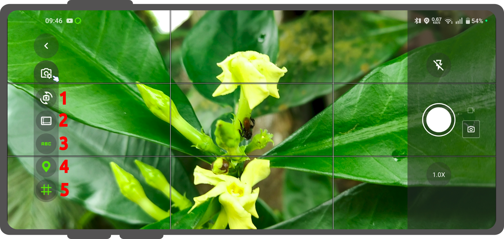
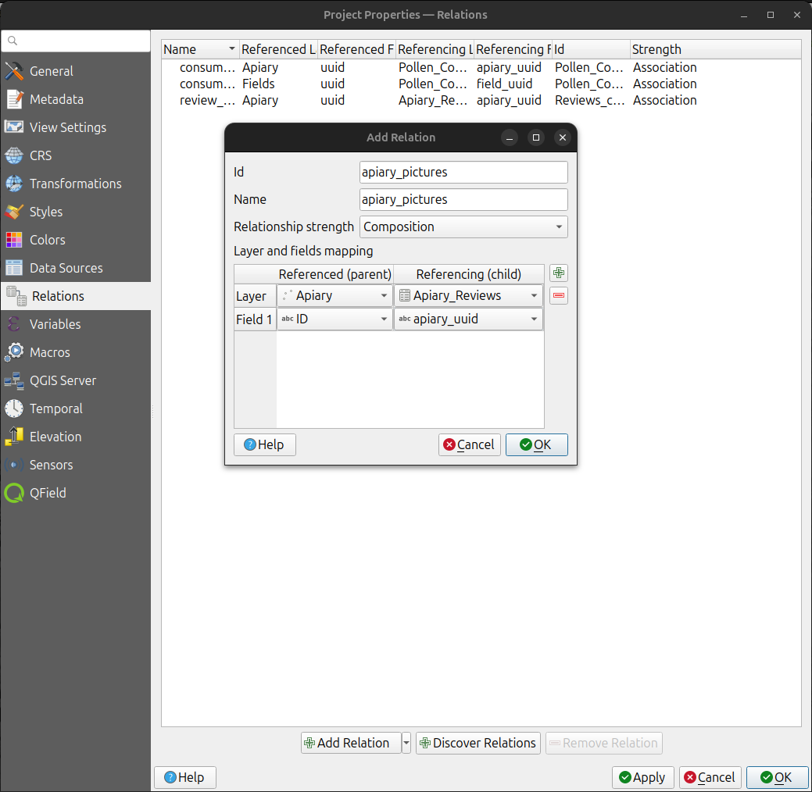
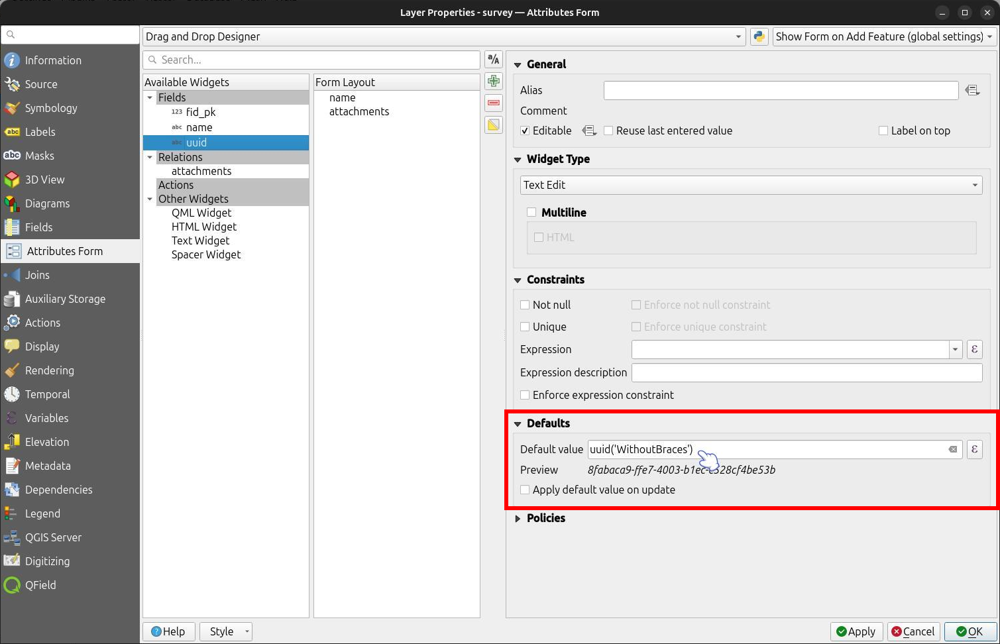
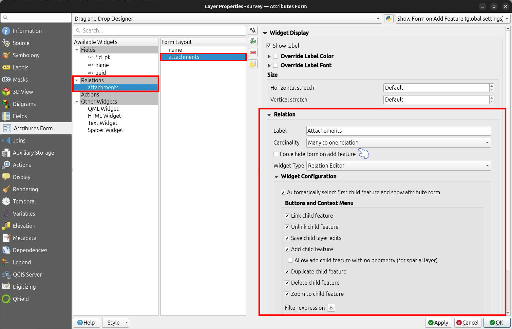
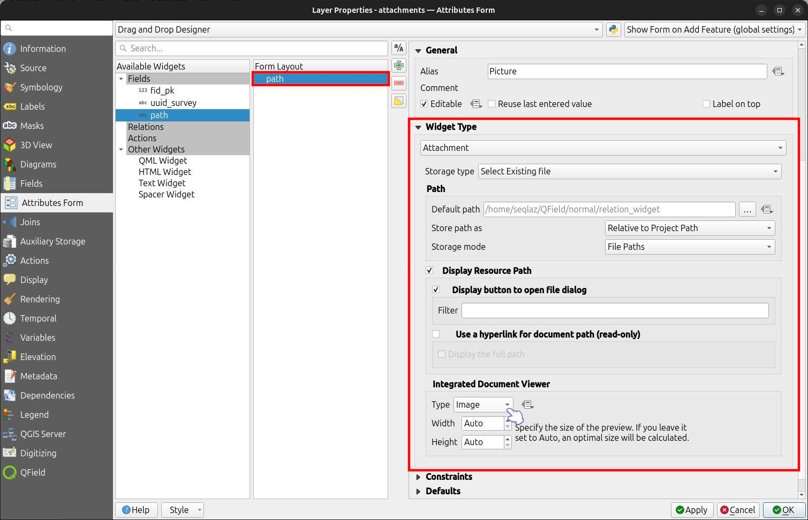
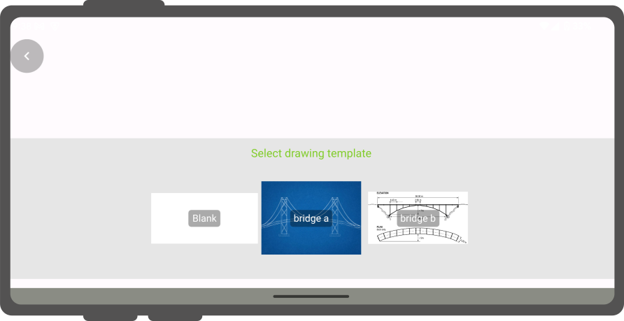
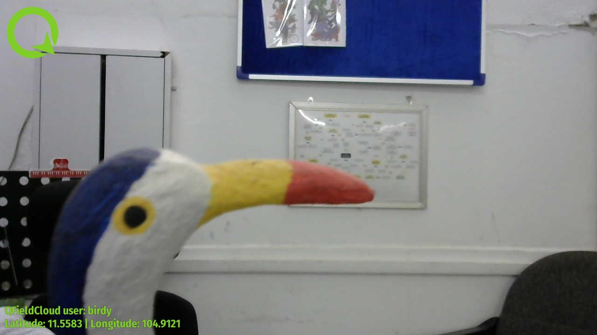

# Use Attachment

In QField, fields configured with the **"Attachment"** widget can:

- Display and capture photos.
- Display and record video clips.
- Listen to and record audio clips.
- Display links to external files like PDFs or documents.

!

Refer to the [Attribute Form Documentation](./attributes-form.md#attachment-widget) to configure the widget in QGIS.

## In-App Camera Interface
:material-tablet: Fieldwork

The built-in QField camera interface provides live toggles and post-capture editing tools when taking photos inside an attachment widget:

!

### Live Capture Controls

- **Camera switch:** Toggles between front-facing and rear-facing camera lenses.
- **Resolution and aspect ratio:** Adjusts photo resolution and frame dimensions to manage file sizes and image layouts.
- **Live image stamping:** Toggles a real-time text overlay directly onto the photo canvas.
By default, the stamp applies context details such as date, time, latitude, longitude, altitude, ground speed, and heading orientation in degrees (configure the stamp using [expressions](#image-stamping)).
- **Location metadata (EXIF):** Toggles whether geographic metadata is saved directly inside the image file structure.
- **Composition grid:** Displays a rule-of-thirds grid overlay on the screen to assist with framing and aligning photos in the field.

### Photo Preview and Quick Editing

A preview screen displays after photo capture to inspect and manually adjust images before saving them to your project.
A floating toolbar above the capture button offers the following editing options:

- **"Rotate Counter-Clockwise":** Rotates the photo 90° to the left.
- **"Mirror / Reflect":** Flips the photo horizontally.
- **"Rotate Clockwise":** Rotates the photo 90° to the right.

Applied rotations or reflections bake permanently into the saved JPEG image alongside active image stamps or EXIF metadata.


## Add a Series of Pictures to a Feature
:material-monitor: Desktop preparation

Add multiple photos to a single feature using multiple attachment attributes or by creating a layer relation to a child photo table.
This section illustrates configuring a 1:N photo relation.
Set up a layer relation in QGIS project properties to store newly captured media in a related table.

!!! Workflow
    1. Create two database tables in your data source using the schema structure below:

    **"Apiary"** (parent feature layer):

    | Field      | Type       |
    |------------|------------|
    | `id`       | Text (UUID)|
    | `geometry` | Geometry   |
    | `...`      |            |

    ***Apiary_pictures:***

    | Field       | Type       |
    |-------------|------------|
    | `id`        | Text (UUID)|
    | `apiary_id` | Text (UUID)|
    | `path`      | Text       |
    | `...`       |            |

### Relations

Configure a relation in QGIS with the following properties:

- **Referenced layer:** `apiary`
- **Referenced field:** `id`
- **Referencing layer:** `apiary_picture`
- **Referencing field:** `apiary_id`
- **Relationship strength:** Composition

!

### Attribute Form Configuration

Configure attribute forms in feature layers after creating the layer relation.
Specify a default value in the `apiary` parent layer to generate unique primary keys.
Set the widget type to **"Attachment"** in the `apiary_picture` child layer.

!!! Workflow
    **Parent layer configuration:**

    1. Navigate to _Vector Layer Properties... > Attribute Form_.
    2. Select the `id` UUID field and set **"Widget Type"** to **"Text Edit"** or **"UUID Generator"**.
    3. Set **"Default Value"** to `uuid('WithoutBraces')`.
    4. (Optional) Uncheck **"Editable"** or hide the field to prevent user modifications.
    5. Drag the relation into the form layout and set cardinality to **"Many to one relation"**.

!

!

!!! Workflow
    **Child layer configuration:**

    1. Navigate to _Vector Layer Properties... > Attribute Form_ for the child layer.
    2. Select the `path` field and set **"Widget Type"** to **"Attachment"**.
    3. Add the field to the attribute form layout.

!

## Drawing and Sketching

QField includes built-in drawing and sketching tools to annotate captured images, draw on blank canvases, or sketch over templates.


### Drawing Templates

QField supports sketching on top of custom image templates in addition to annotating photos.

Add custom templates using two methods:

- Create a `drawing_templates` directory alongside your QGIS project file and populate it with image files.
QField registers all images inside `drawing_templates` as sketching templates when loading the project.
- Add image files to the `drawing_templates` directory inside the QField application directory on your mobile device.
Find app directory locations at the bottom of the **"About QField"** screen.

Templates stored alongside projects or inside the QField app directory display when tapping the three-dotted menu *(⋮)* on an Attachment widget and selecting **"Draw a sketch"**.

!

## Geotagging
:material-tablet: Fieldwork

The integrated QField camera automatically geotags captured photos.
Location and heading orientation metadata bake directly into the image file structure.

!!! Note
    Disable **"Use native camera"** in QField general settings to preserve EXIF metadata on modern mobile devices.

## Image Stamping

QField allows adding customizable image stamps to captured photos.
Configure image stamping options in QFieldSync inside QGIS.
Image stamping embeds formatted text overlays and logos directly onto field photos.

### Styling Settings
:material-monitor: Desktop preparation

!!! Workflow
    1. Navigate to _Project > Properties... > QField > Attachments and Directories_.
    2. Click **"Settings"** under **"Customize image stamping details"**.

!

Configure the following image stamping options:

- **Font and alignment:** Controls text appearance, including font styles, text color, size, drop shadows, and horizontal alignment (left, center, or right).
- **Image decoration:** Adds custom image overlays (such as logos or watermarks) onto captured photos.
- **Force stamping:** Enforces image stamping on all captured photos regardless of individual mobile app settings.
- **Stamp details:** Defines multiline text overlays using QGIS expressions.
The default template pre-populates date, time, and GNSS positioning variables.

Default template expression:

```sql
[% format_date(now(), 'yyyy-MM-dd @ HH:mm') %]
Latitude [% coalesce(format_number(y(@gnss_coordinate), 7), 'N/A') %] | Longitude [% coalesce(format_number(x(@gnss_coordinate), 7), 'N/A') %] | Altitude [% coalesce(format_number(z(@gnss_coordinate), 3) || ' m', 'N/A') %]
Speed [% if(@gnss_ground_speed != 'nan', format_number(@gnss_ground_speed, 3) || ' m/s', 'N/A') %] | Orientation [% if(@gnss_orientation != 'nan', format_number(@gnss_orientation, 1) || ' °', 'N/A') %]
```

!

*Example*

!

## Fetching Geotags (EXIF) from the Image File into the Attribute Table
:material-monitor: Desktop preparation

Store EXIF geotag parameters (such as latitude, longitude, and camera orientation) directly inside vector attribute fields.

To store the EXIF information, follow these steps:

!!! Workflow
    1. Add an attribute per EXIF tag in the table that contains the pictures.
    2. In the pictures form, configure the default value of each attribute to the corresponding
    *EXIF* expression [See QGIS EXIF function](https://docs.qgis.org/latest/en/docs/user_manual/expressions/functions_list.html#exif), <!-- markdown-link-check-disable-line -->
    and make sure *Apply on update* is activated.
    3. The EXIF tags that QField can capture are listed in the QGIS documentation (link above).
    However, this list might slightly vary depending on the mobile characteristics.
    4. Capturing EXIF tags requires accessing the full physical path of the picture.
    Be sure to reflect this in the QGIS expression.
    For example, the expression `exif(@project_folder + '/' + "path", 'Exif.Image.Orientation')` retrieves the orientation of the picture stored in *path*.
    For more tags visit the [QField EXIF reference documentation](../../reference/exif.md) and the [exiv library documentation](https://exiv2.org/tags.html).

    QField extracts and populates EXIF geotag values into attribute tables when taking photos in the field.

## Maximum picture size
:material-monitor: Desktop preparation

Rescale captured photos to maximum width and height thresholds to save storage space.
Configure maximum dimensions by navigating to _Project > Properties... > QField > Attachments and Directories_.

!

## Configurable attachment path
:material-monitor: Desktop preparation

QFieldSync provides the possibility to configure the path and the file names of picture attachments.

!!! Workflow
    1. Go to Vector Layer *Properties* > *QField*
    2. Choose the layer, the field and configure the expression

Use expressions to specify the path of the attachments.

By default, pictures are saved into the "DCIM" folder, audio are saved into the "audio" folder and videos are saved into "video" with a timestamp as name.

!

Additional directories can be synchronized with pictures or other attachments.
Extra paths can be configured in _Attachment and Directories_ tab in the QFieldSync settings under _Project > Properties > QField_.
All extra paths evaluate relative to the project directory.

!
