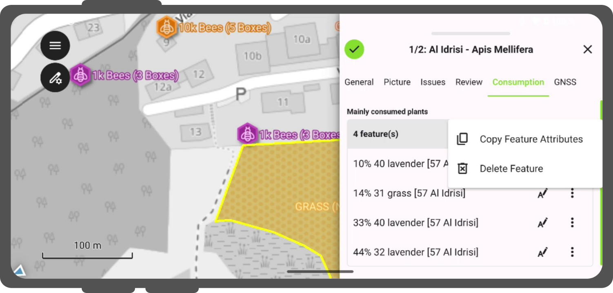
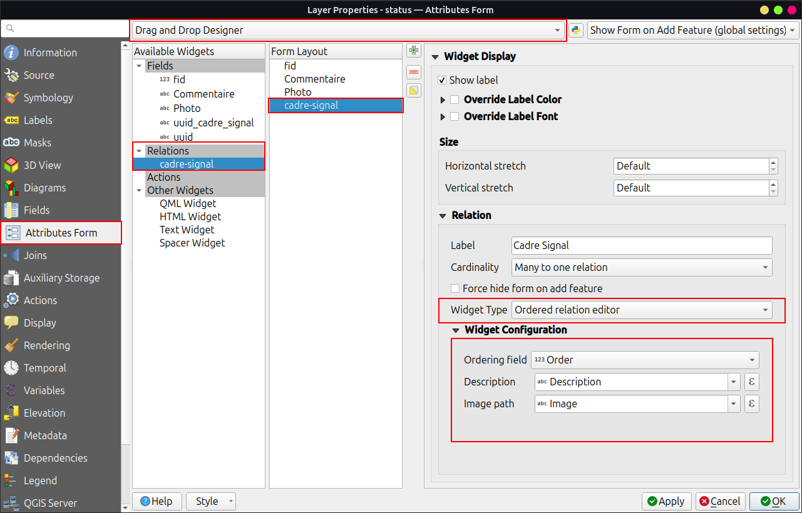
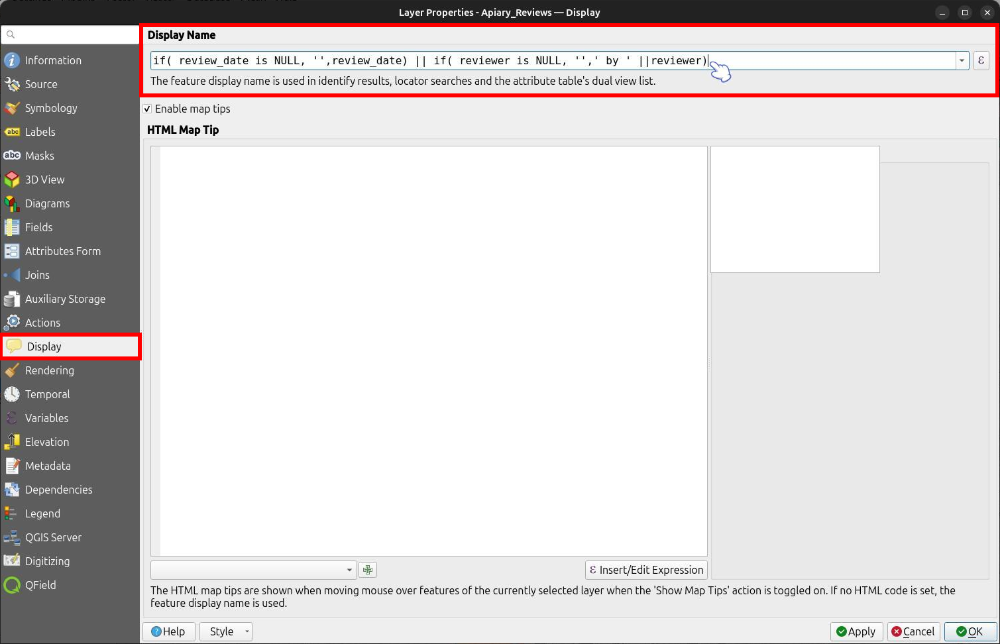
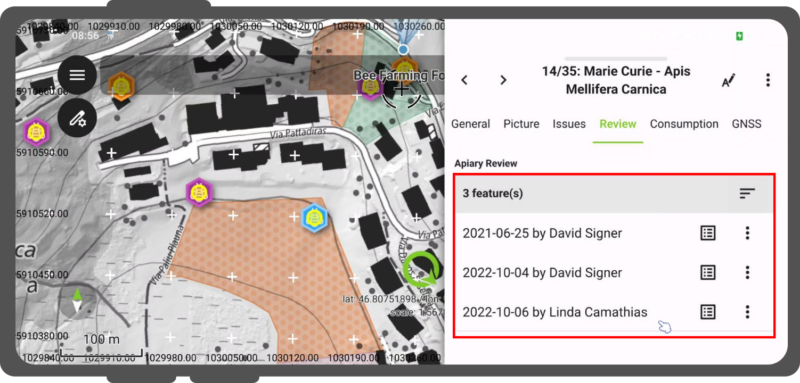

# Relation Reference Widget

Relating layers is useful when features depend on each other or when a single feature contains multiple child records.
For example, a building feature contains multiple apartment records, which in turn link to individual owner records.
Use the relation reference widget to select existing child features or create new child records directly inside feature forms.

## Relation Configuration

Before adding, editing, or viewing related features, set up a layer relation in QGIS.
Add a primary key field to the parent layer (**"Reference Layer"**) and a corresponding foreign key field to the child layer (**"Referencing Layer"**).
These linking fields must contain unique values.
We recommend using UUIDs for primary key values because 36-character non-numerical strings prevent data conflicts during collaborative editing.

!!! Workflow
    **Creating a layer relation:**

    1. Navigate to _Project > Properties... > Relations_.
    2. Click the green plus (**"+"**) icon to add a new relation.
    3. Select your reference layer, referenced layer, and linking attribute fields.
    Refer to the [QGIS Relations Documentation](https://docs.qgis.org/latest/en/docs/user_manual/working_with_vector/joins_relations.html#many-to-many-n-m-relations) for additional details. <!-- markdown-link-check-disable-line -->

!!! Workflow
    **Configuring the parent layer attribute form:**

    1. Navigate to _Vector Layer Properties... > Attribute Form_.
    2. Select your primary key field, set **"Widget Type"** to **"UUID Generator"**, and set the default value to `uuid('WithoutBraces')`.
    3. Drag your relation from the **"Relations"** section into the form layout.
    4. Set **"Cardinality"** to **"Many to one relation"**.
    5. Configure child feature capabilities (such as linking, unlinking, editing, adding, duplicating, deleting, or zooming).
    6. (Optional) Configure filter expressions to restrict displayed child features.
    7. Click **"OK"**.

    !

!!! Workflow
    **Configuring the child layer attribute form:**

    1. Navigate to _Vector Layer Properties... > Attribute Form_.
    2. Configure required attribute fields and widget types.
    3. (Optional) Customize display expressions under _Vector Layer Properties... > Display_.

## Maximum Number of Visible Children

Limit the number of visible child features displayed in relation widgets to simplify forms.

- **Default visible children:** `4` items
- **Unlimited visible children:** Leave the setting empty.

!!! Workflow
    1. Navigate to _Vector Layer Properties... > QField_.
    2. Set **"Maximum number of items visible"** under **"Relationship Settings"**.

    !

    !

## Many-To-Many Relations

Many-to-many ($N:M$) relations require a linking pivot table.
Refer to the [QGIS Many-To-Many Relations Documentation](http://docs.qgis.org/3.40/en/docs/user_manual/working_with_vector/joins_relations.html#many-to-many-n-m-relations) to set up pivot table relations.

## Ordered Relation

Reorder linked child features based on a specific attribute field using the **Ordered Relation Editor** widget.
This functionality requires installing the [Ordered Relation Editor QGIS Plugin](https://github.com/opengisch/qgis-ordered-relation-editor). <!-- markdown-link-check-disable-line -->

!!! Workflow
    1. Install the **"Ordered Relation Editor"** plugin from the QGIS plugin repository.
    2. Navigate to _Vector Layer Properties... > Attribute Form_ and select **"Drag and Drop Designer"**.
    3. Select your relation element in the form layout.
    4. Under **"Widget Display"**, set **"Widget Type"** to **"Ordered Relation Editor"**.
    5. Configure widget properties:
        - **"Ordering Field":** Select the attribute column in the child layer determining feature order.
        - **"Description":** Define an expression to display formatted labels for child features.
        - **"Image Path":** (Optional) Define an expression resolving to an image or icon path.

    !

    !

## Custom Name in Relation Reference Widget

Define **"Display Expression"** rules for parent and child layers to customize feature names in relation lists.
Configure display expressions by navigating to _Vector Layer Properties... > Display_.

!

!

## Gallery Relation Editor

QField automatically upgrades standard relation editor widgets to a **Gallery Relation Editor** when the child layer contains an **Attachment** widget.
This provides a visual media gallery for browsing and managing related photos, videos, and audio recordings directly within the parent feature form.

Key features include:

- **Grid and List Views:** Toggle between thumbnail grid layouts and compact list views using the switch at the bottom of the widget.
- **Dynamic Media Previews:**

    - **Images:** Displayed as image thumbnails.
    - **Videos:** Automatically play muted video previews (tap thumbnails to play or pause).
    - **Audio:** Displays dynamic audio waveform previews based on recorded audio file peaks.
    - **On-Demand Downloads:** Fetches un-downloaded media automatically from QFieldCloud or WebDAV storage when an active internet connection exists.
    - **Interacting with Media:** Tap media card backgrounds to open child feature forms, or tap the three-dotted menu *(⋮)* to access attribute actions.

Creating a project directly in QField with attachment support automatically links notes to a child layer using UUID primary keys.
Opening a note allows adding and browsing multiple attached photos, videos, or audio recordings.

!!! Workflow
    **Configuring the Gallery Relation Editor in QGIS:**

    :material-monitor: Desktop preparation

    The Gallery Relation Editor activates automatically based on your form layout without requiring a specific widget selection.

    1. Open your project in QGIS and set up a standard 1:N relationship between parent and child layers.
    2. Navigate to _Vector Layer Properties... > Attribute Form_ for the child layer.
    3. Set at least one field in the child layer to **"Attachment"**.
    4. Navigate to _Vector Layer Properties... > Attribute Form_ for the parent layer and drag the relation into the form layout.

    Opening parent feature forms in QField automatically renders the relation as an interactive media gallery.

    !
