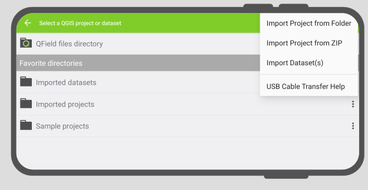
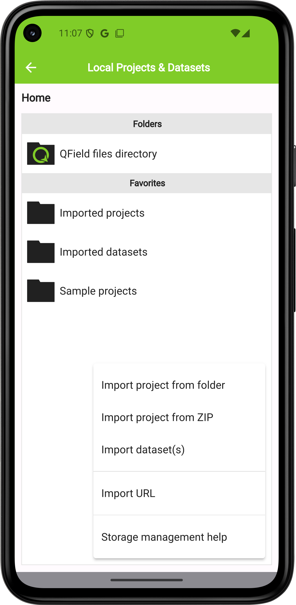
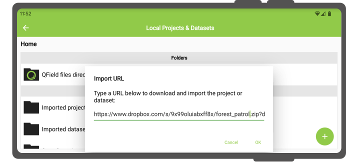
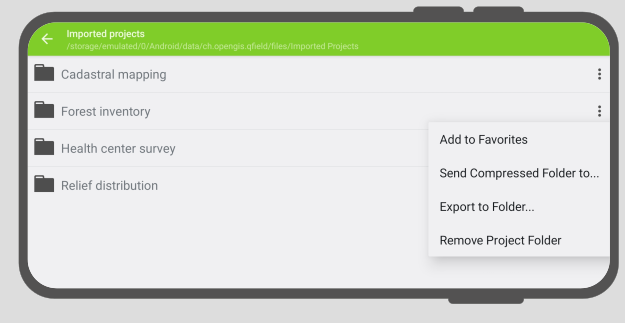
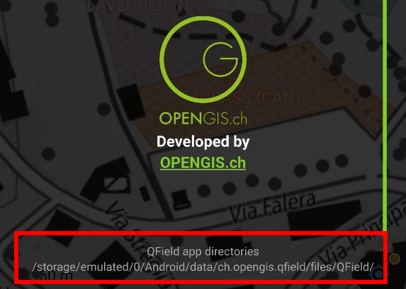

# QField Storage Management

On the QField homescreen, users are presented with two options to open a project.

- **QFieldCloud projects**: The first option is to [access a project stored on QFieldCloud](../../get-started/tutorials/get-started-qfc.md)
How to set up and work with QFieldCloud is explained in the next chapter.
- **Open local file**: The second option involves copying a working copy of the QGIS project file from a laptop or PC (the source device) to the phone or tablet (the target device).
On the target device, users can access and edit this local copy using QField and eventually copy the edited version back to the desktop or to an alternative cloud storage service.

There are various possibilities to export copies of project files and datasets from the source device running QGIS and importing them on to a target device for field-data collection.

## 1. Exporting QGIS project files for use in QField

QField supports a [wide range of data formats](../../reference/data-format.md).
There are two ways of preparing and copying a project in QGIS for use in QField.

* [Storing files in a designated folder](#storing-files-in-a-designated-folder)
* [Saving the project within a GeoPackage](#saving-the-project-within-a-geopackage)

### Storing files in a designated folder

One way of compiling all necessary parts of a QGIS project is to store them in a folder.
This folder can contain individual files such as a

* QGIS project file (.qgs or .qgz)
* Vector data (Shapefiles, GeoJSON or GeoPackage)
* Raster data (GeoTIFFs, JPEGs and others)
* Auxiliary files, which includes additional files used for styling (.qml or .sld) and any other files referenced by the project

### Saving the project within a GeoPackage

The simplest and most efficient way to save a QGIS project and its corresponding geospatial data in one file is to use a [GeoPackage](https://www.geopackage.org/).
We recommend using the GeoPackage file format for projects in QField, since saving the files in one file within QGIS is easy and straightforward.

!!! Workflow

    **Step 1: Save vector layers as GeoPackage:**

    1. Click on the toolbox and search for the tool “package layers”.

    This tool lets you package selected vector layers in the project file (and elsewhere) into a single GeoPackage containing the geospatial data.

    **Step 2: add raster layers to GeoPackage** (Optional)

    If your project contains raster layers these can also be stored in the GeoPackage.

    1. Click on the raster layer you want to export, then *Export* > *Save Features As...*, and select GeoPackage as the format.
    2. Add a filename and select the three dots to browse for the GeoPackage.
    3. Select the GeoPackage and change the file format at the bottom of the dialogue window from “GeoTIFF” to “All files (*.*)”.
    Now both vector and raster layers are saved in the same GeoPackage.
    4. Browse for the GeoPackage in the browser panel and expand it to ensure that all files are there.

    **Step 3: Add project file (.qgs) to GeoPackage:**

    1. Direct to *Project* > *Save to* > *GeoPackage*, and select the GeoPackage file containing all the layers.
    This saves the project file, with the `.qgs` extension into the GeoPackage as well.

    <!-- markdown-link-check-disable-line -->

    *Save QGIS Project into GeoPackage*

    For more information, consult the QGIS documentation  [packaging layers](https://docs.qgis.org/latest/en/docs/user_manual/processing_algs/qgis/database.html#package-layers).

## 2. Copying project over to the QField target device

On both the Android and iOS devices, installing QField creates a folder called QField, containing three folders; `Imported Datasets`, `Imported Projects` and `QField`.
When a project is transferred to the mobile device, it is recommended to use the QFieldSync Plugin to "package" the project and corresponding datafiles so that during the fieldwork, changes are being detected when synchronizing back to the source device.
Depending on whether you are using QFieldCloud or manually transfer your projects, different steps should be undertaken.

!!! Workflow

    1. Before copying or downloading your project, your project and files need to be "packaged" into a readable format for QField.
    If you are using QFieldCloud just upload your project and files and make they are saved in the same data folder.
    If you are manually transferring your project, follow the steps under [QFieldSync](../../get-started/tutorials/get-started-qfs.md)

    2. If you do NOT use QFieldCloud copy the project to your device to the folder called `Imported Projects`.

    You can find the folder under the following paths:

    * Android path: `Android/data/ch.opengis.qfield/files/Imported Projects`
    * iOS path: `On My iPhone/QField/Imported Projects`

    Copying the packaged project over to the corresponding folder of each device can be done in several ways.

### Android

#### Transfer via USB-cable

1. Connect both devices using a USB cable and follow the instructions on [how to transfer files between your computer and the android device.](https://support.google.com/android/answer/9064445?hl=en#zippy=%2Cwindows-computer)
On most devices plugged into a computer via USB cable connection, the path will be `<drive>:/Android/data/ch.opengis.qfield/files/`.
There, users will find both the *Imported Datasets* and *Imported Projects* folders within which the QGIS projects and datasets should be placed.
Changes done to the project content and datasets are saved in the files found in these locations.

#### Sending via Bluetooth

Wireless transfer of files is also possible by [sharing files via a Bluetooth connection.](https://www.wikihow.com/Connect-Your-Android-Phone-to-a-Windows-PC-Using-Bluetooth)

#### Google Drive (and other cloud storage services)

The advantage of using Google Drive is that both the source device and target device have shared access to a central working directory containing the current project files.

!!! Workflow

    1. Prepare and package a QGIS project on your laptop or computer.
    2. Upload the project to Google Drive.
    3. Download the project to the target devices and collect data.
    4. Upload the changed project (or parts of the project) from the target devices back to the cloud and replace the old files with the new ones.
    5. Download the project back on to the source device.

!!! note
    When working with Google Drive, it may be helpful to create a dedicated folder that contains all the projects.
    An equivalent of this folder can then also be created on the target device, to which the QGIS projects can be downloaded and saved in.

### IOS

#### Transfer via USB-cable

Transferring files from MacBooks or iMacs to iPhone using a cable is not straightforward, since it is not possible to access individual files in the QField directory.

!!! Workflow

    1. Copy the entire folder `Imported Projects` from your iOS target device (iPhone, iPad) over to your source device (iMac).
    2. Copy the packaged QGIS project file into the copied `Imported Projects`folder.
    3. Copy back and replace the old `Imported Folder` with the new one.

#### iCloud (and other cloud storage services)

An efficient way to synchronize projects is to use iCloud as a shared workspace to [download and upload project files.](https://support.apple.com/en-in/111764)
It is not possible to import projects from folders inside the iOS QField application.
Instead, the new project files have to be saved in the `Imported Projects` folder so that QField can access them.

!!! Workflow
    1. On the source device, upload the packaged project to a folder on iCloud (titled e.g. "QField projects").
    2. On the target device, download the packaged project and move the file to the QField folder `Imported Projects`.
    3. Open the project file from inside the QField app and collect data.
    4. Upload the project file back to the shared iCloud folder and replace the old project file.
    5. On the source device, download the new project file containing the added data and the changes made.

#### Share via AirDrop

A quick and easy way to exchange files back and forth is using AirDrop.
The only requirement is that both source and target device have to be OS and iOS respectively.

!!! Workflow

    1. On the source device, right-click the file and select `Share...`, choose `AirDrop`, and then select the target device.
    2. On the target device, save the project directly to the QField directory `Imported Projects`.
    3. After your fieldwork, use AirDrop on the target device to transfer the project files back to the source device.

## 3. Importing projects and datasets

Apart from using QFieldCloud, QField can open projects and datasets in five ways:

* [importing a project folder](#importing-a-project-folder)  <!-- markdown-link-check-disable-line -->

* [importing a compressed project](#importing-a-compressed-project) <!-- markdown-link-check-disable-line -->

* [importing from a URL](#importing-from-a-url)  <!-- markdown-link-check-disable-line -->

* **importing from a WebDAV folder**

* [importing individual datasets](#importing-individual-datasets-android-only) <!-- markdown-link-check-disable-line -->

!

On **Android** all of these actions are available by clicking on the "Import (+) button" located on the bottom-right corner of the project/dataset picker screen, which can be accessed by clicking on the "Open local files" button located in QField's welcome screen.

!

!!! note
    On **iOS**, the only action available through the "import (+) button" is to import from a URL.

### Android

#### Importing a project folder

When importing a project through the "Import project from folder" action you have to grant permission for QField to read the content of your folder on the device's storage.

Re-importing a given folder through the drop-down menu action will overwrite preexisting projects given an identical folder name. That will allow you to update their projects.

!!! note
    Feature editing, addition, and deletion will be saved into the imported project's
    datasets, not in the original folder selected during the import process.
    See sections below on how to send/export edited projects and datasets.

#### Importing a compressed project

On Android, it is possible to also import compressed (zipped) projects into QField.
QField will then decompress the file into its "Imported projects" location, from which users can open and interact with the project.
This can greatly ease remote deployment of projects by being able to send a single file to users.

#### Importing from a URL

When importing a project or individual dataset through the "Import URL" action, you will be asked to provide a URL string to a file.
QField will subsequently fetch the content and save it into the "Imported projects" or "Imported datasets", respectively.

!

QField will consider a ZIP archive as a compressed project when one or more `.qgs`/`.qgz` project files are detected.

#### Importing individual datasets (Android only)

The "Import dataset(s)" action allows you  to select one or more datasets via an Android system file picker.
After you selected the datasets, QField will copy those into the "Imported datasets" folder, from where you can then open and modify the content.

!!! note
    Users will have to ensure that all sidecar files are selected when importing datasets (e.g. a Shapefile would require users to select the .shp, .shx, .dbf, .prj,
    and .cpg files).

### iOS

On iOS, installing QField creates a folder titled QField in the Files app.

!!! Workflow

    1. Save your packaged project in the `QField` > `Imported Projects` folder on your source device.
    2. To open a file on your target device, press on "Open local file" on the QField home screen and navigate to `QField files directory` > `Imported Projects` and choose the project you want to open.

#### Importing from a URL

When importing a project or individual dataset through the "Import URL" action, you will be asked to provide a URL string to a file.
QField will subsequently fetch the content and save it into the "Imported projects" or "Imported datasets", respectively.

!

QField will consider a ZIP archive as a compressed project when one or more `.qgs`/`.qgz` project files are detected.

## 4. Exporting modified projects and datasets (Android only)

Once you are done with your fieldwork, there are four ways to sent and export the changed files back to the source device:

* [by exporting a project folder or an individual dataset;](#exporting-a-project-folder-or-an-individual-dataset)
* [by sending a compressed project folder to a {cloud, email, messenger, etc.} app;](#sending-a-compressed-project-folder)
* [by sending an individual dataset to a {cloud, email, messenger, etc.} app;](#sending-an-individual-dataset-android-only) and
* [by accessing imported content directly through USB cable.](#transfer-via-usb-cable)

!

You can access these actions via the dropdown action menu inside the project/dataset picker which you can access by clicking on the "Open local files" button located in QField's welcome screen.

### Exporting a project folder or an individual dataset

When choosing the "Export to folder" action, you will be asked to pick a location where the content will be copied to.

You can use this action to copy the content of modified projects or datasets into a folder on your device that can be accessed by third-party Synchronisation apps such as [Syncthing](https://docs.syncthing.net/intro/getting-started.html).
You can also directly copy content into cloud accounts of providers that support Android's Scoped Storage directory provider (eg. NextCloud).

!!! note
    Exporting onto a folder will overwrite preexisting content.

### Sending a compressed project folder

The "Send compressed folder to" action compresses the content of a selected folder into a ZIP archive.
You will be asked through which app the resulting ZIP archive should be send through.

You can compress and send whole projects by selecting root folders in QField‘s "Imported projects" directory, as well as send selective folders within project folders (for instance, your photos only).

### Sending an individual dataset (Android Only)

You can select the "Send to" action for individual datasets, to directly send the changed datasets via third party apps such as Gmail, Drive, Dropbox or Nextcloud <insert your favorite messenger app>.

You can also export the layers from a synchronized QFieldCloud project, either to your device or a preferred cloud provider.
To do this, within your project:

1. Direct to the folder icon with the wheel via the side "Dashboard" to open the project folder.

    !

2. Inside this project folder, you will find your project files.
Offline layers will be stored in a file named "data.gpkg".
You can also export your attached files (Photos, Audio, Video, etc).

3. click on the three dots *(⋮)* located on the right side of the file or folder.

    !

4. Choose between the actions "Send to..." or "Export to folder..." based on your preference and follow the prompts accordingly.

    !

## 5. QField App directory

Beyond project-specific files stored in project folders, QField utilizes a dedicated **App Directory** to manage resources and configurations that are shared across all projects on a device.
This centralized location allows you to provide custom fonts, basemaps, projection grids, and more on your device without needing to duplicate these files for every project.

**Identification of local App Directory**

1. From the QField home screen, open a project.
2. Open the side "Dashboard" (**☰**) via the button in
 the top-left corner.
3. Select **About QField** from the menu.
4. The application directory locations will be displayed at the bottom of the screen just below the *App directories* path (the paths differ depending on the operating system).

!

***Common Locations***

The path varies by operating system.
Here are some common examples to help you find it:

- **Android:** `Internal Storage/Android/data/ch.opengis.qfield/files/QField`.

- **iOS:** `Files App > On My iPhone/iPad > QField`

- **Windows:** `C:\Users\<YourUsername>\AppData\Roaming\ch.opengis.qfield\QField`

- **macOS:** `/Users/<YourUsername>/Library/Application Support/QField/QField`

- **Linux:** `/home/<YourUsername>/.local/share/OPENGIS.ch/QField`

**The App Directory Structure**

| **Directory** | **Purpose and Contents** |
|---------------|---------------------------------------------------------------------------------------------------------------------------------------------|
| `auth/`       | Stores authentication configurations (e.g., `OAuth.xml` certificates) required to access secured web services (WMS, WFS).                   |
| `basemaps/`   | Contains shared basemap files, like COG or MBTiles layers.                                                                                  |
| `fonts/`      | For custom font files (`.ttf`, `.otf`) to be used for labels or symbology across all projects.                                              |
| `logs/`       | Contains GNSS connection logs, which are valuable for debugging and troubleshooting positioning device issues.                              |
| `plugins/`    | For custom QML plugins that extend QField's functionality.                                                                                  |
| `proj/`       | Stores custom projection grids (e.g., `.tiff` files) for coordinate reference systems (CRS) that require additional transformation files.   |
