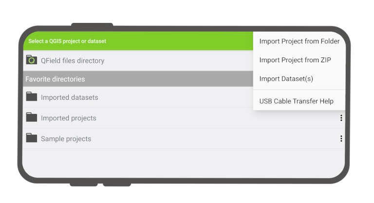
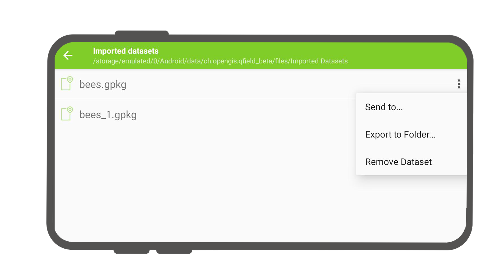

# Project selection

QField has a file selector that allows to open a project from the device locally. To open files from the cloud see [QFieldCloud ](../../get-started/tutorials/get-started-qfc/).

!!! note
    Starting with Android 11 apps are denied full access to main and external storage content. For QField 2, this means direct access to projects and datasets transferred and/or downloaded into storage folders is not possible anymore.

You have to import project folders or individual datasets into the app-dedicated storage location `<drive>:/Android/data/ch.opengis.qfield/files/QField` where it has unrestricted read/write access. With that behavior importing from external SD cards or providers that work with remote files (e.g. Google Drive) are supported as well.

!!! warning
    Be aware that on uninstalling QField the app folder gets deleted as well. On update it stays.
## Import and open local project
:material-tablet-android:{ .device-icon } Fieldwork

When going to *Open local files* (via *Menu button > Open*) you will see a set of new folders named "QField files directory", "Imported datasets", and "Imported projects" as well as a drop-down menu accessible via a bottom-right plus button.

!

The drop-down menu lists the means to import projects and datasets: *import project from folder*, *import project from ZIP (archive)*, and *import (individual) dataset(s)*.

### Import project from folder or ZIP archive
When importing a project from a folder or a ZIP archive, you will be asked to grant permission for QField to read the content of a given folder on the device’s storage via a system folder picker. When the folder or the archive is selected, QField copies the content (including its sub-folders) into the app’s ‘Imported projects’ location. You can then open the project from there.

Re-importing a given folder through the drop-down menu action will overwrite preexisting projects given an identical folder name. That allows you to be able to update projects.

!!! warning
    Note that feature editing, addition and deletion will be saved into the imported project’s datasets, not in the original folder selected during the import process.
### Import datasets
You can also import individual datasets. You will be asked to select one or more files via a system file picker, which will be copied into the "Imported datasets" folder. You have to ensure that all sidecar files are selected when importing (e.g. a shapefile dataset would require you to select the .shp, .shx, .dbf, .prj, and .cpg files).

## Favorite directories

In the first screen of the file selector, there is a section showing the
favorite directories. To add a directory to the favorites, long click in
the file selector on the directory name. To remove an entry from the
favorites, long click on the entry in the favorites list.

## Retrieve modified projects and datasets
:material-desktop-mac:{ .device-icon } Desktop preparation

Imported projects and datasets can be accessed directly using a USB cable. The location on storage is displayed in the top navigation bar when opening a local file.

On most devices plugged into a computer via USB cable connection, the path will be `<drive>:/Android/data/ch.opengis.qfield/files/` where you will find both the "Imported Datasets" and "Imported Projects" folders within which your edited content will be located.

### Send to
:material-tablet-android:{ .device-icon } Fieldwork

You can share and send the datasets straight from QField using Android APIs. This allows for the sending of edited datasets directly to third party apps (Gmail, Drive, Dropbox, Nextcloud, your favourite messenger app, etc.).

!
