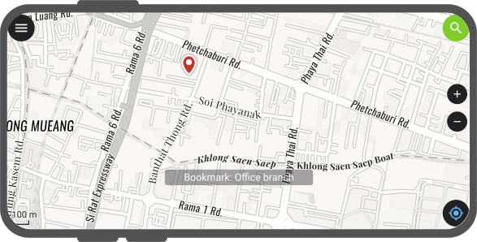
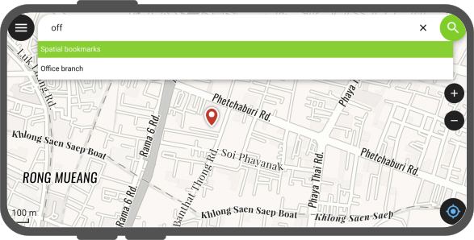

# Bookmarks

QField allows you to save and display bookmarks that will be remembered across sessions and projects.
By default, QField will display bookmarks as marker overlays over the map.
Added bookmarks within QField are displayed across all projects and datasets.

## Viewing bookmarks
:material-tablet: Fieldwork

There are two ways to engage with the bookmark:

- **Single tap**: Displays the bookmark name
- **Double tap**: Re-centers the current map extent around the bookmark location.

!

## Bookmarks Search

!!! Workflow

    1. Tap on the search bar
    2. Search for a bookmark name and click on the matching one.
    The map extent will re-center to the bookmark location.
    3. (Optional) if you type "b" in the searchbar in the beginning, the search function will only browse through the bookmarks.

        !

## Enable Bookmarks

!!! Workflow

    :material-tablet: Fieldwork

    1. Open the Side Dashboard.
    2. Tap on the 3-dotted menu *(⋮)* and select *Settings*.
    3. Direct to *general settings* and "Enable Bookmarks".

        !)

## Adding a new bookmark

!!! Workflow

     :material-tablet: Fieldwork

    **Option 1: Through long-press on location**

     1. To add a new bookmark, simply long-press on the location on the map where you want to place the bookmark.
     2. Tap the "Add Bookmark" action within the popped up menu.

        !

     3. Rename the bookmark and select a preferred color which will be used as a marker.

        !

    **Option 2: From the location pie menu**

    1. Tap on your current location.
    The location pie menu will automatically open.
    2. Tap on the "Bookmark" Symbol to the low right.
    The bookmark menu will appear allowing you to write an appropriate name and assigning your desired colour

     !

!!! Tip
    When adding a bookmark, the current map scale is taken into consideration to save an extent centered around the tapped coordination or current location. This allows you to determine the extent that will be used when double-tapping on a bookmark marker or selecting a bookmark item in the search bar.

## Project bookmarks

When preparing a QGIS project for fieldwork, it may also be useful for you to enter a few bookmarks, which may be helpful for the field officers.
Luckily, QField can display and search for project-embedded bookmarks.
The addition and management of such bookmarks is done [in QGIS itself](https://docs.qgis.org/latest/en/docs/user_manual/introduction/browser.html#spatial-bookmarks).

!!! Workflow

    :material-desktop: Desktop

    1. In QGIS choose a location for your bookmark.
    2. There are three options to add a spatial bookmark:
        - Through the file browser.
        - Through the menu panel
        - Using the shortcut "CTRL + B"
    3. Choose your preferred option and enter a name
    4. (Optional) you can set a map extent, if you want to specify the zoom level.
    5. (Optional) you can also create different groups for your bookmarks, in case that you have a lot of places to revisit.
    6. (Optional) maybe you want the marker of the bookmark to point in a certain direction, in which case you can rotate the marker symbol.

    !
