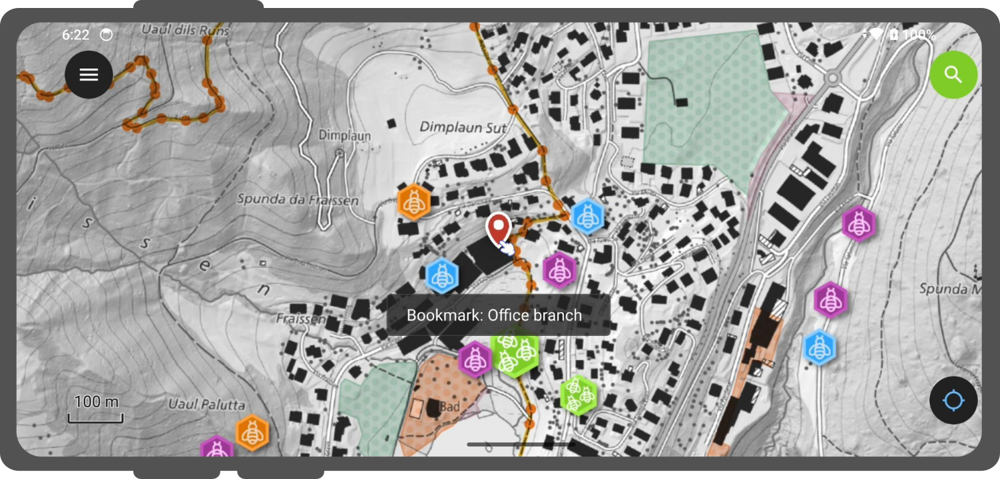
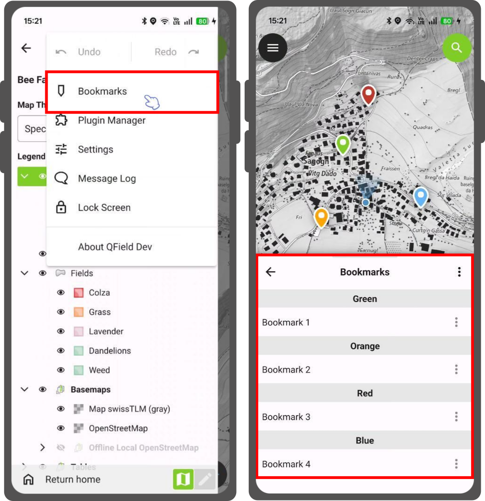

# Bookmarks

QField allows you to save, organize, and navigate to spatial bookmarks across sessions and projects.
By default, bookmarks are displayed as marker overlays on the map, searchable via the search menu, and accessible from a dedicated list panel.

## Project Bookmarks vs. User Bookmarks

QField handles two distinct types of spatial bookmarks:

* **User Bookmarks:** Created directly inside QField on the mobile device. These persist across all local projects and can be fully edited, grouped by color, or exported.
* **Project Bookmarks:** Embedded directly inside the QGIS project file (`.qgs`/`.qgz`) on desktop. These appear under the **Project bookmarks** section header in the list view and are read-only in QField.

### Creating Project Bookmarks in QGIS
:material-desktop: Desktop preparation

!!! Workflow

    1. Open your project in QGIS and navigate to your target area.
    2. Add a spatial bookmark using **Ctrl + B**, or via **View > New Spatial Bookmark**.
    3. Define the name, group, and optional map extent/rotation in [QGIS Spatial Bookmarks Manager](https://docs.qgis.org/latest/en/docs/user_manual/introduction/browser.html#spatial-bookmarks). <!-- markdown-link-check-disable-line -->
    4. Save and synchronize the project to QField.

    !

## Viewing and Accessing Bookmarks
:material-tablet: Fieldwork

There are two primary ways to view and interact with bookmarks in QField:

### Map Overlays

Bookmarks appear directly on the map canvas as colored marker pins.

- **Single tap:** Displays the bookmark name.
- **Double tap:** Re-centers and zooms the current map extent around the bookmark.

!

### Bookmark List Panel

QField features a dedicated slide-over drawer to manage and browse all available bookmarks.

!!! Workflow

    1. Open the **Side Dashboard** from the main map view.
    2. Tap the 3-dotted menu and select **Bookmarks** in the menu.
    3. The Bookmark List will open, categorized into color groups (*Green*, *Orange*, *Red*, *Blue*).
    Additionally, if you have project based bookmarks, which were created in QGIS before are show
    4. Tap any bookmark in the list to instantly jump to its location on the map.

    !

## Adding a New Bookmark
:material-tablet: Fieldwork

Bookmark locations capture both the target point coordinates and the active map scale to preserve your preferred zoom level.

### Option 1: Long-Press on the Map

!!! Workflow

    1. Long-press on the map canvas at the desired location.
    2. Tap **Add Bookmark** in the pop-up context menu.
        !
    3. Enter a custom name and select a color marker group (*Green*, *Orange*, *Red*, *Blue*).
        !

### Option 2: Location Pie Menu

!!! Workflow

    1. Tap on your current location marker on the map canvas.
    2. Tap the **Bookmark** symbol in the bottom-right of the pie menu.
    3. Define the name and color group.

    !

## Managing and Exporting Bookmarks
:material-tablet: Fieldwork

User-created bookmarks can be edited, copied, deleted individually or in bulk and also exported to standalone vector datasets, such as Gpkg's.

### Individual Bookmark Actions

Under the Bookmark List Panel, tap the 3-dotted menu *(⋮)* next to the user bookmark in the Bookmark List panel to access quick actions:

- **Edit Bookmark:** Modify the name or change the color group.
- **Copy Bookmark Details:** Copies the bookmark name and its geographic coordinates (formatted in map CRS) directly to your clipboard.
- **Navigate to bookmark:** Sets the location as your active navigation destination.
- **Delete Bookmark:** Permanently removes the bookmark.

!

### Multi-Selection and Batch Deletion

!!! Workflow

    1. Open the Bookmarks list panel.
    2. Long-press on any user bookmark, or tap the top 3-dotted menu *(⋮)* and select **Toggle Bookmark Selection**.
    3. Check the boxes next to the bookmarks you wish to select.
    4. Tap the *(⋮)* and select **Delete Selected Bookmark(s)** to delete the selected .

    !

### Exporting Bookmarks to GeoPackage

You can export your user bookmarks into a standalone GeoPackage (`.gpkg`) to share with colleagues or archive externally.

!!! Workflow

    1. Open the Bookmarks list panel.

    **To export **all** user bookmarks**
    2. Tap the 3-dotted menu *(⋮)* and select **Export All User Bookmarks**.

    **To export selected bookmarks**
    2a) Select the bookmarks you with to export, tap the  menu *(⋮)*, and select **Export Selected Bookmark(s)**.
    3. QField will compile the point geometries, names, and color attributes into a `.gpkg` file and launch the platform-native sharing dialog (**Send to...**) to transfer the file via email, cloud drive, or messaging apps.

    !

## Navigating to a Bookmark
:material-tablet: Fieldwork

You can set any bookmark directly as a active navigation destination.

### Option 1: Via the Bookmark List Panel

!!! Workflow

    1. Open the **Bookmarks list panel** from the Side Dashboard.
    2. Tap the 3-dotted menu *(⋮)* next to the bookmark name.
    3. Select **Navigate to bookmark** (purple navigation flag icon).
    4. QField will transform the bookmark's center coordinates into an active navigation target.

    !

### Option 2: Via Search (Locator)

!!! Workflow

    1. Tap the search bar on the map canvas.
    2. Type the bookmark name (or type `b ` to filter explicitly for bookmarks).
    3. In the search results list, tap the **purple navigation flag icon** next to the bookmark name to immediately start navigating, or tap the text to center the map canvas.

    !

## Enabling or Disabling Bookmarks
:material-tablet: Fieldwork

If you prefer to hide bookmark markers from the map view:

!!! Workflow

    1. Open the **Dashboard**.
    2. Tap the gear icon to open **Settings**.
    3. Under **General**, toggle **Enable Bookmarks**.

    !
