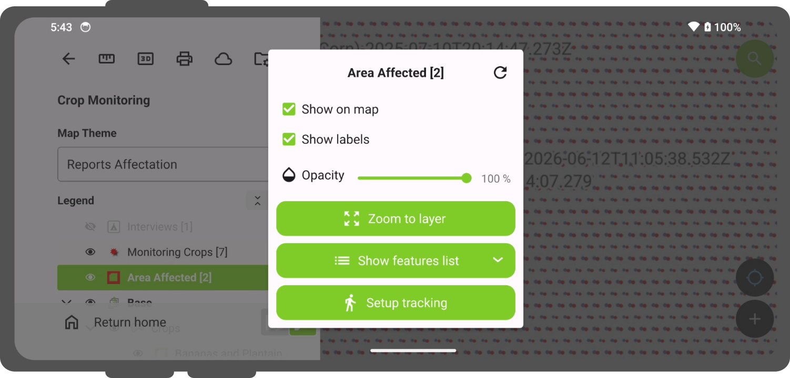
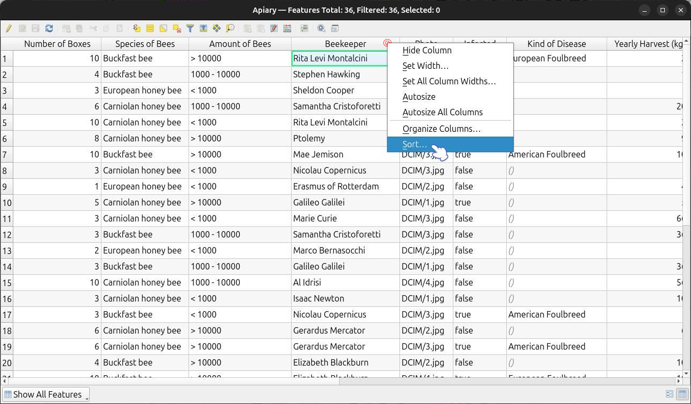
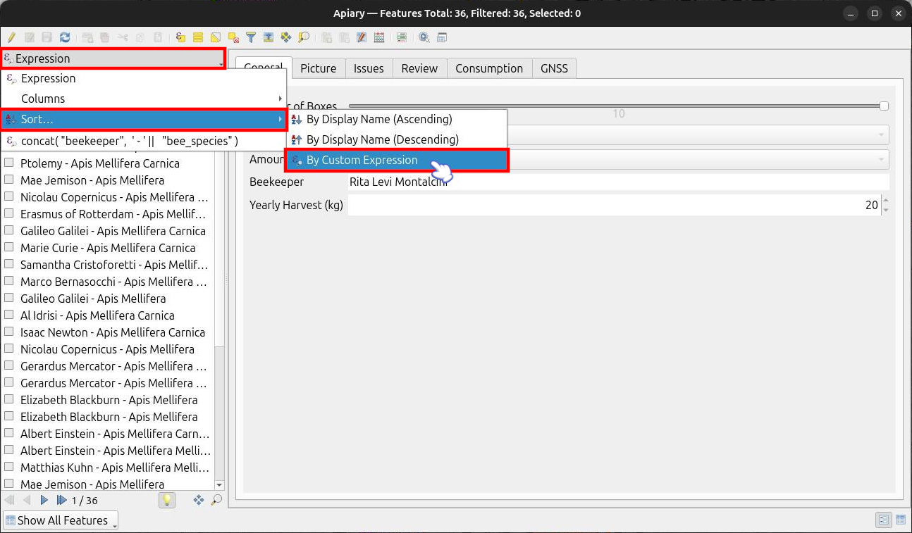
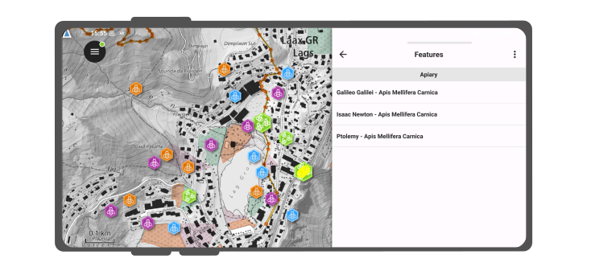
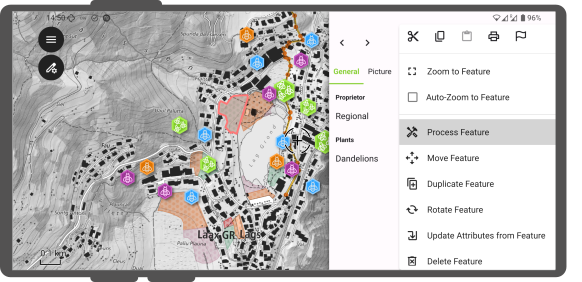
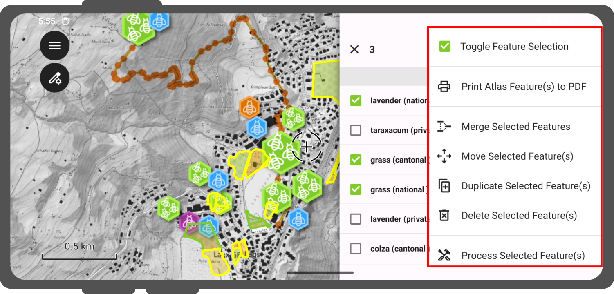

# Interact with the Map

QField supports several interactive map controls during fieldwork.

## Map Legend
:material-tablet: Fieldwork

Open the **Side Dashboard** and expand the layer list to display the map legend.

Double-tap or long-press a layer in the legend to display the layer options menu:

!

- **"Expand legend item":** Toggles the visibility of layer sub-items.
- **"Show on map":** Controls layer visibility on the map canvas.
- **"Show labels":** Controls layer label visibility.
- **"Opacity Slider":** Adjusts layer transparency.
- **"Zoom to layer":** Zooms the map canvas to the full extent of the layer.
- **"Reload icon":** Fetches the latest data for remote layer data sources.
- **"Show feature list":** Displays all layer features in the feature list.
- **"Setup tracking":** Configures feature tracking mode for the layer.

## Sort Layer Features
:material-monitor: Desktop preparation

Configure the feature display order for the **"Show feature list"** view in QGIS using two methods:

- Right-click any column header in the attribute table and select **"Sort..."** to enter custom sorting expressions.

!

- In attribute form view, click the expression button at the top of the feature list and select **"Sort..."**.

!

## Identify Features
:material-tablet: Fieldwork

Tap a feature on the map canvas to identify it.
If multiple overlapping or adjacent features exist where you tap, QField lists all identified features in the identification panel.

!

Tap a feature in the list to open its attribute form.

1. Tap arrow buttons to scroll through identified features.
2. Tap the center button to center the map canvas on the selected feature.
3. Tap the edit button to modify attributes of the selected feature.
4. Scroll through attribute sections to view feature details.

!

### Select Identified Features

Long-press a feature in the list to toggle feature selection.

!

When features are selected, tap the three-dotted menu *(⋮)* in the top-right corner to perform batch actions.

!

### Exceptions to Identified Layers

Exclude background layers or basemaps from identification queries to simplify map interactions.

!!! Workflow
    1. In QGIS, navigate to _Project > Properties... > Data Sources_.
    2. Uncheck background layers under the **"Identifiable"** column to disable map queries for those layers.

## 3D Map View Interactions
:material-tablet: Fieldwork

QField supports viewing and interacting with project data in a 3D map view.
Using elevation data (either an online DEM or a custom DEM configured in QGIS), QField drapes map layers as textures over 3D terrain surfaces.
Interactively navigate map scenes in 3D and synchronize extents seamlessly with the 2D map canvas.

Read more in the [3D Map View Documentation](../advanced-how-tos/3d-map-view.md).
