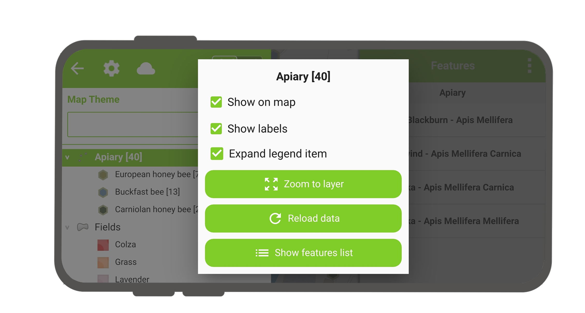
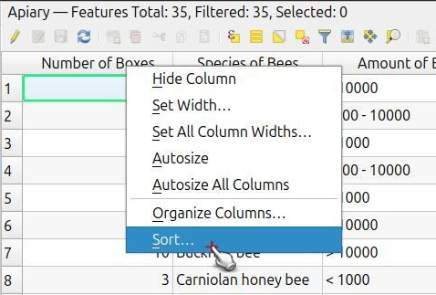
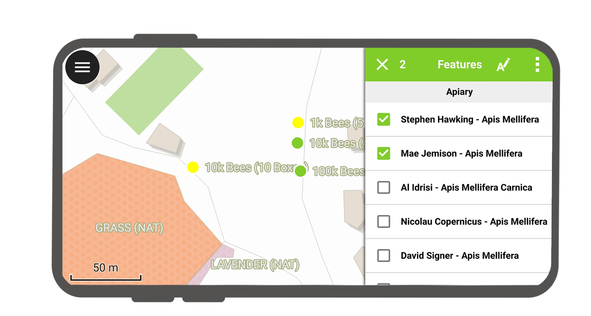
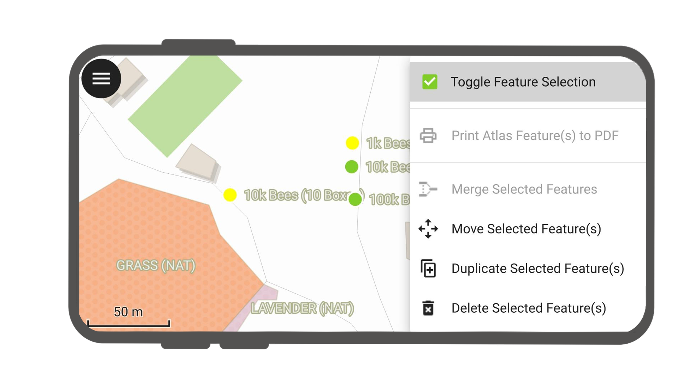

# Interact with the map

Here are some of the possible interactions with the map in QField.

## Map legend
:material-tablet: Fieldwork

Open the side "*Dashboard*" and expand the layers list to display the legend
of the map.

On double-tap or long-press on a layer, you get offered the following possibilities.

!

- *Expand legend item* to show/hide the layer's sub-items.
- *Show on map* to control visibility.
- *Show labels* to control the visibility of the labels.
- *Opacity Slider* to control the transparency of the layer.
- *Zoom to layer* to have all the layer items on the map.
- *Reload icon* to get the current data of a layer with remote sources.
- *Show feature list* to show all the layer's features in the identification list.
- *Setup tracking* to set up tracking mode of layer.

## Sort layer features
:material-monitor: Desktop preparation

If you'd like to configure the order of features in "Show feature list" in QField, you have the following options to pre-configure this on QGIS:

- Simply right-click on any part of a column header and select the "Sort" option from the menu. This allows you to enter complex sorting expressions for your features as required.

!

- When being in the form view, you can access the sorting functionality by clicking on the expression button located at the top of the features list and select the "Sort" option.

!

## Identify features
:material-tablet: Fieldwork

Tap on a feature on the map to identify it.
If several features are located where you tapped (either because there are multiple features really close one to another, or because several layers are overlapping), they will all be listed in the menu that opens on the right of the screen.

!

Tap on one of the listed features to access its attributes.

1. Tap the *arrows* to scroll through all the identified features.
2. Tap the *centre button* to centre the map on the selected feature.
3. Tap the *edit button* to edit the attributes of the selected feature.
4. Scroll through the *sub-menus* to access all the attributes.

!

### Select identified features

With long-press, you can toggle the feature selection.

!

When features are selected, you can perform the actions in the 3-dotted menu *(⋮)* on the top right.

!

### Exceptions to identified layers

Often it is not required to be able to query every layer. Some layers
are only present as basemap, and their attributes are not of interest.

You can manage this layer list in QGIS desktop in
*Project* > *Properties...* > *Data sources* > *Identify Layers* and uncheck the base layers.
