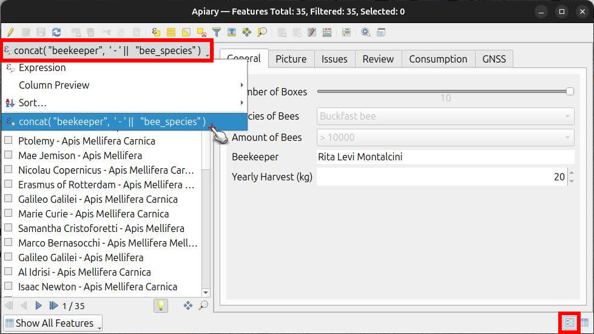
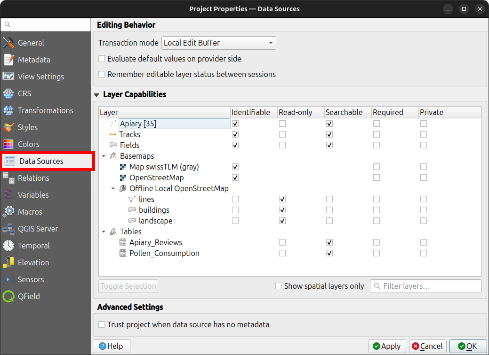
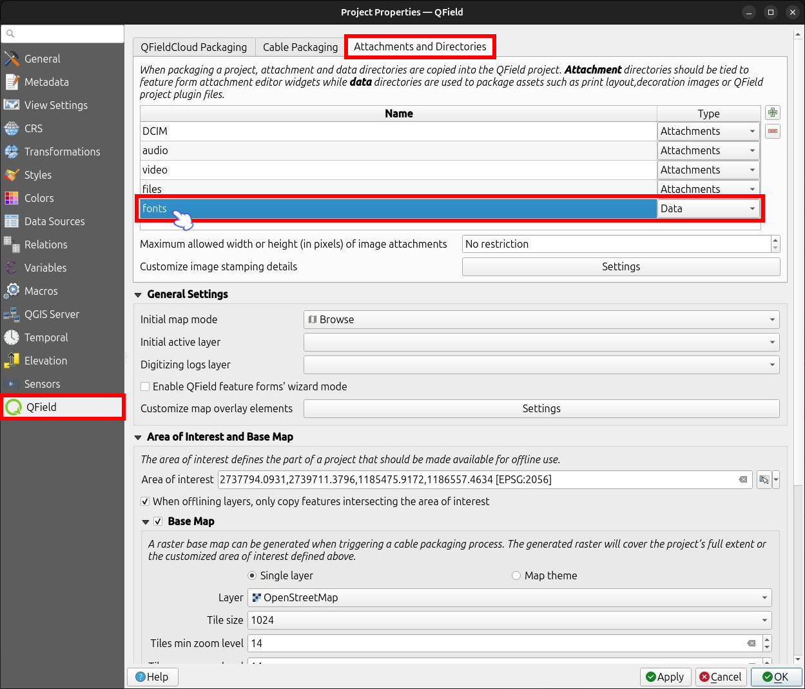
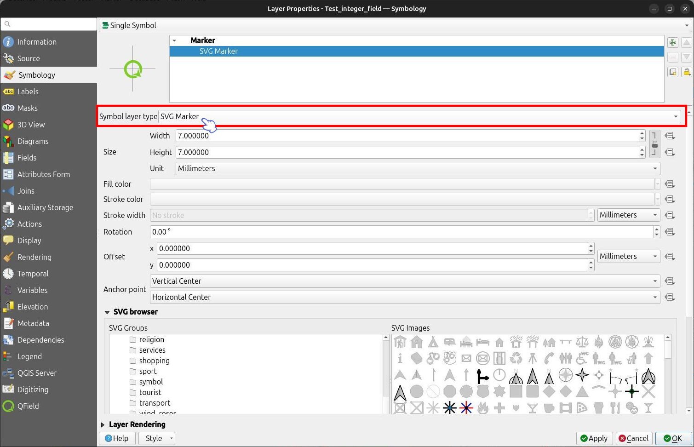
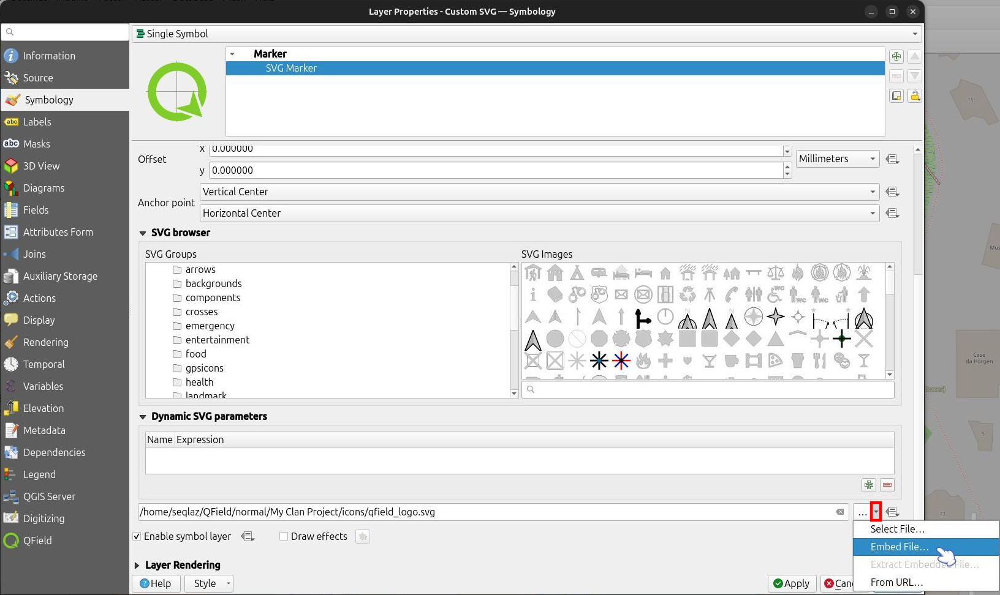

# Map Styling

QField directly supports all style settings configured in QGIS.
This includes renderer types such as graduated, categorized, rule-based, 2.5D, and data-defined symbology.

## Display Expression
:material-monitor: Desktop preparation

In QField, features are identified by a display name customized using QGIS expressions.
Display expressions are also used when searching for features within layers.

!!! Workflow
    1. Open the attribute table in QGIS and switch to form view.
    2. Navigate to _Vector Layer Properties > Display_.
    3. Define your display expression under the **"Display Expression"** field.

!

## Read-Only, Non-Identifiable, and Searchable Layers
:material-monitor: Desktop preparation

Some layers in a project serve purely visual purposes and should not trigger identification popups when a user taps the map canvas.
Other layers contain background reference data and must be protected from user editing, feature addition, or deletion.
You can also configure which layers are searchable in QField.

!!! Workflow
    1. In QGIS, navigate to _Project > Properties... > Data Sources_.
    2. Configure layer capabilities by toggling checkboxes for **"Identifiable"**, **"Read-Only"**, **"Searchable"**, **"Required"**, or **"Private"**.

!

## Using Additional Fonts
:material-monitor: Desktop preparation

QField allows you to use custom fonts in your projects.
You can register additional fonts using two methods:

- **System-Wide Fonts (App Directory):** Copy your font files (`.ttf` or `.otf`) into the **[App Directory](../../how-to/project-setup/storage.md#5-qfield-app-directory)/QField/fonts**.
These fonts become accessible across all projects and individual datasets on the device.
- **Project-Specific Fonts:** Create a subfolder named `fonts` inside the same directory as your QGIS project file (`.qgs` or `.qgz`).
These fonts are accessible only when viewing that specific project.

When creating a QFieldCloud project that includes custom fonts in a `fonts` subfolder, add this directory to the synchronized directories list in your project settings.
This ensures custom font files are pushed to QFieldCloud and downloaded to mobile devices.

!!! Workflow
    1. In QGIS, navigate to _Project > Properties... > QField_.
    2. Under the **"Attachments and Directories"** tab, add the relative path of your `fonts` subfolder to the directories list as a **"Data"** directory type.

!

## Custom SVG Symbols
:material-monitor: Desktop preparation

You can embed SVG symbols directly within a QGIS project file.

!!! Workflow
    1. Select the layer requiring custom SVG symbology and open its properties dialog.
    2. Navigate to _Vector Layer Properties > Symbology_.
    3. In the Symbol Layer Panel, select **"Simple marker"**.
        !
    4. Change the symbol layer type to **"SVG marker"**.
    5. Scroll to the bottom panel and click the dropdown menu icon next to the file selection button.
        !
    6. Select **"Embed File..."** and choose your SVG file in the file picker.
    7. Apply the changes and click **"OK"**.

!
