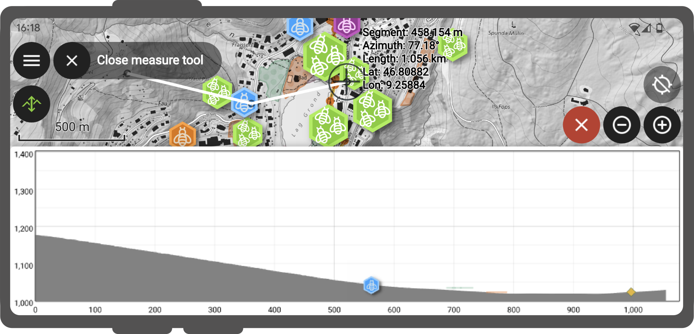

# Measuring tool

QField offers measurement functionalities out of the box, you have the flexibility to change the units for measuring distance and area in your projects.
You can do this in QGIS by navigating to the *Project* > *Properties* > *General* section.

!

To enable the measuring tool, open the side "Dashboard" and select the ruler symbol in the main menu bar.

!

Once the tool is enabled, use the digitizing controls located at the bottom-right corner of the screen to add and remove vertices.
By default, the measured geometry will be a line; to change to a polygon, simply connect the coordinate cursor to the first vertex entered.

For the segment formed of the two last vertices added, details returned include segment length and its azimuth.
When the measured geometry is a line, the total line length is provided while the perimeter and area are displayed for polygons.

## Elevation profiling

When the measuring tool is enabled, an *Elevation Profile* tool button appears at the top-left corner of the screen.
Toggling this on will open the elevation profiling panel, which will show the terrain elevation as well as intersecting vector features along the measured geometry.

!

For ease of use, QField defaults to using the `Mapzen Global Terrain` dataset to provide worldwide 30-meter resolution elevation profiles.
It is, however, possible to customize terrain settings through project and individual map layer properties within QGIS when building projects.
