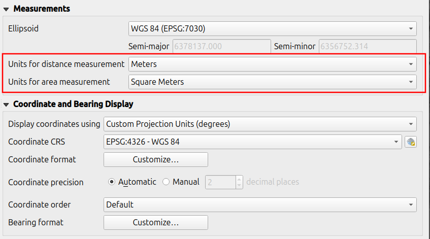
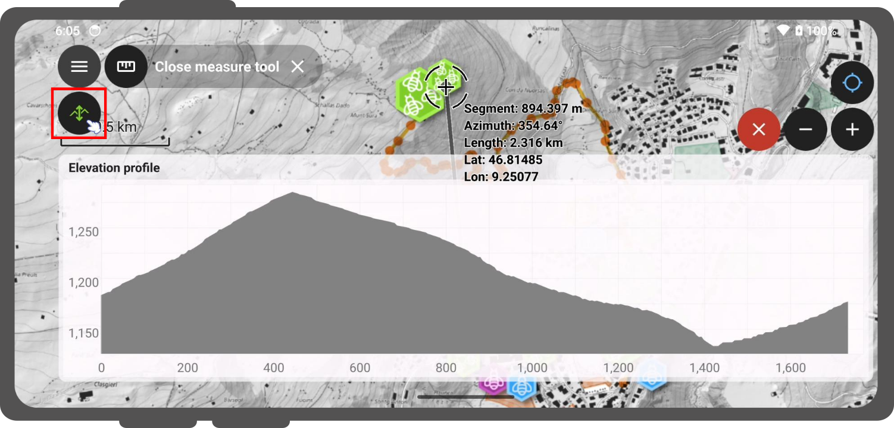

# Measuring tool

QField offers measurement functionalities.
You have the flexibility to change the units for measuring distance and area in your projects.

## Editing units

:material-monitor: Project Manager

!!! Workflow

    1. Navigate to the *Project* > *Properties* > *General*
    2. Set the measuring units to your desired metric.

     !

## Activating the measuring tool

:material-tablet: Fieldwork

!!! Workflow

    1. Open the **"Side Dashboard"** and select the ruler symbol in the main menu bar.
    2. Once the tool is enabled, use the digitizing controls located at the bottom-right corner of the screen to add and remove vertices.
    By default, the measured geometry will be a line; to change to a polygon, simply connect the coordinate cursor to the first vertex entered.
    For the segment formed of the two last vertices added, details returned include segment length and its azimuth.
    When the measured geometry is a line, the total line length is provided while the perimeter and area are displayed for polygons.

    !

## Elevation profiling

!!! Workflow

    1. Enable the measuring tool.
    2. Tap on the *Elevation Profile* tool button at the top-left corner of the screen.
    3. Toggle the buton and the elevation profiling panel will open showing the terrain elevation as well as intersecting vector features along the measured geometry.

    !

    **Note**:
    For ease of use, QField defaults to using the `Mapzen Global Terrain` dataset to provide worldwide 30-meter resolution elevation profiles. It is, however, possible to customize terrain settings through project and individual map layer properties within QGIS when building projects.
