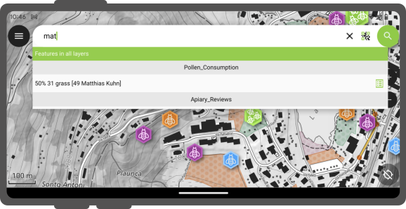

# Search bar

QField is equipped with a search bar that allows you to:

- search for features within a project's vector layers
- navigate to specified coordinates
- locate spatial bookmarks
- and calculate expressions

## Layer search

:material-tablet: Fieldwork

You can search for an object scanning the attributes across all your layers or of an active layer.
Alternatively, you can filter down to attribute level.

!!! Workflow

    1. Tap on the **Search button** in the top-right corner of the screen to expand the search bar.

    ### Vector layers search

     The value entered in the search bar is used to find features with matching attribute values.
     A minimum of three characters is required to initiate the search.

     !

    ### Active Layer Search Feature Matching

     The active layer search functionality focuses search queries exclusively on the currently active layer and specific fields within it.

     - To search through all texts and numbers on all the fields fields in the active layer, type `f ` followed by your search term (e.g., `f oak`).
     - To target a specific field in the active layer, type `f @ATTRIBUTE_NAME search-term` (e.g., `f @tree_type oak`).

     Matching attribute names and values are highlighted in the search results list.

     

## Search with code scanner

You can use QField's Code Reader to search for features by scanning physical codes or selecting image files.

!!! Workflow

    1. Tap **Scan code** inside the search bar to trigger the Code Reader overlay.
    2. Decode the code using one of two methods:

         - **Live Camera / NFC:**
         Point the camera at a physical QR code or barcode, or hold an NFC text tag near the device.
        !
         - **Image File from Gallery:**
         Tap the **Gallery icon** (image button) on the bottom control bar and select a pre-existing photo containing a QR code or barcode.
        !
    3. Once the code is decoded, tap the checkmark (✔️) button to execute the search query for the decoded string.

        Matching features appear in the results list:

        - Tap the **Feature Name** to pan and highlight the feature on the map.
        - Tap the **Attributes Button** to open the feature's form directly.
            !

## Search with NFC

The Code Reader natively detects and decodes NFC text tags.

!!! Note
    Both the camera reader and NFC detector are active by default when opening the Code Reader. You can toggle either sensor off in the scanner interface to conserve battery life.

## Go to coordinate

!!! Workflow

    1. Enter the coordinates directly into the search bar using `Latitude, Longitude` format (WGS84) or coordinates matching the project's Coordinate Reference System (CRS).
    2. Tap on the coordinate in the results list.
    QField will automatically center the map canvas on that location.

## Go to spatial bookmark

!!! Workflow

    1. Type 'b' to filter for the bookmark section.
    2. Enter the name for your required bookmark in the search bar.
    3. Tap on the desired matching bookmark result.
    QField will automatically re-center and zoom to the map canvas and to the saved extent.

## Expression calculator

The search bar doubles as an expression calculator.

!!! Workflow

    1. Start your query with an `= ` sign to evaluate expressions (e.g., `= 20 + 5` or `= $area` for QGIS expressions).
    The calculated result will appear in the list and can be tapped to copy the value to the clipboard.

Pro-tip: use the aggregate() expression function to calculate statistics against vector layers. For example, calculating the total area covered by a polygon layers
can be done by typing `*= aggregate('my_layer','sum', $area)*`.

## Configure vector layers search in QGIS
:material-monitor: Desktop preparation

By default, all vector layers are searchable. To exclude specific layers from search queries:

!!! Workflow

    1. Open your project in QGIS.
    2. Navigate to **Project** > **Properties...** > **Data Sources**.
    3. Locate the layer capabilities table and uncheck the **Searchable** checkbox for any layers you wish to exclude.
    [Source configuration](../project-setup/data_source_and_project_paths.md#data-source-configuration)
